# 🎨 Tesla 스타일링 아키텍처

완전한 무채색 그레이스케일 + 뉴모피즘 디자인 시스템

## 📋 목차

- [📊 아키텍처 다이어그램](#-아키텍처-다이어그램)
- [🗂️ 파일 구조 맵](#️-파일-구조-맵)  
- [🎯 변수 시스템](#-변수-시스템)
- [🔄 데이터 플로우](#-데이터-플로우)
- [📚 상세 문서](#-상세-문서)

---

## 📊 아키텍처 다이어그램

### 1. 전체 시스템 구조

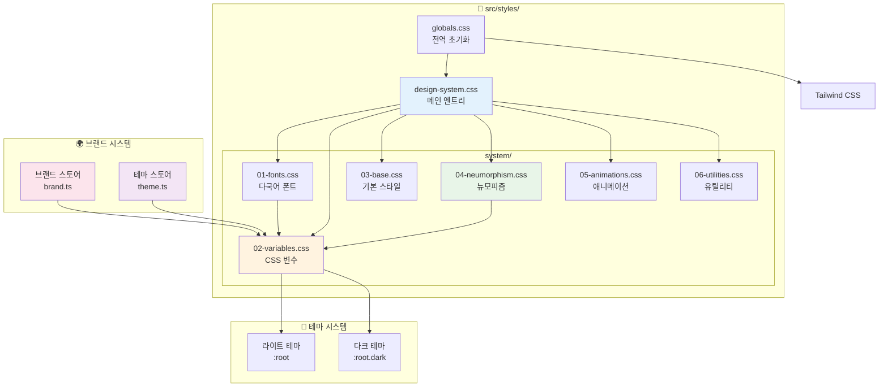

### 2. CSS 변수 계층 구조

```mermaid
flowchart TD
    subgraph "🎨 기본 그레이 스케일"
        A[--gray-0: 100% 순수 흰색]
        B[--gray-1: 98% 거의 흰색]
        C[--gray-2: 94% 매우 밝음]
        D[--gray-3: 88% 밝음]
        E[--gray-4: 80% 중간 밝음]
        F[--gray-5: 60% 중간]
        G[--gray-6: 40% 중간 어둠]
        H[--gray-7: 30% 어둠]
        I[--gray-8: 20% 매우 어둠]
        J[--gray-9: 5% 거의 검정]
    end
    
    subgraph "📦 배경 요소 (순차 매핑)"
        K[--background: gray-1]
        L[--card: gray-0]
        M[--muted: gray-2]
        N[--input: gray-2]
        O[--border: gray-3]
        P[--popover: gray-0]
    end
    
    subgraph "✏️ 텍스트/UI (역순 매핑)"
        Q[--foreground: gray-9]
        R[--primary: gray-8]
        S[--secondary: gray-7]
        T[--accent: gray-6]
        U[--muted-foreground: gray-6]
    end
    
    subgraph "🎨 브랜드 10단계 스케일"
        V[--brand-0: 97% 가장 밝음]
        W[--brand-5: 55% 기본값]
        X[--brand-9: 15% 가장 어둠]
    end
    
    subgraph "🎭 뉴모피즘 변수"
        Y[--nm-light-rgba: 255,255,255,0.95]
        Z[--nm-dark-rgba: 0,0,0,0.08]
        AA[--nm-offset: 3px]
        BB[--nm-blur: 6px]
    end
    
    B --> K
    A --> L
    C --> M
    C --> N
    D --> O
    A --> P
    
    J --> Q
    I --> R
    H --> S
    G --> T
    G --> U
    
    style A fill:#ffffff
    style B fill:#fafafa
    style C fill:#f0f0f0
    style D fill:#e0e0e0
    style E fill:#cccccc
    style F fill:#999999
    style G fill:#666666
    style H fill:#4d4d4d
    style I fill:#333333
    style J fill:#0d0d0d
```

### 3. 테마 전환 프로세스

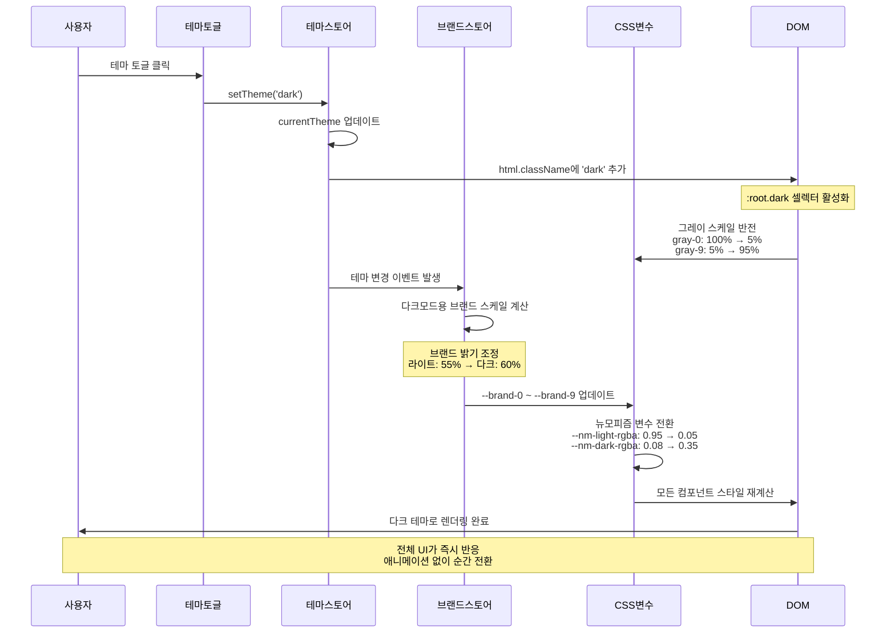

### 4. 뉴모피즘 렌더링 파이프라인

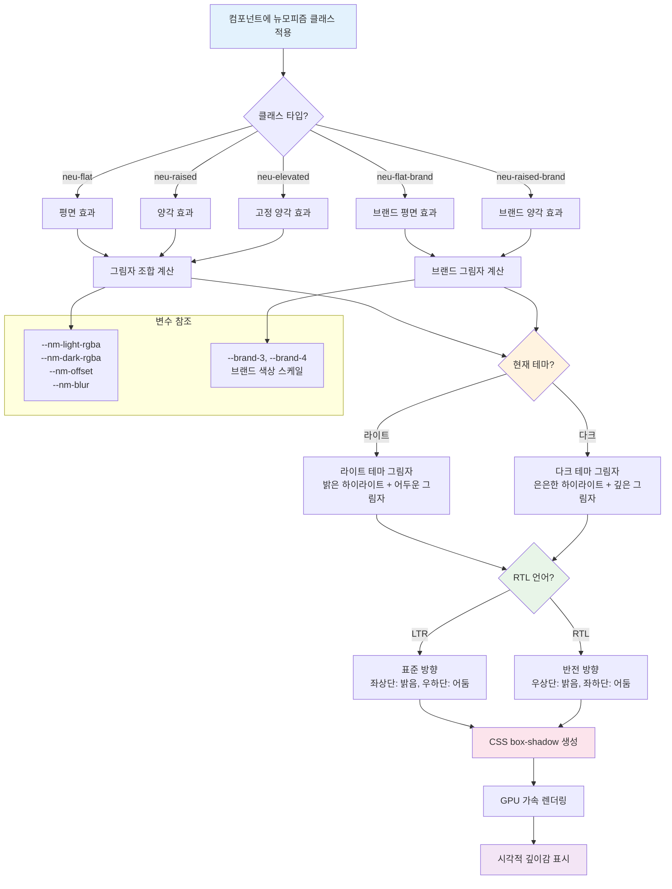

### 5. 다국어 폰트 시스템

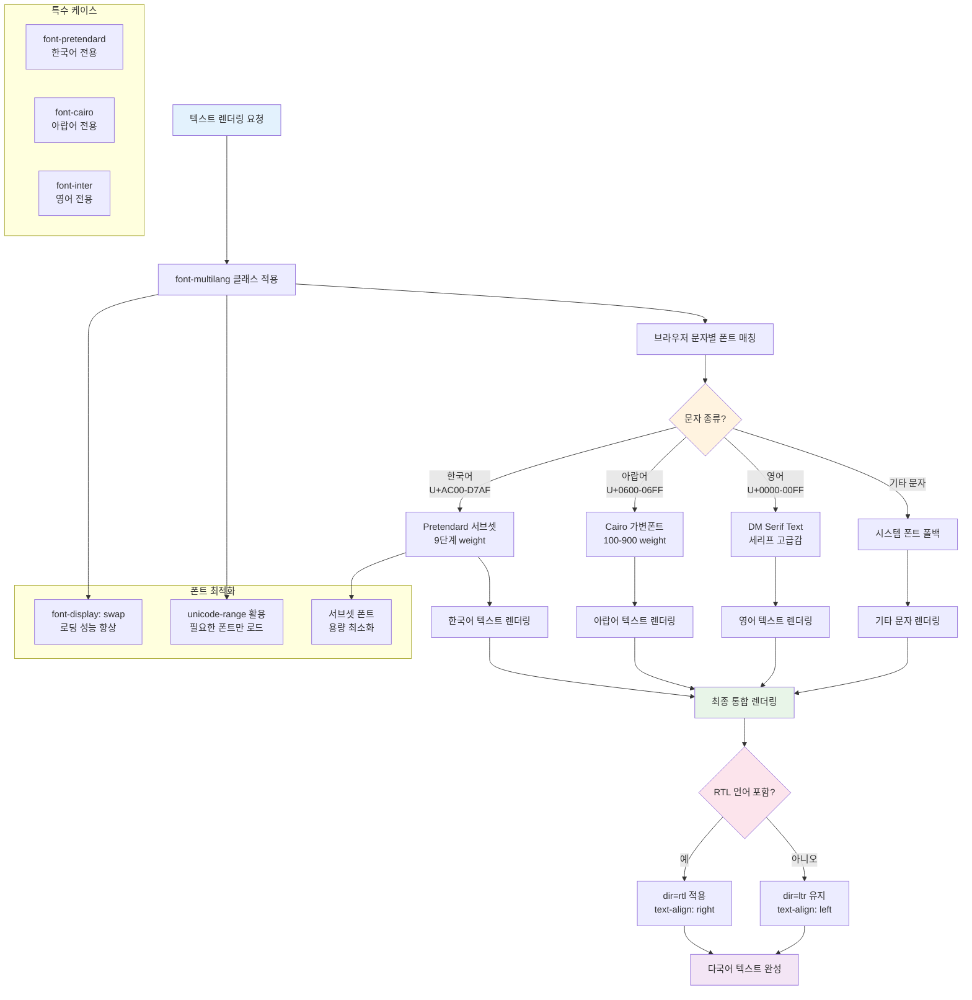

---

## 🗂️ 파일 구조 맵

### 6. 스타일 파일 디펜던시

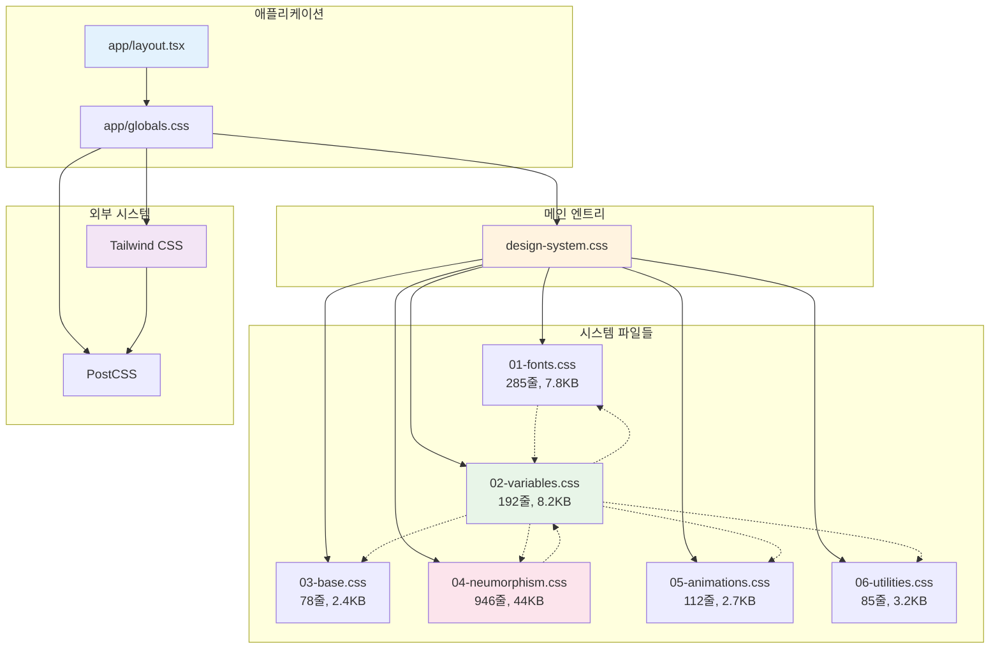

### 7. 변수 상속 관계

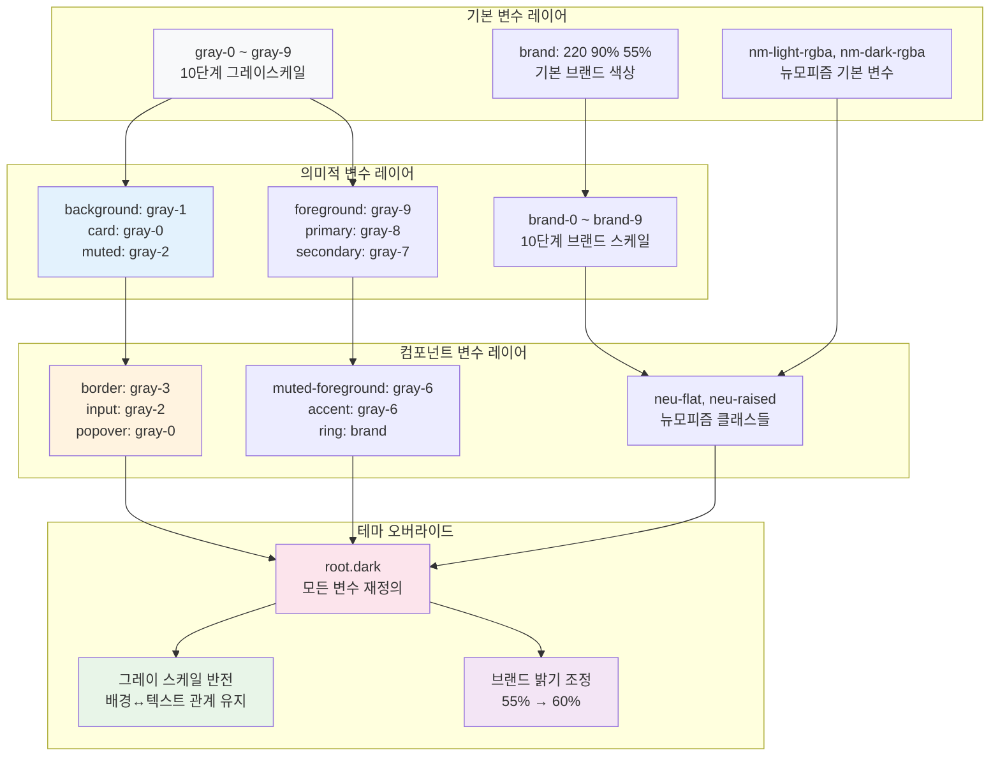

---

## 🎯 변수 시스템

### 8. 그레이스케일 매핑

```mermaid
graph LR
    subgraph "라이트 테마"
        A[gray-0: 100%<br/>순수 흰색] --> A1[background<br/>card<br/>popover]
        B[gray-1: 98%<br/>거의 흰색] --> B1[background]
        C[gray-2: 94%<br/>매우 밝음] --> C1[muted<br/>input]
        D[gray-3: 88%<br/>밝음] --> D1[border]
        E[gray-6: 40%<br/>중간 어둠] --> E1[muted-foreground<br/>accent]
        F[gray-8: 20%<br/>매우 어둠] --> F1[primary]
        G[gray-9: 5%<br/>거의 검정] --> G1[foreground]
    end
    
    subgraph "다크 테마"
        H[gray-0: 5%<br/>거의 검정] --> H1[popover]
        I[gray-1: 8%<br/>매우 어둠] --> I1[background]
        J[gray-2: 12%<br/>어둠] --> J1[card]
        K[gray-3: 18%<br/>중간 어둠] --> K1[muted]
        L[gray-6: 60%<br/>밝음] --> L1[muted-foreground<br/>accent]
        M[gray-8: 85%<br/>거의 흰색] --> M1[primary]
        N[gray-9: 95%<br/>순수 흰색] --> N1[foreground]
    end
    
    style A fill:#ffffff
    style B fill:#fafafa
    style C fill:#f0f0f0
    style D fill:#e0e0e0
    style E fill:#666666
    style F fill:#333333
    style G fill:#0d0d0d
    
    style H fill:#0d0d0d
    style I fill:#141414
    style J fill:#1f1f1f
    style K fill:#2d2d2d
    style L fill:#999999
    style M fill:#d9d9d9
    style N fill:#f2f2f2
```

### 9. 브랜드 색상 스케일

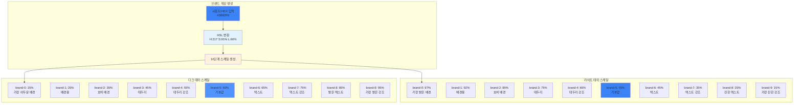

---

## 🔄 데이터 플로우

### 10. 테마 변경 시퀀스

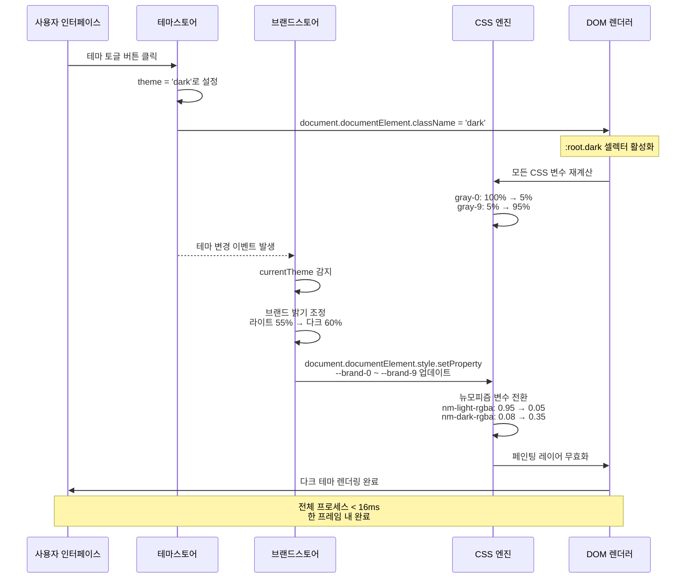

### 11. 브랜드 색상 업데이트

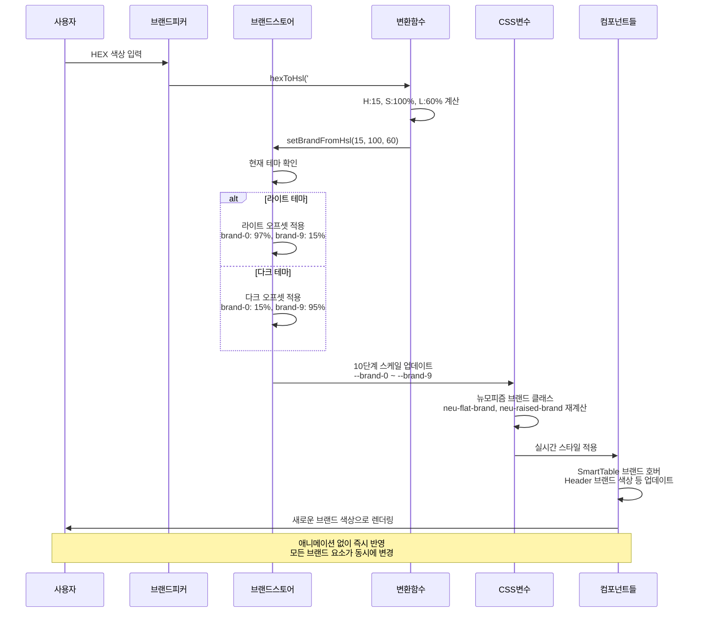

---

## 📚 상세 문서

- **[뉴모피즘 완전 가이드](docs/neumorphism-system.md)** - 상세 사용법과 베스트 프랙티스
