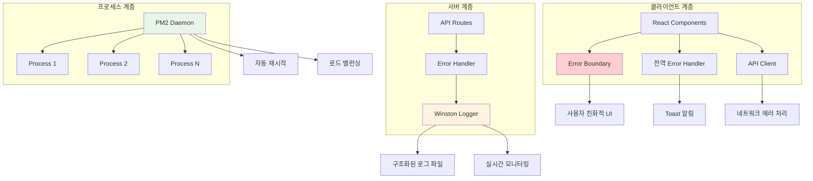

# 🏛️ 통합 에러 핸들링 아키텍처 - 견고한 웹 애플리케이션을 위한 설계

## 🎯 통합 에러 핸들링의 필요성

현대의 웹 애플리케이션은 마치 복잡한 도시와 같다. 프론트엔드, 백엔드, 데이터베이스, 외부 서비스 등 수많은 구성 요소들이 서로 연결되어 동작한다. 이런 복잡한 시스템에서 에러는 언제든지 발생할 수 있으며, 하나의 작은 에러가 전체 시스템의 마비로 이어질 수 있다.

통합 에러 핸들링 아키텍처는 이런 위험을 방지하기 위한 종합적인 방어 체계다. 마치 도시의 안전을 위해 경찰, 소방서, 병원, 재난 대응팀이 유기적으로 협력하는 것처럼, 각기 다른 계층에서 발생하는 에러를 체계적으로 감지하고, 분류하고, 대응하는 시스템이다.

단순히 에러를 숨기거나 무시하는 것이 아니라, 에러를 통해 시스템의 상태를 파악하고, 사용자 경험을 보호하며, 개발팀이 지속적으로 시스템을 개선할 수 있도록 하는 것이 목표다.

## 🏗️ 아키텍처의 계층 구조

### **클라이언트 계층 (Frontend Layer)**

사용자와 직접 상호작용하는 가장 앞단에서는 React Error Boundary가 핵심 역할을 한다. 이 계층에서의 에러 처리는 사용자 경험과 직결되기 때문에 특별히 신중하게 설계해야 한다.

React Error Boundary는 컴포넌트 렌더링 과정에서 발생하는 에러를 포착하여 전체 애플리케이션이 크래시되는 것을 방지한다. 마치 자동차의 에어백처럼, 사고가 발생했을 때 승객의 안전을 보호하는 최후의 방어선이다.

하지만 Error Boundary만으로는 모든 클라이언트 에러를 처리할 수 없다. 비동기 코드에서 발생하는 에러, 이벤트 핸들러에서의 에러, 네트워크 요청 실패 등은 별도의 처리가 필요하다. 이를 위해 전역 에러 핸들러와 API 호출 래퍼 함수들이 함께 동작한다.

### **서버 계층 (Backend Layer)**

서버에서는 Winston이 중심이 되어 모든 에러 정보를 체계적으로 기록한다. 클라이언트에서와는 달리, 서버에서의 에러 처리는 주로 로깅과 안정성 확보에 초점을 맞춘다.

API 요청 처리 과정에서 발생하는 에러, 데이터베이스 연결 실패, 외부 서비스 호출 실패 등 모든 서버 사이드 에러는 Winston을 통해 구조화된 형태로 기록된다. 이 로그들은 나중에 에러 분석과 시스템 개선을 위한 중요한 자료가 된다.

### **프로세스 관리 계층 (Process Management Layer)**

가장 하위 계층에서는 PM2가 Node.js 프로세스 자체의 안정성을 책임진다. 애플리케이션이 예상치 못하게 크래시되면 즉시 재시작시키고, 메모리 누수나 성능 저하가 감지되면 프로세스를 교체한다.

PM2는 또한 클러스터 모드를 통해 하나의 프로세스에서 에러가 발생해도 다른 프로세스들이 계속 서비스를 제공할 수 있도록 한다. 이는 시스템의 가용성을 크게 향상시킨다.

## 🔄 에러 흐름과 처리 과정

### **에러 발생과 1차 감지**

에러가 발생하는 순간부터 시작해서 최종 처리까지의 과정을 살펴보면, 먼저 각 계층의 감지 시스템이 에러를 포착한다. React Error Boundary는 컴포넌트 렌더링 에러를, Winston은 서버 사이드 에러를, PM2는 프로세스 레벨 에러를 각각 감지한다.

각 감지 시스템은 자신이 처리할 수 있는 범위의 에러에 대해서는 즉시 대응하고, 처리할 수 없는 에러는 상위 계층으로 전달하거나 다른 시스템과 협력하여 처리한다.

### **에러 분류와 우선순위 결정**

감지된 에러는 그 성격과 심각성에 따라 분류된다. 사용자에게 즉시 알려야 하는 에러, 백그라운드에서 처리해도 되는 에러, 시스템 관리자에게 알림이 필요한 에러 등으로 구분된다.

예를 들어, 네트워크 연결 실패는 사용자에게 즉시 알리고 재시도 옵션을 제공해야 하지만, 내부 로그 기록 실패는 사용자에게는 보이지 않게 처리하면서 시스템 관리자에게만 알릴 수 있다.

### **복구 전략 실행**

에러의 종류와 심각성에 따라 다른 복구 전략이 실행된다. 자동으로 복구 가능한 에러는 시스템이 스스로 해결하고, 사용자 개입이 필요한 에러는 적절한 안내와 함께 대안을 제시한다.

복구가 불가능한 심각한 에러의 경우에는 시스템의 안정성을 위해 해당 기능을 일시적으로 비활성화하거나, 대체 기능을 제공하는 등의 조치를 취한다.

## 🛡️ 계층별 방어 전략

### **프론트엔드 방어선**

첫 번째 방어선은 사용자 인터페이스 계층이다. 여기서는 사용자가 에러를 느끼지 않도록 하거나, 에러가 발생해도 적절한 피드백을 제공하는 것이 목표다.

Form 검증을 통해 잘못된 입력을 미리 차단하고, 로딩 상태를 명확히 표시하여 사용자의 혼란을 방지한다. API 호출이 실패하면 사용자에게 명확한 에러 메시지와 함께 해결 방법을 제시한다.

React Error Boundary는 이 모든 것을 우회한 예상치 못한 에러들을 최종적으로 포착하여, 전체 애플리케이션이 중단되는 최악의 시나리오를 방지한다.

### **백엔드 방어선**

두 번째 방어선은 서버 애플리케이션 계층이다. 여기서는 비즈니스 로직을 보호하고, 데이터의 무결성을 유지하는 것이 중요하다.

입력 데이터 검증, 인증과 권한 확인, 데이터베이스 트랜잭션 관리 등을 통해 에러를 예방한다. 예방할 수 없는 에러가 발생하면 Winston을 통해 상세히 기록하고, 적절한 HTTP 상태 코드와 함께 클라이언트에게 응답한다.

중요한 것은 에러가 발생해도 시스템의 일관성을 유지하는 것이다. 데이터베이스 트랜잭션 롤백, 임시 파일 정리, 연결 해제 등의 정리 작업을 확실히 수행해야 한다.

### **인프라 방어선**

세 번째 방어선은 프로세스와 시스템 계층이다. PM2가 이 역할을 담당하며, 애플리케이션 프로세스 자체의 안정성을 보장한다.

메모리 누수로 인한 프로세스 크래시, 예상치 못한 예외로 인한 프로세스 종료, 시스템 리소스 부족 등의 상황에 대응한다. 하나의 프로세스가 문제가 생겨도 다른 프로세스들이 서비스를 계속 제공할 수 있도록 한다.

## 📊 데이터 수집과 분석

### **에러 데이터의 가치**

에러는 단순히 문제가 발생했다는 신호가 아니라, 시스템을 개선할 수 있는 중요한 정보의 원천이다. 어떤 에러가 자주 발생하는지, 특정 시간대나 사용자 그룹에서 집중적으로 발생하는 에러가 있는지, 에러 발생 패턴이 변화하고 있는지 등을 분석할 수 있다.

이런 분석을 통해 시스템의 취약점을 파악하고, 사용자 경험을 개선하며, 성능 병목 지점을 발견할 수 있다. 때로는 에러 패턴을 통해 새로운 비즈니스 인사이트를 얻을 수도 있다.

### **구조화된 로깅**

Winston을 통해 수집되는 로그는 구조화된 형태로 저장된다. JSON 포맷을 사용하여 에러의 종류, 발생 시간, 사용자 정보, 시스템 상태 등을 체계적으로 기록한다.

이렇게 구조화된 데이터는 나중에 Elasticsearch, Splunk 같은 로그 분석 도구나 Grafana 같은 시각화 도구와 연동하여 더 깊이 있는 분석을 할 수 있게 해준다.

### **실시간 모니터링과 알림**

PM2의 실시간 모니터링 기능과 Winston의 로깅을 결합하면 시스템의 건강 상태를 실시간으로 파악할 수 있다. 에러 발생률이 급증하거나, 특정 임계값을 초과하면 즉시 개발팀에 알림을 보낼 수 있다.

이런 실시간 대응 능력은 장애 대응 시간을 크게 단축시키고, 사용자에게 미치는 영향을 최소화한다.

## 🔧 시스템 간 상호 작용

### **React Error Boundary와 Winston의 연계**

클라이언트에서 포착된 에러 정보를 서버로 전송하여 Winston으로 기록할 수 있다. 이를 통해 서버 개발자도 클라이언트에서 발생하는 문제를 파악할 수 있고, 전체적인 에러 현황을 한눈에 볼 수 있다.

다만 이때 사용자의 개인정보나 민감한 정보가 포함되지 않도록 주의해야 하고, 네트워크 부하를 고려하여 모든 에러를 다 전송하지는 않는 것이 좋다.

### **Winston과 PM2의 통합**

PM2는 자체적인 로그 관리 기능을 제공하지만, Winston과 함께 사용하면 더 풍부한 로그 정보를 얻을 수 있다. Winston의 구조화된 로그와 PM2의 프로세스 상태 정보를 결합하면 에러의 원인을 더 정확히 파악할 수 있다.

예를 들어, 특정 시간에 메모리 사용량이 급증했다는 PM2의 정보와 그 시간대에 발생한 특정 API 호출 에러라는 Winston의 정보를 결합하면, 메모리 누수의 원인을 찾는 데 도움이 된다.

### **전체 시스템의 조화**

세 시스템이 잘 조화되면 각각의 한계를 보완할 수 있다. React Error Boundary가 놓친 클라이언트 에러는 전역 에러 핸들러가, Winston이 기록하지 못한 프로세스 레벨 문제는 PM2가 처리한다.

중요한 것은 각 시스템이 독립적으로 동작하면서도 필요할 때는 정보를 공유하고 협력할 수 있도록 설계하는 것이다.

## 🚀 성능과 확장성 고려사항

### **로깅 성능 최적화**

대용량 트래픽을 처리하는 시스템에서는 로깅 자체가 성능 병목이 될 수 있다. Winston의 비동기 로깅 기능을 활용하고, 로그 레벨을 적절히 조정하여 성능 영향을 최소화해야 한다.

프로덕션 환경에서는 디버그 레벨 로그는 비활성화하고, 에러나 경고 레벨의 중요한 로그만 기록하는 것이 일반적이다.

### **메모리 사용량 관리**

PM2의 클러스터 모드를 사용할 때는 전체 메모리 사용량을 모니터링해야 한다. 각 프로세스가 독립적으로 메모리를 사용하므로, 프로세스 수를 늘릴수록 메모리 사용량도 증가한다.

적절한 프로세스 수를 찾기 위해서는 부하 테스트를 통해 최적점을 찾아야 한다.

### **확장성 고려**

시스템이 성장하면서 에러 데이터의 양도 증가한다. 로그 스토리지 용량을 관리하고, 필요하다면 로그 데이터를 외부 서비스로 전송하는 것을 고려해야 한다.

Elasticsearch 클러스터나 클라우드 로깅 서비스 등을 활용하여 확장성을 확보할 수 있다.

## 🔮 미래 지향적 설계

### **마이크로서비스 아키텍처 대응**

시스템이 마이크로서비스로 분리되면 에러 추적이 더 복잡해진다. 분산 트레이싱과 상관 관계 ID를 활용하여 여러 서비스에 걸친 에러를 추적할 수 있도록 설계해야 한다.

### **AI/ML 기반 에러 예측**

축적된 에러 데이터를 활용하여 머신러닝 모델을 구축하면 에러를 미리 예측하고 예방할 수 있다. 특정 패턴이 감지되면 자동으로 스케일링을 하거나 리소스를 추가 할당하는 등의 프로액티브한 대응이 가능해진다.

### **클라우드 네이티브 환경**

Kubernetes 환경에서는 PM2의 역할 중 일부가 Kubernetes의 기능과 중복될 수 있다. 이런 환경에서는 각 도구의 역할을 명확히 구분하고, 서로 보완적으로 동작하도록 설계해야 한다.

통합 에러 핸들링 아키텍처는 단순히 에러를 처리하는 시스템이 아니라, 전체 애플리케이션의 안정성과 신뢰성을 보장하는 핵심 인프라다. 올바르게 구축하고 운영한다면 사용자 경험 향상, 개발 생산성 증대, 운영 비용 절감 등 다양한 혜택을 얻을 수 있다.

중요한 것은 각 계층의 특성을 이해하고, 전체 시스템의 조화를 고려하여 설계하는 것이다. 그리고 지속적으로 모니터링하고 개선하여 시스템의 성숙도를 높여나가는 것이다. 