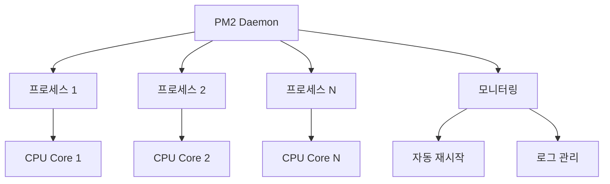

# ⚙️ PM2 - Node.js 애플리케이션 프로세스 관리자

## 🎯 PM2란?

PM2(Process Manager 2)는 Node.js 애플리케이션을 위한 고급 프로세스 관리자다. 마치 숙련된 감독관처럼 여러 개의 Node.js 프로세스를 동시에 관리하고, 장애가 발생했을 때 즉시 복구시키며, 성능을 최적화하는 역할을 한다.

일반적으로 Node.js 애플리케이션은 단일 프로세스로 실행되는데, 이는 마치 한 명의 직원이 모든 업무를 처리하는 것과 같다. 업무량이 많아지거나 직원이 아프면 전체 업무가 마비될 수 있다. PM2는 이런 문제를 해결하기 위해 여러 개의 프로세스를 동시에 실행하고, 각각을 독립적으로 관리한다.

PM2의 이름에서 "2"가 붙은 이유는 이전 버전인 PM(Process Manager)의 개선된 버전이기 때문이다. 초기 버전의 한계를 극복하고 더욱 강력한 기능들을 추가하여 현재의 형태로 발전했다.

## 🏗️ PM2의 핵심 기능

### **프로세스 생명주기 관리**

PM2의 가장 기본적인 기능은 Node.js 프로세스의 생명주기를 관리하는 것이다. 애플리케이션을 시작, 중지, 재시작하는 것은 물론, 예상치 못한 크래시가 발생했을 때 자동으로 재시작시킨다.

이는 마치 24시간 경비원이 건물을 지키는 것과 같다. 문제가 발생하면 즉시 대응하고, 필요한 경우 비상 조치를 취한다. 개발자가 잠들어 있는 새벽 시간에도 PM2는 깨어있어서 서비스를 보호한다.

### **클러스터 모드와 로드 밸런싱**

Node.js는 기본적으로 단일 스레드로 동작하기 때문에, 멀티코어 CPU의 성능을 완전히 활용하지 못한다. PM2는 클러스터 모드를 통해 이 문제를 해결한다. 하나의 애플리케이션을 여러 개의 프로세스로 복제하여 각각 다른 CPU 코어에서 실행시킨다.

이는 마치 레스토랑에서 주문이 많아질 때 요리사를 추가로 고용하는 것과 같다. 한 명의 요리사가 모든 주문을 처리하려고 하면 고객들이 오래 기다려야 하지만, 여러 명의 요리사가 동시에 요리하면 대기 시간이 크게 줄어든다.

### **무중단 배포 (Zero-downtime Deployment)**

서비스를 운영하다 보면 새로운 기능을 추가하거나 버그를 수정하기 위해 코드를 업데이트해야 한다. 전통적인 방식으로는 서비스를 중단하고 새 코드를 배포한 후 다시 시작해야 하는데, 이 과정에서 사용자들은 서비스를 이용할 수 없다.

PM2는 무중단 배포 기능을 제공하여 이 문제를 해결한다. 기존 프로세스를 그대로 두고 새로운 프로세스를 시작한 다음, 새 프로세스가 완전히 준비되면 기존 프로세스를 종료한다. 사용자 입장에서는 서비스가 전혀 중단되지 않은 것처럼 느껴진다.

### **실시간 모니터링**

PM2는 실행 중인 모든 프로세스의 상태를 실시간으로 모니터링한다. CPU 사용률, 메모리 사용량, 활성 연결 수, 요청 처리 속도 등의 정보를 지속적으로 수집하고 표시한다.

이는 마치 병원의 환자 모니터링 시스템과 같다. 환자의 생체 신호를 실시간으로 추적하여 문제가 발생하기 전에 미리 감지하고 대응할 수 있다.

## 🔄 PM2의 작동 원리

### **데몬 프로세스**

PM2는 데몬(daemon) 프로세스로 동작한다. 데몬은 백그라운드에서 계속 실행되면서 다른 프로세스들을 관리하는 특별한 프로세스다. 마치 오케스트라의 지휘자처럼, 직접 연주를 하지는 않지만 모든 연주자들을 조율하고 통제한다.

PM2 데몬은 시스템이 부팅될 때 자동으로 시작되고, 시스템이 종료될 때까지 계속 실행된다. 사용자가 명령을 내리면 데몬이 이를 받아서 해당하는 작업을 수행한다.

### **프로세스 분기와 관리**

새로운 애플리케이션을 시작하라는 명령을 받으면, PM2는 새로운 프로세스를 생성(fork)한다. 이 프로세스는 PM2의 자식 프로세스가 되어, PM2의 관리 하에 놓인다.

PM2는 각 프로세스에 고유한 ID를 부여하고, 프로세스의 상태, 시작 시간, 재시작 횟수 등의 정보를 추적한다. 마치 학교에서 학생들에게 학번을 부여하고 출석을 관리하는 것과 같다.

### **헬스 체크와 자동 복구**

PM2는 관리하는 모든 프로세스의 건강 상태를 지속적으로 확인한다. 프로세스가 응답하지 않거나 예상치 못하게 종료되면, 즉시 이를 감지하고 새로운 프로세스로 교체한다.

이 과정은 매우 빠르게 진행되어, 보통 수 초 내에 서비스가 복구된다. 사용자는 대부분의 경우 장애가 발생했다는 것도 모르고 지나간다.



## 🚀 PM2의 고급 기능

### **로그 관리**

PM2는 각 프로세스에서 발생하는 로그를 중앙집중식으로 관리한다. 여러 개의 프로세스가 동시에 실행되더라도 모든 로그를 하나의 파일에 통합하거나, 프로세스별로 분리해서 저장할 수 있다.

로그 로테이션 기능도 제공하여, 로그 파일이 너무 커지지 않도록 관리한다. 정해진 크기나 시간 간격에 따라 새로운 로그 파일을 생성하고, 오래된 파일은 압축하거나 삭제한다.

### **메모리 기반 재시작**

장시간 실행되는 Node.js 애플리케이션은 메모리 누수(memory leak) 문제를 겪을 수 있다. PM2는 프로세스의 메모리 사용량을 모니터링하여, 설정된 임계값을 초과하면 자동으로 프로세스를 재시작시킨다.

이는 마치 컴퓨터를 정기적으로 재부팅하여 성능을 유지하는 것과 같다. 사용자에게는 영향을 주지 않으면서도 시스템의 안정성을 보장한다.

### **환경별 설정 관리**

개발, 테스트, 프로덕션 등 다양한 환경에서 애플리케이션을 실행할 때, 각각 다른 설정이 필요할 수 있다. PM2는 환경별로 다른 설정을 관리할 수 있는 기능을 제공한다.

설정 파일을 통해 각 환경에 맞는 환경 변수, 프로세스 수, 로그 설정 등을 미리 정의해둘 수 있다. 배포할 때는 해당 환경에 맞는 설정을 선택하여 실행하면 된다.

## 📊 실무에서의 활용 시나리오

### **소규모 스타트업에서의 활용**

자원이 제한적인 소규모 스타트업에서는 PM2의 기본 기능만으로도 큰 효과를 볼 수 있다. 자동 재시작 기능만으로도 서비스의 안정성이 크게 향상되고, 24시간 모니터링을 위해 별도의 인력을 배치할 필요가 없어진다.

특히 초기 단계에서는 예상치 못한 버그가 자주 발생할 수 있는데, PM2가 있으면 버그로 인한 서비스 중단 시간을 최소화할 수 있다.

### **중간 규모 기업에서의 확장**

서비스가 성장하면서 트래픽이 증가하면, PM2의 클러스터 모드를 활용하여 성능을 향상시킬 수 있다. 추가적인 하드웨어 투자 없이도 기존 서버의 성능을 최대한 활용할 수 있다.

또한 무중단 배포 기능을 통해 새로운 기능을 더 자주, 더 안전하게 배포할 수 있어 개발 속도도 향상된다.

### **대규모 엔터프라이즈 환경**

대규모 환경에서는 PM2를 다른 모니터링 도구들과 연계하여 사용한다. Prometheus, Grafana 등과 연동하여 더 상세한 모니터링과 알림 시스템을 구축할 수 있다.

여러 서버에 분산된 애플리케이션들을 중앙에서 관리하는 용도로도 활용할 수 있다.

## 🔧 PM2와 다른 도구들의 조화

### **Docker와의 결합**

최근에는 Docker 컨테이너 환경에서 PM2를 사용하는 경우가 많다. Docker는 애플리케이션의 실행 환경을 표준화하고, PM2는 그 안에서의 프로세스 관리를 담당한다.

이 조합을 사용하면 개발 환경과 프로덕션 환경의 차이를 최소화하면서도, 안정적인 프로세스 관리의 혜택을 모두 얻을 수 있다.

### **Nginx와의 연동**

PM2가 관리하는 여러 프로세스 앞에 Nginx를 리버스 프록시로 배치하는 것이 일반적인 구성이다. Nginx는 정적 파일 제공과 SSL 처리를 담당하고, PM2는 동적 요청 처리를 담당한다.

이런 구성을 통해 각 도구의 장점을 최대화하면서 전체 시스템의 성능과 안정성을 향상시킬 수 있다.

### **CI/CD 파이프라인 통합**

PM2는 Jenkins, GitHub Actions, GitLab CI 등의 CI/CD 도구와 잘 통합된다. 자동화된 배포 파이프라인에서 PM2의 무중단 배포 기능을 활용하여 안전하고 빠른 배포를 구현할 수 있다.

## ⚡ PM2 사용 시 주의사항

### **메모리 관리**

PM2가 여러 프로세스를 실행하면 당연히 메모리 사용량도 증가한다. 서버의 메모리 용량을 고려하여 적절한 수의 프로세스를 실행해야 한다. 너무 많은 프로세스를 실행하면 오히려 성능이 저하될 수 있다.

일반적으로 CPU 코어 수만큼의 프로세스를 실행하는 것이 권장되지만, 애플리케이션의 특성과 서버 환경에 따라 조정이 필요하다.

### **세션 관리**

여러 프로세스가 동시에 실행되는 환경에서는 세션 관리에 주의해야 한다. 메모리 기반 세션을 사용하면 사용자의 요청이 다른 프로세스로 라우팅될 때 세션 정보를 찾을 수 없는 문제가 발생할 수 있다.

이를 해결하기 위해서는 Redis 같은 외부 세션 저장소를 사용하거나, sticky session 설정을 활용해야 한다.

### **파일 시스템 접근**

여러 프로세스가 동시에 같은 파일에 접근하면 경쟁 상태(race condition)가 발생할 수 있다. 파일 기반 로깅이나 캐싱을 사용할 때는 이런 문제를 고려해야 한다.

## 🔮 PM2의 미래와 대안

### **컨테이너 시대의 PM2**

Docker와 Kubernetes가 널리 사용되면서 PM2의 역할에 대한 논의가 있다. 컨테이너 오케스트레이션 도구들이 PM2의 일부 기능을 대체할 수 있기 때문이다.

하지만 PM2는 여전히 Node.js 특화된 기능들을 제공하며, 컨테이너 환경에서도 유용하게 사용되고 있다. 특히 단일 컨테이너 내에서의 프로세스 관리에는 여전히 PM2가 적합하다.

### **성능 모니터링의 진화**

PM2의 모니터링 기능도 계속 발전하고 있다. APM(Application Performance Monitoring) 도구들과의 통합이 강화되고, 더 상세한 성능 지표들을 제공하고 있다.

머신러닝을 활용한 이상 탐지나 예측적 스케일링 같은 고급 기능들도 추가되고 있다.

## 🎯 PM2 도입 성공 요인

### **점진적 도입**

PM2를 처음 도입할 때는 모든 기능을 한 번에 사용하려고 하지 말고, 기본적인 프로세스 관리부터 시작하는 것이 좋다. 팀이 PM2에 익숙해진 후에 클러스터 모드, 무중단 배포 등의 고급 기능을 단계적으로 도입한다.

### **모니터링 체계 구축**

PM2를 도입한다고 해서 자동으로 모든 문제가 해결되는 것은 아니다. PM2가 제공하는 모니터링 정보를 적극적으로 활용하여 애플리케이션의 성능을 지속적으로 개선해야 한다.

### **팀 교육**

개발팀 전체가 PM2의 기본적인 사용법을 숙지해야 한다. 특히 배포와 관련된 명령어들은 여러 명이 알고 있어야 비상 상황에 대응할 수 있다.

PM2는 Node.js 애플리케이션의 운영을 한 단계 끌어올려주는 강력한 도구다. 올바르게 설정하고 활용한다면 서비스의 안정성과 성능을 크게 향상시킬 수 있으며, 개발팀의 운영 부담도 줄일 수 있다.

## 💡 기본 사용법 예시

```bash
# 애플리케이션 시작
pm2 start app.js

# 클러스터 모드로 시작 (CPU 코어 수만큼)
pm2 start app.js -i max

# 프로세스 목록 확인
pm2 list

# 실시간 모니터링
pm2 monit

# 로그 확인
pm2 logs
``` 