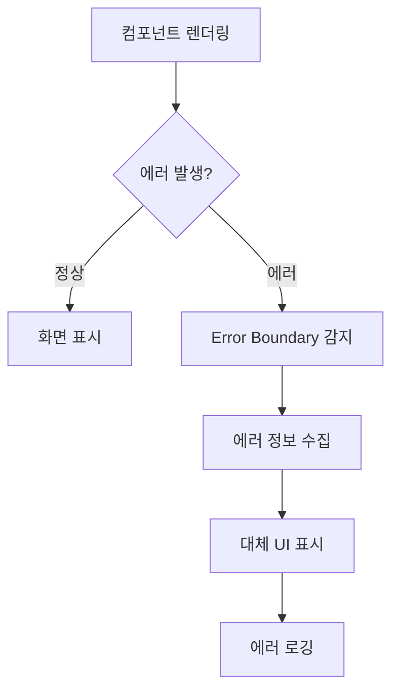

# 🛡️ React Error Boundary - 안전한 React 애플리케이션을 위한 에러 처리

## 🎯 Error Boundary란?

React Error Boundary는 React 애플리케이션에서 발생하는 JavaScript 에러를 포착하고 처리하는 특별한 컴포넌트다. 마치 건물의 스프링클러 시스템처럼, 화재(에러)가 발생했을 때 전체 건물(애플리케이션)이 불타버리는 것을 방지하고 피해를 최소화하는 역할을 한다.

React에서 컴포넌트 중 하나에서 에러가 발생하면, 기본적으로는 전체 애플리케이션이 중단되고 사용자에게는 빈 화면만 보여진다. 이는 마치 자동차의 한 부품이 고장났을 때 차 전체가 멈춰버리는 것과 같다. Error Boundary는 이런 상황을 방지하여 일부 기능에 문제가 있어도 나머지 부분은 정상적으로 작동할 수 있게 해준다.

## 🏗️ Error Boundary의 작동 원리

### **에러 감지 메커니즘**

Error Boundary는 React의 생명주기 메서드를 활용하여 하위 컴포넌트 트리에서 발생하는 에러를 감지한다. 이는 마치 부모가 자녀들을 돌보면서 누군가 다쳤을 때 즉시 알아차리고 응급처치를 하는 것과 비슷하다.

React는 컴포넌트가 렌더링되거나 생명주기 메서드가 실행될 때 발생하는 에러를 Error Boundary로 전달한다. 이때 Error Boundary는 에러 정보를 받아서 적절한 대응을 할 수 있다.

### **에러 격리와 복구**

Error Boundary의 핵심 기능은 에러를 격리하는 것이다. 하나의 컴포넌트에서 에러가 발생했을 때, 그 에러가 상위 컴포넌트나 형제 컴포넌트로 전파되는 것을 막는다. 이는 마치 배의 격벽처럼, 한 곳에 구멍이 나도 전체 배가 침몰하지 않도록 하는 역할이다.

에러가 감지되면 Error Boundary는 대체 UI를 보여준다. 이 대체 UI는 에러가 발생했다는 친근한 메시지일 수도 있고, 사용자가 다른 작업을 계속할 수 있도록 하는 기능적인 인터페이스일 수도 있다.

## 🔄 에러 처리 생명주기

Error Boundary는 React의 특별한 생명주기 메서드들을 사용하여 에러를 처리한다. 이 과정은 마치 의료진이 응급상황에 대응하는 절차와 유사하다.

### **에러 발견 단계**

컴포넌트에서 에러가 발생하면, React는 즉시 상위의 Error Boundary를 찾는다. 이는 마치 응급상황이 발생했을 때 가장 가까운 병원을 찾는 것과 같다. Error Boundary가 발견되면 에러 정보가 전달된다.

### **에러 분석 단계**

Error Boundary는 전달받은 에러 정보를 분석한다. 어떤 종류의 에러인지, 어디서 발생했는지, 얼마나 심각한지 등을 파악한다. 이 정보를 바탕으로 적절한 대응 방법을 결정한다.

### **대체 UI 표시**

에러 분석이 완료되면 Error Boundary는 문제가 있는 컴포넌트 대신 대체 UI를 표시한다. 이 UI는 사용자에게 현재 상황을 알리고, 가능한 경우 문제를 해결할 수 있는 방법을 제시한다.

### **에러 정보 기록**

마지막으로 Error Boundary는 에러 정보를 기록한다. 이는 나중에 개발자가 문제를 분석하고 수정할 수 있도록 도와준다. 로깅 시스템과 연계하여 에러 발생 패턴을 파악하고 예방 조치를 마련할 수 있다.



## 🛠️ Error Boundary가 처리할 수 있는 에러 유형

### **렌더링 에러**

가장 일반적인 에러 유형은 컴포넌트 렌더링 과정에서 발생하는 에러다. 예를 들어, 존재하지 않는 객체의 속성에 접근하려고 할 때나, 잘못된 타입의 데이터를 처리하려고 할 때 발생한다. 이는 마치 요리를 할 때 재료가 없는데 요리를 계속 진행하려고 하는 상황과 비슷하다.

### **생명주기 메서드 에러**

컴포넌트의 생명주기 메서드에서 발생하는 에러도 Error Boundary가 처리할 수 있다. componentDidMount, componentDidUpdate 등에서 발생하는 에러가 여기에 해당한다.

### **하위 컴포넌트 에러**

Error Boundary는 자신의 직접적인 자식 컴포넌트뿐만 아니라 전체 하위 컴포넌트 트리에서 발생하는 에러를 모두 포착할 수 있다. 이는 마치 보안 시스템이 건물 전체를 감시하는 것과 같다.

## ⚠️ Error Boundary의 한계

### **처리할 수 없는 에러 유형**

Error Boundary는 모든 종류의 에러를 처리할 수 있는 만능 해결책은 아니다. 비동기 코드에서 발생하는 에러, 이벤트 핸들러에서 발생하는 에러, Error Boundary 자체에서 발생하는 에러 등은 처리할 수 없다.

이는 마치 자동차의 에어백이 정면 충돌은 보호해주지만 측면 충돌이나 뒤쪽 충돌은 완전히 보호해주지 못하는 것과 같다. 따라서 Error Boundary와 함께 다른 에러 처리 메커니즘도 함께 사용해야 한다.

### **서버 사이드 렌더링 제한**

서버 사이드 렌더링 환경에서는 Error Boundary의 일부 기능이 제한될 수 있다. 클라이언트에서만 가능한 에러 처리 로직이 있기 때문이다.

## 📊 실무에서의 활용 전략

### **전략적 배치**

Error Boundary는 애플리케이션의 구조를 고려하여 전략적으로 배치해야 한다. 너무 상위에 배치하면 작은 에러에도 큰 부분이 영향을 받고, 너무 하위에 배치하면 에러 처리의 일관성이 떨어질 수 있다.

일반적으로 페이지 레벨, 주요 섹션 레벨, 그리고 중요한 컴포넌트 레벨에 Error Boundary를 배치하는 것이 좋다. 이는 마치 건물에 여러 층의 보안 시스템을 구축하는 것과 같다.

### **사용자 경험 고려**

Error Boundary가 보여주는 대체 UI는 사용자 경험을 고려해서 설계해야 한다. 단순히 "에러가 발생했습니다"라는 메시지만 보여주는 것이 아니라, 사용자가 할 수 있는 다음 행동을 안내해주는 것이 중요하다.

예를 들어, 페이지 새로고침 버튼을 제공하거나, 홈페이지로 돌아가는 링크를 제공하거나, 고객 지원팀에 문의할 수 있는 방법을 안내하는 것이 좋다.

### **모니터링과 분석**

Error Boundary에서 포착된 에러 정보는 단순히 기록하는 것으로 끝나지 않고, 체계적으로 분석해야 한다. 어떤 에러가 자주 발생하는지, 특정 브라우저나 기기에서만 발생하는 에러가 있는지, 사용자의 특정 행동 패턴과 관련이 있는지 등을 파악해야 한다.

이러한 분석을 통해 애플리케이션의 안정성을 지속적으로 개선할 수 있고, 사용자가 겪는 문제를 예방할 수 있다.

## 🔧 다른 에러 처리 방법과의 조화

### **전역 에러 핸들러와의 협력**

Error Boundary는 React 컴포넌트 내에서 발생하는 에러를 처리하지만, 전역 JavaScript 에러나 네트워크 에러 등은 별도의 처리가 필요하다. window.onerror나 window.addEventListener('unhandledrejection')과 같은 전역 에러 핸들러와 함께 사용하여 포괄적인 에러 처리 시스템을 구축할 수 있다.

### **로깅 시스템과의 통합**

Error Boundary에서 포착된 에러 정보는 Winston 같은 로깅 시스템과 연동하여 체계적으로 관리할 수 있다. 에러 발생 시점, 사용자 정보, 브라우저 정보, 에러 스택 트레이스 등을 함께 기록하여 나중에 분석할 수 있도록 한다.

### **사용자 피드백 시스템**

에러가 발생했을 때 사용자로부터 피드백을 받을 수 있는 시스템을 구축하는 것도 좋다. 사용자가 무엇을 하려고 했는지, 어떤 상황에서 에러가 발생했는지 등의 정보는 에러 해결에 큰 도움이 된다.

## 🚀 현대적인 Error Boundary 패턴

### **Hook 기반 Error Boundary**

최근에는 React Hook을 활용한 에러 처리 패턴도 등장하고 있다. react-error-boundary 같은 라이브러리를 사용하면 Hook을 통해 더 간편하게 에러 처리를 할 수 있다.

### **에러 복구 메커니즘**

단순히 에러를 표시하는 것을 넘어서, 에러에서 자동으로 복구할 수 있는 메커니즘을 구축하는 것도 가능하다. 예를 들어, 네트워크 에러가 발생했을 때 자동으로 재시도를 하거나, 캐시된 데이터를 사용하여 서비스를 계속 제공하는 것이다.

### **점진적 에러 처리**

모든 에러를 동일하게 처리하는 것이 아니라, 에러의 심각성에 따라 다르게 대응하는 점진적 에러 처리 방법도 있다. 경미한 에러는 토스트 알림으로만 알리고, 중간 정도의 에러는 일부 기능을 제한하며, 심각한 에러만 전체 UI를 교체하는 방식이다.

## 💡 Error Boundary 모범 사례

### **명확한 에러 메시지**

사용자에게 보여지는 에러 메시지는 명확하고 이해하기 쉬워야 한다. 기술적인 용어는 피하고, 사용자가 할 수 있는 구체적인 행동을 안내해야 한다.

### **에러 정보 수집**

개발자를 위한 에러 정보는 최대한 상세하게 수집해야 한다. 에러 스택 트레이스, 컴포넌트 트리 정보, 사용자 액션 히스토리, 브라우저 환경 정보 등을 포함해야 한다.

### **성능 고려**

Error Boundary 자체가 애플리케이션 성능에 부정적인 영향을 주어서는 안 된다. 에러 처리 로직은 효율적으로 작성되어야 하고, 불필요한 렌더링을 방지해야 한다.

Error Boundary는 React 애플리케이션의 안정성과 사용자 경험을 크게 향상시킬 수 있는 중요한 도구다. 올바르게 구현하고 활용한다면, 예상치 못한 에러가 발생하더라도 사용자는 계속해서 애플리케이션을 사용할 수 있고, 개발팀은 체계적으로 문제를 해결할 수 있다.

## 💡 기본 구현 예시

```typescript
class ErrorBoundary extends Component {
  constructor(props) {
    super(props);
    this.state = { hasError: false };
  }

  static getDerivedStateFromError(error) {
    return { hasError: true };
  }

  componentDidCatch(error, errorInfo) {
    console.error('에러 발생:', error, errorInfo);
  }

  render() {
    if (this.state.hasError) {
      return <h1>문제가 발생했습니다. 페이지를 새로고침해주세요.</h1>;
    }
    return this.props.children;
  }
}
``` 