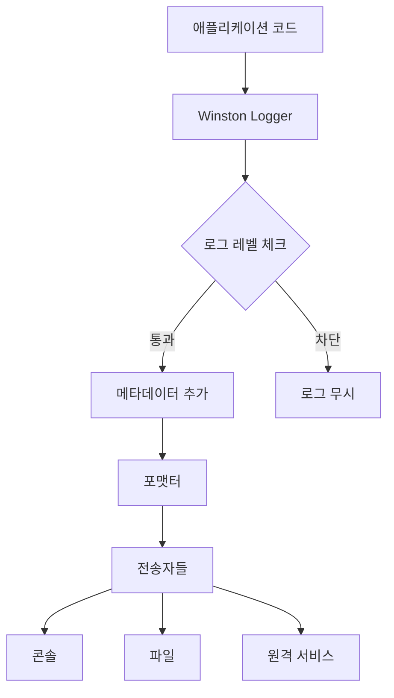

# 📝 Winston - Node.js 로깅 라이브러리 완전 가이드

## 🎯 Winston이란?

Winston은 Node.js 환경에서 가장 널리 사용되는 범용 로깅 라이브러리다. "Winston"이라는 이름은 영국의 유명한 정치가 윈스턴 처칠에서 따온 것으로, 마치 처칠이 중요한 역사를 기록했듯이 애플리케이션의 모든 중요한 사건들을 기록한다는 의미를 담고 있다.

로깅은 소프트웨어 개발에서 빼놓을 수 없는 핵심 요소다. 애플리케이션이 실행되는 동안 발생하는 모든 이벤트, 에러, 상태 변화 등을 체계적으로 기록함으로써 디버깅, 모니터링, 성능 분석을 가능하게 한다. Winston은 이러한 로깅 작업을 간편하면서도 강력하게 수행할 수 있도록 도와주는 도구다.

## 🏗️ Winston의 핵심 개념과 구조

### **로거(Logger)의 역할**

Winston의 중심에는 로거라는 개념이 있다. 로거는 마치 신문 기자처럼 애플리케이션에서 일어나는 모든 사건을 관찰하고 기록한다. 각 로그 메시지에는 중요도에 따라 레벨이 부여되며, 이를 통해 어떤 정보가 얼마나 중요한지를 구분할 수 있다.

로그 레벨은 일반적으로 다음과 같은 계층구조를 갖는다:
- **error**: 심각한 오류 상황
- **warn**: 경고성 메시지  
- **info**: 일반적인 정보
- **http**: HTTP 요청 관련 정보
- **verbose**: 상세한 정보
- **debug**: 디버깅용 정보
- **silly**: 매우 상세한 디버깅 정보

### **전송자(Transport)의 개념**

Winston의 독특한 점은 전송자라는 개념을 사용한다는 것이다. 전송자는 로그 메시지를 어디에, 어떤 방식으로 저장할지를 결정하는 출력 채널이다. 하나의 로거에 여러 개의 전송자를 연결할 수 있어, 같은 로그 메시지를 동시에 여러 곳에 저장할 수 있다.

예를 들어, 개발 중에는 콘솔에서 로그를 바로 확인하고 싶지만, 프로덕션 환경에서는 파일로 저장해서 나중에 분석하고 싶을 수 있다. Winston은 이런 요구사항을 전송자를 통해 유연하게 해결한다.

### **포맷터(Formatter)의 역할**

로그 메시지의 형태를 결정하는 것이 포맷터다. 로그를 단순한 텍스트로 출력할 수도 있고, JSON 형태로 구조화해서 저장할 수도 있다. 또한 타임스탬프를 추가하거나 색상을 입혀서 가독성을 높일 수도 있다.

포맷터는 로그 데이터를 받아서 최종적으로 출력될 문자열 형태로 변환하는 역할을 한다. 이를 통해 로그의 일관성을 유지하면서도 각 환경에 맞는 최적의 형태로 출력할 수 있다.

## 🔄 Winston의 작동 원리

Winston이 로그를 처리하는 과정은 마치 신문사의 뉴스 처리 과정과 비슷하다. 기자(로거)가 사건을 취재해서 기사를 작성하면, 편집자(포맷터)가 기사의 형태를 다듬고, 최종적으로 다양한 매체(전송자)를 통해 독자들에게 전달되는 것이다.

구체적인 과정을 살펴보면:

1. **로그 요청 수신**: 애플리케이션에서 특정 이벤트가 발생하면 Winston 로거에게 로그 기록 요청이 들어온다.

2. **레벨 검사**: 요청된 로그의 레벨이 현재 설정된 로그 레벨보다 중요한지 확인한다. 예를 들어, 로거가 'info' 레벨로 설정되어 있다면 'debug' 레벨의 로그는 무시된다.

3. **메타데이터 추가**: 타임스탬프, 서비스 이름, 요청 ID 등의 메타데이터가 로그 메시지에 추가된다.

4. **포맷팅**: 각 전송자에 설정된 포맷터가 로그 메시지를 최종 출력 형태로 변환한다.

5. **전송**: 설정된 모든 전송자를 통해 로그가 동시에 출력된다.



## 🚀 Winston의 장점과 특징

### **유연성과 확장성**

Winston의 가장 큰 장점은 유연성이다. 작은 애플리케이션에서는 간단한 콘솔 로깅만 사용하다가, 프로젝트가 커지면서 파일 로깅, 데이터베이스 로깅, 원격 로깅 서비스 등을 단계적으로 추가할 수 있다. 기존 코드를 거의 수정하지 않고도 로깅 방식을 확장할 수 있다는 것은 큰 매력이다.

### **비동기 처리**

Winston은 내부적으로 비동기 처리를 통해 로깅 작업이 애플리케이션의 성능에 미치는 영향을 최소화한다. 로그를 기록하는 동안 애플리케이션의 다른 작업이 멈추지 않으므로, 대용량 트래픽을 처리하는 서버에서도 안정적으로 사용할 수 있다.

### **에러 처리**

로깅 라이브러리 자체에서 에러가 발생하는 것은 매우 심각한 문제다. 디버깅을 위한 도구가 오히려 애플리케이션을 불안정하게 만들 수 있기 때문이다. Winston은 자체적으로 강력한 에러 처리 메커니즘을 갖추고 있어, 로깅 과정에서 문제가 발생해도 애플리케이션에 영향을 주지 않는다.

### **성능 최적화**

Winston은 로깅 성능을 위해 다양한 최적화 기법을 사용한다. 로그 레벨을 통한 조건부 처리, 버퍼링을 통한 I/O 최적화, 메모리 사용량 관리 등을 통해 높은 처리량을 달성한다.

## 📊 실무에서의 활용 시나리오

### **개발 환경에서의 디버깅**

개발 과정에서 Winston은 마치 현미경과 같은 역할을 한다. 코드의 실행 흐름을 추적하고, 변수의 값 변화를 관찰하며, 예상치 못한 동작의 원인을 파악할 수 있다. 특히 복잡한 비즈니스 로직이나 비동기 처리가 많은 애플리케이션에서는 Winston의 상세한 로깅이 없으면 디버깅이 매우 어려워진다.

### **프로덕션 모니터링**

실제 서비스가 운영되는 프로덕션 환경에서 Winston은 시스템의 건강상태를 진단하는 의사와 같은 역할을 한다. 에러 발생률, 응답 시간, 사용자 행동 패턴 등을 지속적으로 모니터링하여 문제를 조기에 발견하고 대응할 수 있게 해준다.

### **성능 분석과 최적화**

Winston의 로그 데이터는 성능 분석의 중요한 자료가 된다. 어떤 API가 가장 자주 호출되는지, 어떤 작업이 가장 많은 시간을 소요하는지, 병목 지점이 어디인지 등을 파악하여 시스템 최적화의 방향을 결정할 수 있다.

### **보안과 감사**

금융, 의료, 공공 서비스 등 보안이 중요한 영역에서는 모든 사용자 행동과 시스템 접근을 기록해야 한다. Winston은 이러한 감사 로그를 안전하고 신뢰할 수 있는 방식으로 관리할 수 있는 기능을 제공한다.

## ⚡ Winston과 다른 로깅 솔루션 비교

### **console.log와의 차이점**

많은 개발자들이 처음에는 간단한 `console.log`를 사용하지만, 이는 마치 메모장으로 중요한 문서를 작성하는 것과 같다. 기본적인 기능은 수행할 수 있지만, 전문적인 작업에는 한계가 있다.

`console.log`는 로그 레벨 구분이 없고, 파일 저장 기능이 없으며, 형태를 자유롭게 조정할 수 없다. 반면 Winston은 이 모든 것을 체계적으로 관리할 수 있는 완전한 도구다.

### **다른 Node.js 로깅 라이브러리와의 비교**

Bunyan, Pino 등 다른 로깅 라이브러리들도 각각의 장점이 있다. Pino는 성능에 특화되어 있고, Bunyan은 구조화된 로깅에 강점이 있다. 하지만 Winston은 이들 사이에서 균형잡힌 선택지로, 성능과 기능성을 모두 갖춘 종합적인 솔루션이다.

## 🛠️ 실제 구현에서의 고려사항

### **로그 레벨 설정 전략**

로그 레벨은 애플리케이션의 생명주기에 따라 동적으로 조정되어야 한다. 개발 초기에는 모든 디버그 정보가 필요하지만, 안정화 단계에서는 불필요한 로그가 오히려 방해가 될 수 있다. 환경변수나 설정 파일을 통해 로그 레벨을 유연하게 조정할 수 있도록 설계하는 것이 중요하다.

### **로그 파일 관리**

시간이 지나면서 로그 파일은 계속 커진다. 이를 관리하지 않으면 디스크 공간이 부족해지거나, 파일이 너무 커져서 분석이 어려워질 수 있다. Winston은 로그 로테이션 기능을 제공하여 이러한 문제를 해결한다.

### **민감한 정보 보호**

로그에는 종종 사용자의 개인정보나 시스템의 중요한 정보가 포함될 수 있다. Winston을 사용할 때는 이러한 민감한 정보가 로그에 기록되지 않도록 주의해야 하며, 필요한 경우 마스킹이나 암호화 등의 보호 조치를 적용해야 한다.

## 🔮 Winston의 미래와 발전 방향

Winston은 계속해서 발전하고 있는 프로젝트다. 최근에는 TypeScript 지원이 강화되었고, 클라우드 환경에 최적화된 기능들이 추가되고 있다. 또한 Kubernetes, Docker 등 컨테이너 환경에서의 로깅에 대한 지원도 지속적으로 개선되고 있다.

마이크로서비스 아키텍처가 일반화되면서 분산 로깅의 중요성이 더욱 커지고 있고, Winston도 이러한 트렌드에 맞춰 발전하고 있다. OpenTelemetry 같은 표준과의 통합, 실시간 로그 분석 지원 등이 앞으로의 주요 발전 방향이다.

## 🎯 Winston 도입 시 성공 요인

Winston을 성공적으로 도입하기 위해서는 기술적인 측면뿐만 아니라 조직적인 측면도 고려해야 한다. 개발팀 전체가 로깅의 중요성을 인식하고, 일관된 로깅 규칙을 따르는 것이 중요하다.

또한 로그 데이터를 단순히 저장하는 것으로 끝나지 않고, 이를 분석하고 활용할 수 있는 체계를 구축하는 것이 필요하다. Elasticsearch, Kibana 등의 도구와 연계하여 로그 데이터의 가치를 최대화할 수 있다.

Winston은 단순한 로깅 도구를 넘어서, 애플리케이션의 품질과 안정성을 향상시키는 핵심 인프라스트럭처의 역할을 한다. 올바르게 활용한다면 개발 생산성 향상, 장애 대응 시간 단축, 사용자 경험 개선 등 다양한 긍정적 효과를 얻을 수 있다.

## 💡 기본 사용법 예시

```typescript
import winston from 'winston';

const logger = winston.createLogger({
  level: 'info',
  format: winston.format.json(),
  transports: [
    new winston.transports.File({ filename: 'error.log', level: 'error' }),
    new winston.transports.Console()
  ]
});

// 사용법
logger.info('애플리케이션이 시작되었습니다');
logger.error('데이터베이스 연결 실패', { error: 'connection timeout' });
``` 