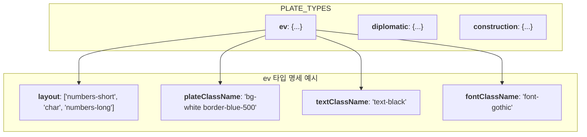

# LicensePlate 기술 명세서

이 문서는 `LicensePlate` 컴포넌트가 중앙 설정 객체를 기반으로 어떻게 다양한 종류의 번호판을 동적으로 렌더링하는지에 대한 내부 구현 방식을 설명합니다.

## 1. 아키텍처: 설정 객체 기반 렌더링

`LicensePlate` 컴포넌트는 모든 번호판의 속성(레이아웃, 스타일, 폰트 등)을 `PLATE_TYPES`라는 단일 설정 객체에서 관리합니다. 렌더링 시, `type` prop을 키(key)로 사용하여 이 객체에서 해당 번호판의 명세를 조회하고, 그에 따라 동적으로 컴포넌트를 생성합니다.

```mermaid
graph TD
    subgraph "입력 Props"
        A[type='ev']
    end
    subgraph "중앙 설정 객체"
        B[PLATE_TYPES]
    end
    subgraph "렌더링 로직"
        C["PLATE_TYPES[type] 조회"]
        D["조회된 명세에 따라<br/>스타일과 레이아웃 결정"]
    end
    subgraph "출력"
        E[전기차(ev) 번호판 UI]
    end

    A & B --> C --> D --> E
    style B fill:#e3f2fd, stroke:#333
```

이 아키텍처는 새로운 종류의 번호판을 추가할 때, `PLATE_TYPES` 객체에 새로운 명세를 추가하기만 하면 되므로 확장성이 매우 뛰어납니다.

## 2. `PLATE_TYPES` 객체 구조

`PLATE_TYPES` 객체는 각 번호판 타입(`type`)을 키로 가지며, 각 키는 해당 번호판의 모든 속성을 담고 있는 객체를 값으로 가집니다.



- `layout`: 번호판 내부의 텍스트 블록 순서와 종류를 정의합니다.
- `plateClassName`: 번호판 자체의 배경색, 테두리 등 스타일 클래스입니다.
- `textClassName`: 번호판 텍스트의 색상 스타일 클래스입니다.
- `fontClassName`: 해당 번호판에 사용될 폰트 스타일 클래스입니다.

## 3. 동적 레이아웃 렌더링

컴포넌트는 `layout` 배열을 순회하며, 각 요소의 이름에 해당하는 텍스트 블록을 동적으로 생성하여 최종 레이아웃을 완성합니다.

```mermaid
flowchart TD
    A[layout 배열 조회<br/>(e.g., ['region', 'serial'])] --> B{배열 순회 (map)};
    B --> C{"'region' 블록 렌더링"};
    C --> D{"'serial' 블록 렌더링"};
    D --> E[최종 번호판 HTML 구조 생성];
```

## 4. `status`에 따른 조건부 스타일링

`status` prop이 `unrecognized`로 설정되면, `cn` 유틸리티를 통해 조건부로 스타일 클래스를 추가하여 '미인식' 상태를 시각적으로 표현합니다.

- **`grayscale`**: 전체 번호판에 흑백 필터를 적용합니다.
- **`relative`**: '미인식' 워터마크를 `absolute`로 배치하기 위한 기준점을 설정합니다.
- **`after:*` 가상 요소**: Tailwind CSS의 `after` 유틸리티를 사용하여 '미인식' 텍스트를 담은 워터마크를 중앙에 오버레이로 생성합니다.
