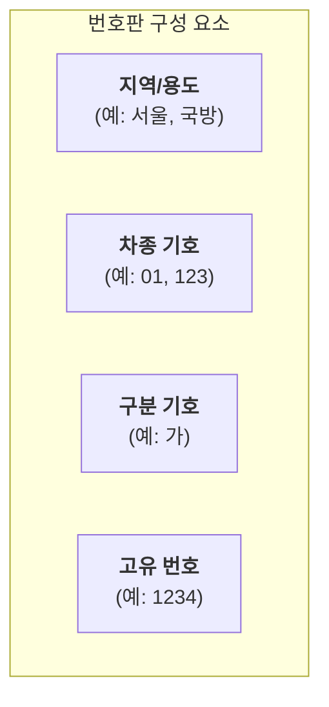

# LicensePlate 기능 명세서

`LicensePlate`는 다양한 종류의 대한민국 자동차 번호판을 시각적으로 정확하게 렌더링하는 컴포넌트입니다.

## 1. 컴포넌트 구조

번호판은 표시되는 정보에 따라 여러 부분으로 나뉩니다. 이 컴포넌트는 실제 번호판의 규격과 유사한 레이아웃으로 각 요소를 배치합니다.

## 2. 번호판 종류 (`type` prop)

`type` prop에 특정 값을 전달하여 다양한 종류의 번호판을 렌더링할 수 있습니다. 각 타입은 고유의 색상과 형식을 가집니다.

| `type` 값          | 예시 (시각적 표현)                                                                                                                | 설명                                 |
| :----------------- | :-------------------------------------------------------------------------------------------------------------------------------- | :----------------------------------- |
| `private` (기본값) | 12가 3456       | 일반 자가용 (흰색 바탕, 검은색 글씨) |
| `commercial`       | 서울아 1234  | 영업용 (노란색 바탕, 검은색 글씨)    |
| `ev`               | 123가 4567   | 전기차 (하늘색 테두리, 검은색 글씨)  |
| `diplomatic`       | 외교 001-001 | 외교용 (남색 바탕, 흰색 글씨)        |
| `construction`     | 01 서울 1234 | 건설기계 (주황색 바탕, 흰색 글씨)    |

_(더 많은 타입이 지원될 수 있습니다.)_

## 3. 번호판 상태 (`status` prop)

`status` prop을 사용하여 번호판의 인식 상태를 시각적으로 표현할 수 있습니다.

| `status` 값        | 설명                                                                                                |
| :----------------- | :-------------------------------------------------------------------------------------------------- |
| `default` (기본값) | 정상적으로 인식된 번호판을 표시합니다.                                                              |
| `unrecognized`     | '미인식' 워터마크가 표시되고, 전체적으로 회색 톤으로 처리되어 인식 실패 상태임을 명확히 보여줍니다. |

## 4. 주요 사용 시나리오

- **주차 관제 시스템**: 입/출차 차량의 번호판을 인식하여 화면에 시각적으로 표시합니다. 인식 실패 시 `unrecognized` 상태로 보여줍니다.
- **교통 단속 시스템**: 단속된 차량의 번호판 정보를 기록하고 화면에 표시할 때 사용합니다.
- **차량 관리 솔루션**: 등록된 차량 목록에서 각 차량의 번호판 종류와 번호를 시각적으로 구분하여 보여줍니다.
- **자동차 관련 교육 자료**: 다양한 번호판의 종류와 형식을 설명하는 교육용 콘텐츠에 활용됩니다.
