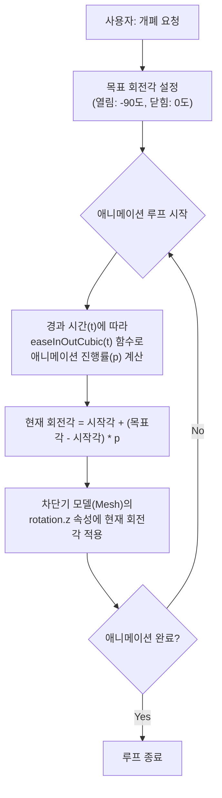
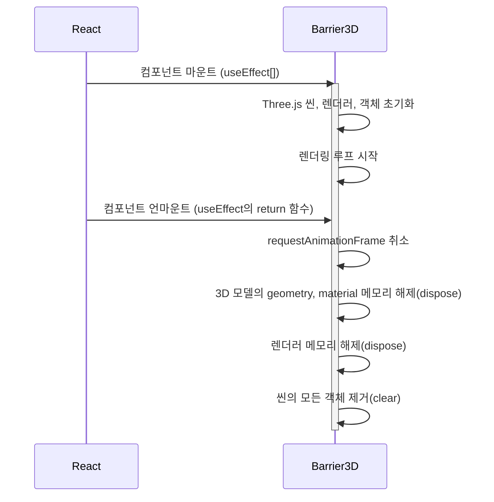

# Barrier3D 기술 명세서

이 문서는 `Three.js`를 직접 사용하여 구현된 `Barrier3D` 컴포넌트의 3D 씬 구성, 렌더링 루프, 애니메이션 시스템의 핵심 기술 원리를 설명합니다.

## 1. 3D 씬(Scene) 아키텍처

`Barrier3D`의 3D 공간은 `Three.js`의 기본적인 구성 요소들을 조합하여 만들어집니다.

```mermaid
graph TD
    subgraph "핵심 3요소"
        A[Scene<br/>(모든 3D 객체를 담는 가상 공간)]
        B[Camera<br/>(어디서, 어떻게 볼지 결정하는 시점)]
        C[Renderer<br/>(Scene을 Camera 시점으로<br/>실제 화면(Canvas)에 그리는 역할)]
    end

    subgraph "Scene 구성물"
        D["<b>Mesh (3D 모델)</b><br/>- Geometry (모양)<br/>- Material (재질/색상)"]
        E["<b>Light (조명)</b><br/>- AmbientLight (전역광)<br/>- DirectionalLight (직사광, 그림자 생성)"]
    end

    D & E --> A
    A & B --> C
```

`Renderer`는 매 프레임마다 `Scene`의 현재 상태를 `Camera`의 시점에서 계산하여 2D 이미지로 변환하고, 이를 브라우저의 `<canvas>` 요소에 그립니다.

## 2. 메인 렌더링 루프

부드러운 움직임을 만들기 위해, 컴포넌트는 `requestAnimationFrame`을 사용하여 매 프레임마다 렌더링을 반복하는 루프를 실행합니다.

```mermaid
flowchart TD
    Start --> A{requestAnimationFrame(loop)};
    A --> B[카메라 위치/각도 업데이트];
    B --> C[조명 등 다른 요소 업데이트];
    C --> D[renderer.render(scene, camera)];
    D --> A;
```

이 루프는 브라우저의 렌더링 주기에 맞춰 최적의 타이밍에 실행되므로, 60fps에 가까운 부드러운 사용자 경험을 제공합니다.

## 3. 개폐 애니메이션 로직

차단기의 개폐 애니메이션은 `GSAP`와 유사한 원리로, 목표 값(target value)과 이징(easing) 함수를 사용하여 구현됩니다.



`easeInOutCubic`과 같은 이징 함수는 애니메이션이 시작하고 끝날 때 가속/감속 효과를 주어 움직임을 훨씬 자연스럽게 만듭니다.

## 4. React 생명주기와 리소스 정리

Three.js는 WebGL 컨텍스트와 GPU 메모리를 직접 사용하므로, 컴포넌트가 사라질 때(unmount) 관련 리소스를 명시적으로 해제해주어야 메모리 누수를 막을 수 있습니다.



이러한 철저한 리소스 정리는 애플리케이션의 안정성과 성능 유지에 매우 중요합니다.
