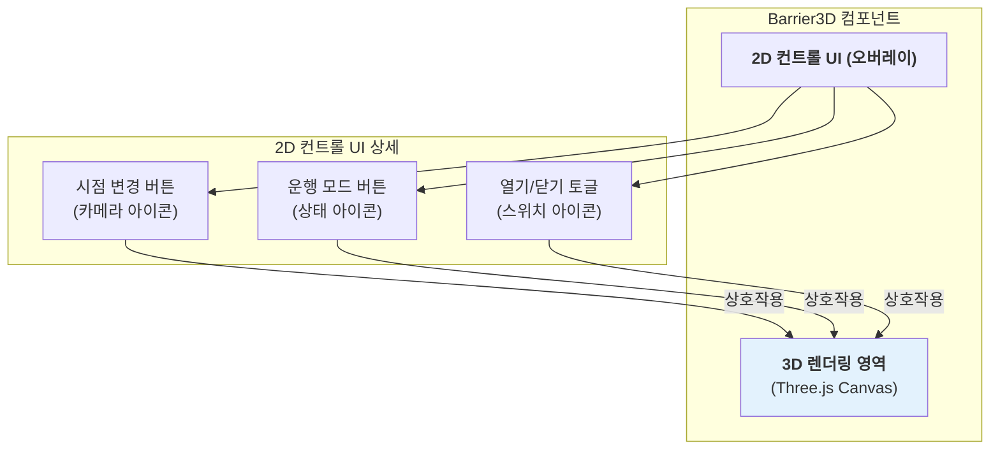
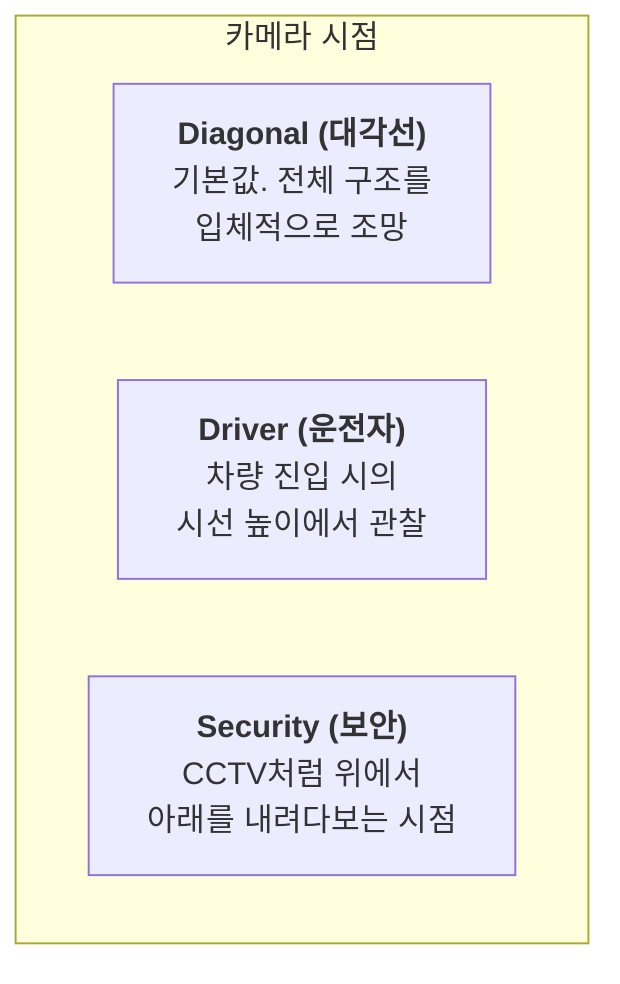
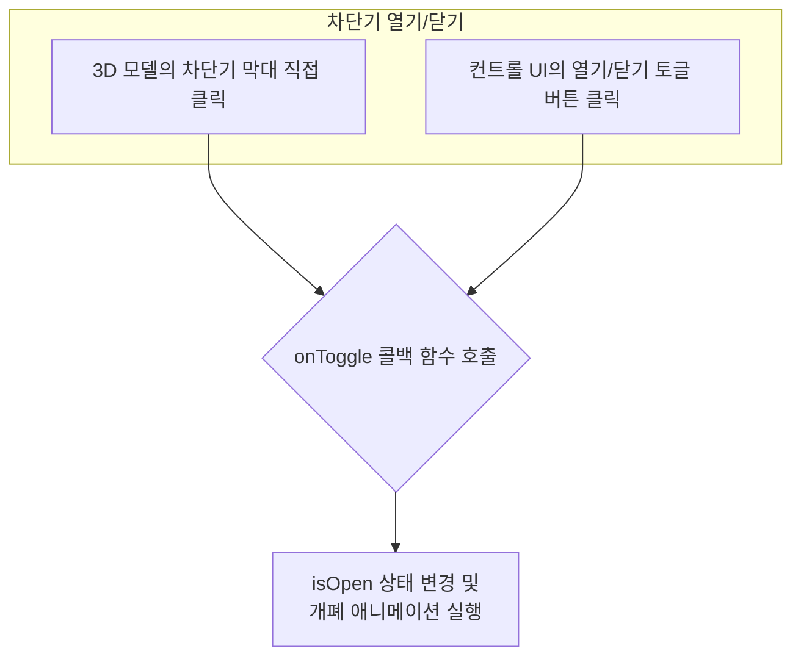

# Barrier3D 기능 명세서

`Barrier3D`는 Three.js를 기반으로 한 3D 주차장 차단기를 시뮬레이션하는 인터랙티브 컴포넌트입니다. 사용자는 다양한 시점에서 차단기를 관찰하고, 상태를 제어할 수 있습니다.

## 1. 인터페이스 구조

`Barrier3D` 컴포넌트는 3D 뷰와 이 뷰를 제어하는 2D 컨트롤 UI가 결합된 형태입니다.

## 2. 시점(View Angle) 옵션

사용자는 컨트롤 UI를 통해 세 가지 다른 카메라 시점에서 차단기를 관찰할 수 있습니다.

각 시점은 `viewAngle` prop을 통해 설정할 수 있으며, 사용자가 컨트롤 UI의 카메라 아이콘을 클릭할 때마다 순환됩니다.

## 3. 운행 모드(Operation Mode) 옵션

차단기는 세 가지 운행 모드를 가지며, 각 모드는 상태 아이콘과 색상으로 구분됩니다.

| 모드             | 아이콘 | 색상   | 설명                                                       |
| :--------------- | :----- | :----- | :--------------------------------------------------------- |
| `auto-operation` | 🔄     | 파란색 | **자동 운행**: 정상적인 개폐 동작 모드입니다.              |
| `always-open`    | ✅     | 초록색 | **상시 개방**: 항상 열려있는 상태를 유지합니다.            |
| `bypass`         | ⚡️    | 주황색 | **우회**: 비상 상황 등 특별한 경우의 수동 조작 모드입니다. |

`operationMode` prop으로 모드를 설정하며, 사용자가 컨트롤 UI의 상태 아이콘을 클릭하면 다음 모드로 순환됩니다.

## 4. 주요 상호작용

사용자는 두 가지 방법으로 차단기의 개폐 상태(`isOpen` prop)를 변경할 수 있습니다.

## 5. 주요 사용 시나리오

- **주차 관제 시스템**: 여러 주차장 입/출구의 차단기 상태를 대시보드에서 3D로 실시간 모니터링하고 원격으로 제어합니다.
- **보안 모니터링**: CCTV 화면과 함께 차단기의 3D 모델을 표시하여, 현재 운행 모드와 개폐 상태를 직관적으로 파악합니다.
- **시설 관리 시뮬레이터**: 관리자가 차단기를 다양한 시점과 모드로 전환해보며 유지보수나 비상 상황에 대비하는 훈련용으로 사용합니다.
- **스마트 빌딩 UI**: 빌딩 관리 시스템 내에서 주차장 설비의 하나로 포함되어, 다른 스마트 기기들과 연동되어 동작합니다.
