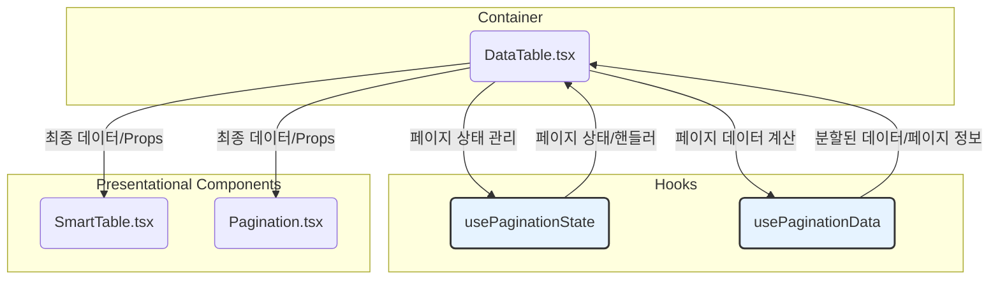
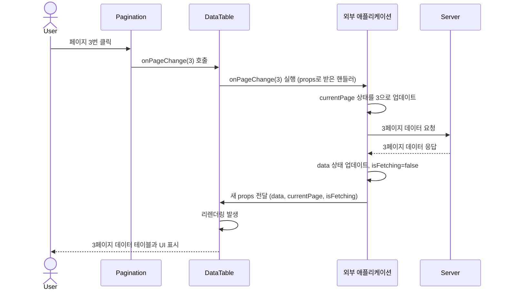
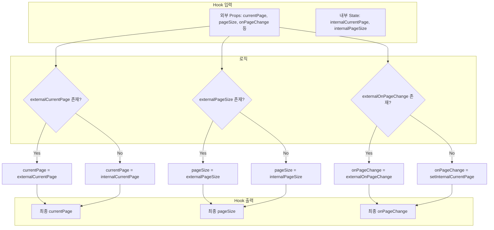
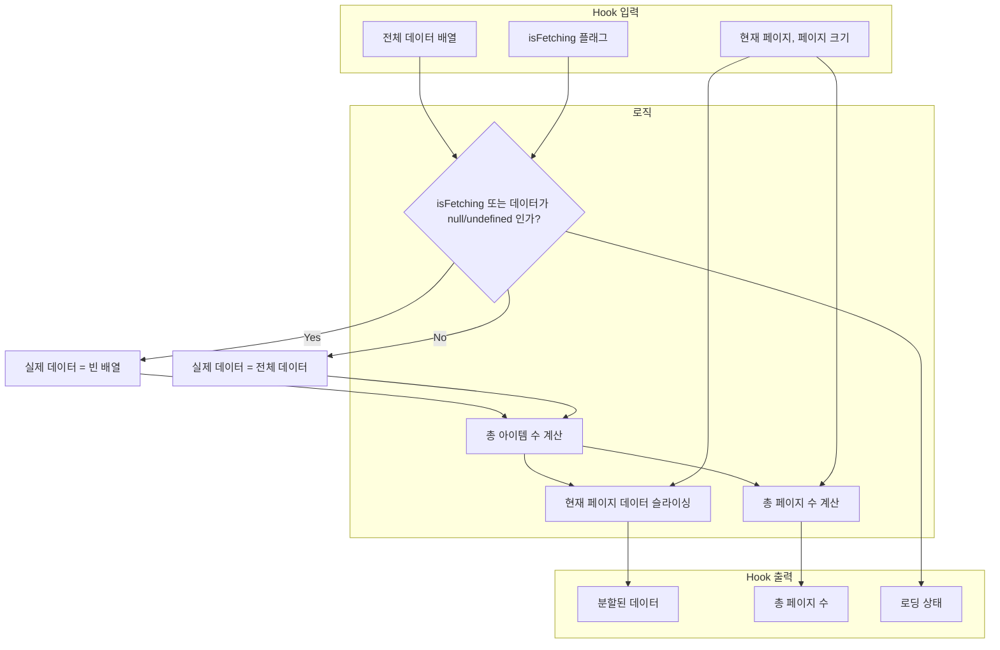

# DataTable 기술 명세

이 문서는 `DataTable` 컴포넌트의 내부 아키텍처와 핵심 로직을 설명하여 개발자가 컴포넌트를 깊이 이해하고 확장할 수 있도록 돕습니다.

## 1. 컴포넌트 아키텍처

`DataTable`은 **Container-Presentational 패턴**과 **커스텀 훅**을 활용하여 관심사를 분리합니다.

- **Container (`DataTable.tsx`)**: 데이터와 상태 로직을 조합하여 하위 컴포넌트에 전달하는 역할을 합니다.
- **Hooks (`usePaginationState`, `usePaginationData`)**: 상태 관리와 데이터 계산 로직을 캡슐화합니다.
- **Presentational (`SmartTable`, `Pagination`)**: 전달받은 데이터를 순수하게 UI로 렌더링하는 데 집중합니다.

## 2. 페이지 변경 시퀀스 다이어그램 (외부 제어 모드)

사용자가 페이지 번호를 클릭했을 때, 서버사이드 페이지네이션을 사용하는 경우의 내부 동작 순서는 다음과 같습니다.

## 3. 핵심 훅 로직 플로우차트

### 3.1. `usePaginationState` 로직

페이지 상태(현재 페이지, 페이지 크기)와 핸들러를 결정합니다. 외부에서 제어할 수 있는 '제어 컴포넌트' 패턴을 따릅니다.

### 3.2. `usePaginationData` 로직

전체 데이터 배열을 받아 현재 페이지에 해당하는 부분만 잘라내고, 총 페이지 수를 계산합니다.

