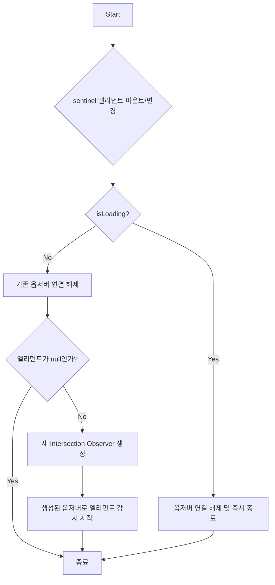

# InfiniteScroll 기술 명세

이 문서는 `InfiniteScroll` 컴포넌트의 핵심 기술인 `Intersection Observer`의 설정 및 동작 원리를 다이어그램 중심으로 설명합니다.

## 1. Intersection Observer 초기화 및 관리 플로우

`InfiniteScroll`은 `useRef`와 `useCallback`을 사용하여 `Intersection Observer` 인스턴스를 관리합니다. `sentinelRef` 콜백은 감시 대상 엘리먼트가 DOM에 마운트되거나 언마운트될 때 실행되며, `isLoading` 상태에 따라 옵저버의 연결을 제어합니다.



## 2. 데이터 로딩 트리거 로직

`Intersection Observer`가 생성될 때, 뷰포트와의 교차 상태가 변경되면 실행될 콜백 함수가 등록됩니다. 이 콜백 함수가 `loadMore` 함수 호출을 결정합니다.

```mermaid
flowchart TD
    Start[옵저버 콜백 실행] --> A{교차 상태(isIntersecting)가 true인가?};
    A -- "Yes" --> B{hasMore가 true인가?};
    A -- "No" --> End;
    B -- "Yes" --> C[loadMore() 함수 호출];
    B -- "No" --> End;
    C --> End;
```

## 3. 컴포넌트 구조

`InfiniteScroll` 컴포넌트는 `children`으로 받은 콘텐츠 목록과, 그 아래에 위치한 `sentinel` 및 상태 표시 영역으로 구성됩니다.

```mermaid
graph TD
    subgraph "InfiniteScroll"
        A[children]
        B(Sentinel & 상태 표시 영역)
    end

    A --> B

    subgraph "Sentinel & 상태 표시 영역"
        C(감시 대상 ref<br/>sentinelRef)
        D{상태에 따른 UI<br/>(로딩, 더 보기, 끝)}
    end

    B --> C & D

    style A fill:#f9f9f9
    style B fill:#f0f8ff
```
