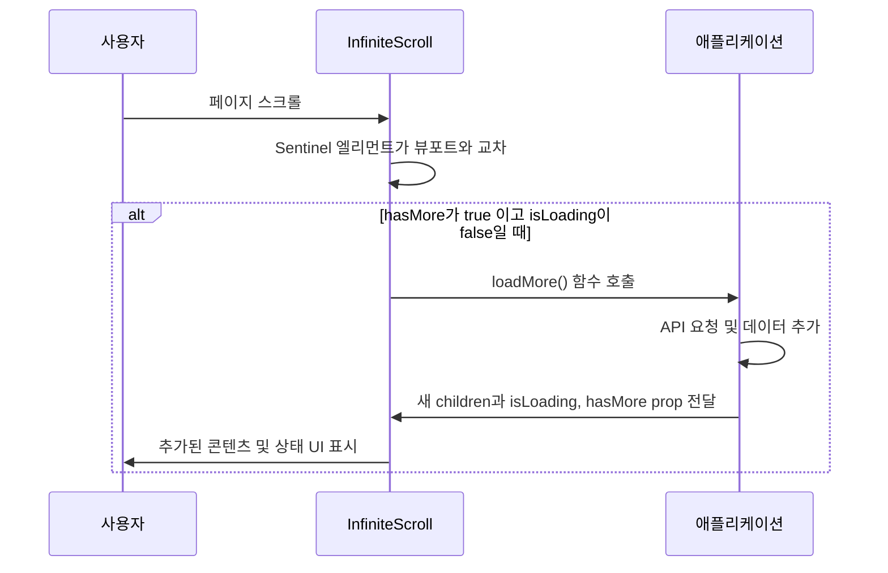
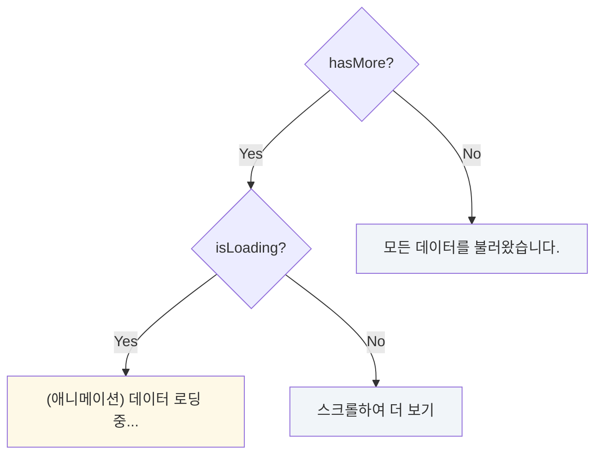

# InfiniteScroll 컴포넌트

`InfiniteScroll`은 사용자가 페이지 하단에 도달했을 때 자동으로 추가 데이터를 불러오는 기능을 구현하는 컴포넌트입니다. `Intersection Observer` API를 기반으로 효율적으로 동작하며, 사용자에게 끊김 없는 콘텐츠 탐색 경험을 제공합니다.

## 주요 기능

- **자동 데이터 로딩**: 스크롤이 특정 지점(sentinel)에 도달하면 `loadMore` 콜백 함수를 실행하여 다음 페이지의 데이터를 요청합니다.
- **상태 기반 UI**: `isLoading`, `hasMore` prop을 통해 현재 상태(로딩 중, 추가 데이터 있음, 모든 데이터 로드 완료)를 시각적으로 명확하게 표시합니다.
- **효율적인 감지**: `Intersection Observer`를 사용하여 불필요한 스크롤 이벤트 리스너 없이 성능 저하를 최소화합니다.
- **유연한 콘텐츠**: `children` prop으로 어떤 종류의 콘텐츠 목록이든 감싸서 사용할 수 있습니다.

## 동작 원리

`InfiniteScroll`은 `children`으로 전달된 콘텐츠 목록 아래에 보이지 않는 '감시 대상(sentinel)' 엘리먼트를 둡니다. 이 엘리먼트가 화면에 나타나는 시점을 `Intersection Observer`가 감지하여 `loadMore` 함수를 트리거합니다.

## 상태별 UI

컴포넌트는 `hasMore`와 `isLoading` prop의 조합에 따라 하단에 다른 UI를 렌더링합니다.

## 사용 시나리오

`InfiniteScroll`은 외부에서 데이터 로딩 로직과 상태(`isLoading`, `hasMore`, `items` 배열 등)를 관리하고, 이 컴포넌트는 해당 상태를 UI로 표현하고 다음 데이터 로딩을 트리거하는 역할만 담당합니다.

예를 들어, 게시물 목록, 상품 목록, 댓글 목록 등 사용자의 스크롤 액션에 따라 계속해서 새로운 데이터를 보여줘야 하는 모든 곳에 적용할 수 있습니다.
