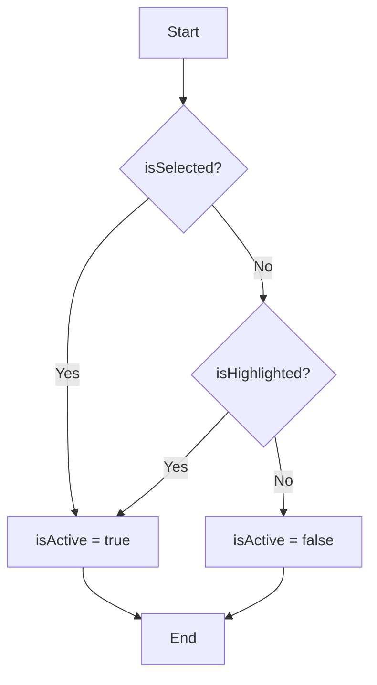
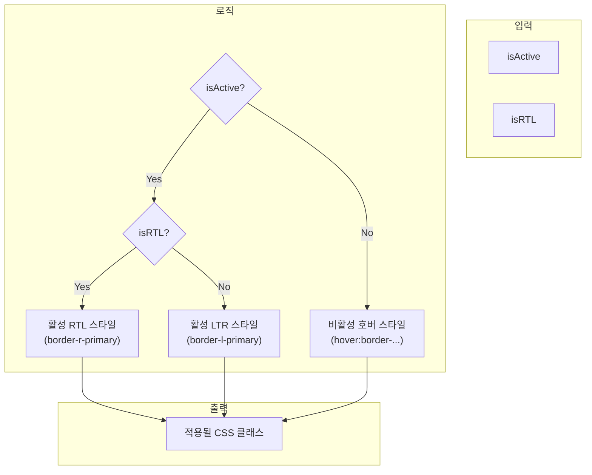
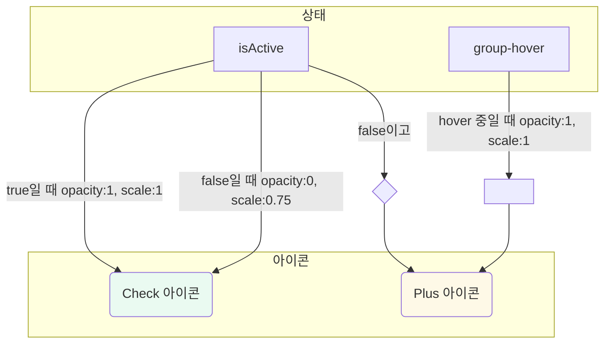

# ListHighlightMarker 기술 명세

이 문서는 `ListHighlightMarker` 컴포넌트의 내부 로직과 상태에 따른 동적 스타일링 방식을 다이어그램 중심으로 설명합니다.

## 1. 활성 상태(`isActive`) 결정 로직

컴포넌트의 `isActive` 상태는 `isSelected` 또는 `isHighlighted` prop 중 하나라도 `true`이면 `true`로 결정됩니다. 이 상태는 대부분의 조건부 스타일링에 사용됩니다.

## 2. 테두리 스타일(`getBorderClass`) 결정 플로우

호버 및 활성 상태에 적용되는 왼쪽/오른쪽 테두리 스타일은 `isActive` 상태와 `isRTL` 상태를 조합하여 결정됩니다.

## 3. 동적 아이콘 렌더링 로직

컴포넌트 우측의 아이콘은 `isActive` 상태와 CSS의 `group-hover`를 이용하여 두 아이콘(`Plus`, `Check`)의 투명도(opacity)와 크기(scale)를 조절하는 방식으로 전환됩니다.

