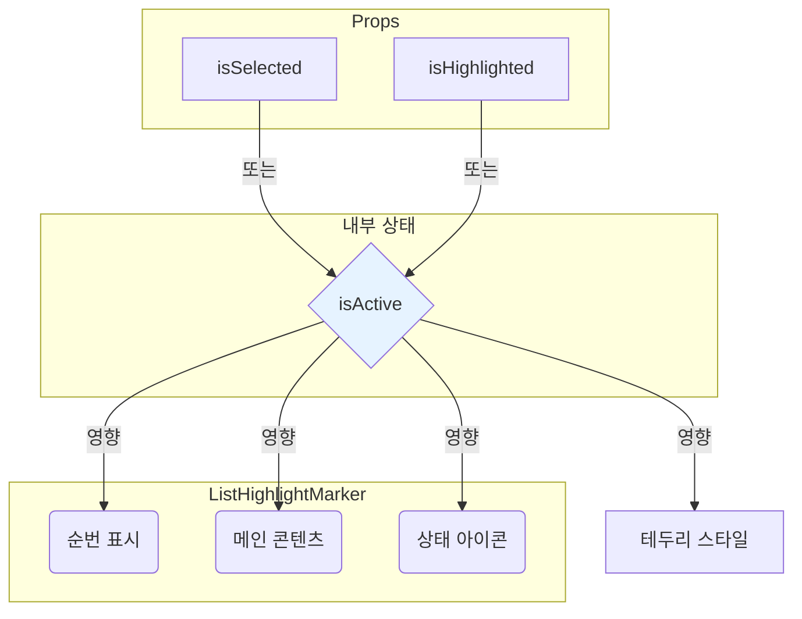
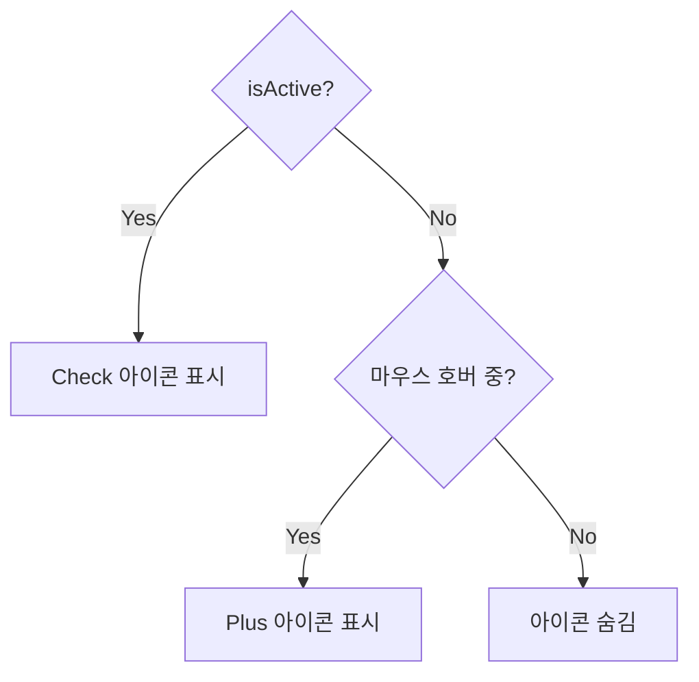

# ListHighlightMarker 컴포넌트

`ListHighlightMarker`는 목록의 개별 항목을 시각적으로 표현하는 데 사용되는 컴포넌트입니다. 사용자의 상호작용(클릭, 키보드 탐색)에 따라 다양한 상태(선택, 하이라이트, 비활성화)를 명확하게 보여주어, 인터랙티브한 리스트 UI를 쉽게 구현할 수 있도록 돕습니다.

## 주요 기능

- **다중 상태 시각화**: `isSelected`, `isHighlighted`, `disabled` prop을 통해 각 항목의 상태를 직관적으로 표현합니다.
- **인터랙티브한 피드백**: 마우스를 올렸을 때와 항목이 활성화(선택 또는 하이라이트)되었을 때 서로 다른 시각적 효과(아이콘, 색상, 테두리)를 제공합니다.
- **동적 아이콘**: 항목의 활성 상태와 호버 상태에 따라 `Plus` 아이콘과 `Check` 아이콘이 동적으로 전환됩니다.
- **RTL 지원**: 오른쪽에서 왼쪽으로 읽는 언어 환경에서도 하이라이트 마커와 같은 시각적 요소가 올바르게 표시됩니다.
- **유연한 콘텐츠**: `children` prop을 통해 항목 내부에 어떤 내용이든 자유롭게 구성할 수 있습니다.

## 컴포넌트 구조 및 상태

`ListHighlightMarker`는 순번, 메인 콘텐츠, 상태 아이콘의 세 부분으로 구성됩니다. `isSelected`와 `isHighlighted` prop은 컴포넌트의 `isActive` 상태를 결정하며, 이는 대부분의 시각적 스타일에 영향을 줍니다.

## 아이콘 전환 로직

오른쪽에 표시되는 아이콘은 `isActive` 상태와 `group-hover`(마우스 호버) 상태의 조합에 따라 결정됩니다.

## 사용 시나리오

사이드바 메뉴, 검색 결과 목록, 선택 가능한 옵션 리스트 등 사용자의 선택이나 키보드 탐색에 따라 특정 항목을 강조해야 하는 모든 UI에 적용할 수 있습니다. 예를 들어, 키보드 위아래 방향키로 목록을 탐색할 때는 `isHighlighted` 상태를, 특정 항목을 클릭하거나 선택했을 때는 `isSelected` 상태를 제어하여 사용자에게 명확한 피드백을 제공합니다.
