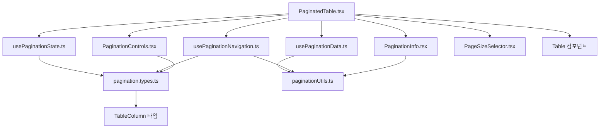

# Pagination 컴포넌트 구조 문서

## 📋 개요

이 디렉토리는 테이블과 페이지네이션을 통합한 컴포넌트들을 포함합니다. 
단일 책임 원칙에 따라 리팩토링되어 가독성, 재사용성, 유지보수성이 크게 향상되었습니다.

## 📁 파일 구조

```
src/components/ui/pagination/
├── README.md                   # 이 문서
├── Pagination.tsx              # 기존 컴포넌트 (유지)
├── PaginatedTable.tsx          # 새로운 메인 컴포넌트
├── pagination.types.ts         # 타입 정의
├── paginationUtils.ts          # 유틸리티 함수
├── usePaginationState.ts       # 상태 관리 훅
├── usePaginationData.ts        # 데이터 처리 훅  
├── usePaginationNavigation.ts  # 네비게이션 훅
├── PaginationInfo.tsx          # 정보 표시 컴포넌트
├── PaginationControls.tsx      # 네비게이션 버튼
└── PageSizeSelector.tsx        # 페이지 크기 선택
```

## 🎯 각 파일 설명

### 📄 **PaginatedTable.tsx** (메인 컴포넌트)
- **역할**: 모든 하위 컴포넌트와 훅을 조합한 메인 컴포넌트
- **크기**: ~100줄 (기존 248줄에서 대폭 축소)
- **의존성**: 모든 하위 파일들을 import

### 📄 **pagination.types.ts** (타입 정의)
- **역할**: 모든 TypeScript 타입과 인터페이스 정의
- **포함**: PaginationConfig, PaginationState, PaginationHandlers 등
- **의존성**: TableColumn 타입만 import

### 📄 **paginationUtils.ts** (유틸리티 함수)
- **역할**: 페이지네이션 계산 로직 (순수 함수들)
- **포함**: 페이지 그룹 계산, 데이터 슬라이싱, 범위 계산 등
- **의존성**: 없음 (순수 함수)

### 📄 **usePaginationState.ts** (상태 관리 훅)
- **역할**: 내부/외부 상태 관리 로직
- **크기**: ~40줄
- **의존성**: pagination.types.ts

### 📄 **usePaginationData.ts** (데이터 처리 훅)
- **역할**: 데이터 슬라이싱, 로딩 상태 처리
- **크기**: ~45줄
- **의존성**: paginationUtils.ts

### 📄 **usePaginationNavigation.ts** (네비게이션 훅)
- **역할**: 페이지 이동 로직과 핸들러
- **크기**: ~60줄
- **의존성**: paginationUtils.ts, pagination.types.ts

### 📄 **PaginationInfo.tsx** (정보 표시)
- **역할**: "총 X개 중 Y-Z개 표시" 정보 렌더링
- **크기**: ~25줄
- **의존성**: paginationUtils.ts

### 📄 **PaginationControls.tsx** (네비게이션 버튼)
- **역할**: 페이지 이동 버튼들 (첫/이전/다음/마지막 페이지)
- **크기**: ~80줄
- **의존성**: pagination.types.ts

### 📄 **PageSizeSelector.tsx** (페이지 크기 선택)
- **역할**: 페이지당 항목 수 선택 드롭다운
- **크기**: ~50줄
- **의존성**: 없음

## 🔄 의존성 관계



## 🚀 사용 방법

### 기본 사용법 (내부 상태 관리)
```tsx
import PaginatedTable from '@/components/ui/pagination/PaginatedTable';

<PaginatedTable
  data={userData}
  columns={columns}
  pageSize={10}
  itemName="사용자"
/>
```

### 외부 상태 관리
```tsx
<PaginatedTable
  data={userData}
  columns={columns}
  currentPage={currentPage}
  pageSize={pageSize}
  onPageChange={handlePageChange}
  onPageSizeChange={handlePageSizeChange}
  itemName="사용자"
/>
```

### 로딩 상태
```tsx
<PaginatedTable
  data={userData}
  columns={columns}
  isFetching={isFetching}
  pageSize={10}
/>
```

### 개별 훅 사용 (고급)
```tsx
import { usePaginationState } from '@/components/ui/pagination/usePaginationState';
import { usePaginationData } from '@/components/ui/pagination/usePaginationData';

const MyComponent = () => {
  const paginationState = usePaginationState({ defaultPageSize: 15 });
  const paginationData = usePaginationData({ 
    data: myData, 
    ...paginationState 
  });
  
  // 커스텀 UI 구성 가능
};
```

## ✨ 리팩토링 효과

### Before (Pagination.tsx)
- **크기**: 248줄
- **책임**: 상태관리 + 데이터처리 + UI렌더링 + 네비게이션 로직
- **재사용성**: 낮음
- **테스트**: 어려움

### After (분할된 구조)
- **크기**: 각 파일 25-100줄
- **책임**: 단일 책임 원칙 준수
- **재사용성**: 높음 (개별 훅/컴포넌트 사용 가능)
- **테스트**: 쉬움 (단위 테스트 가능)

## 🔧 개발 가이드

### 새로운 기능 추가 시
1. **유틸리티 함수**: `paginationUtils.ts`에 추가
2. **타입**: `pagination.types.ts`에 정의
3. **상태 로직**: 적절한 훅에 추가
4. **UI 로직**: 해당 컴포넌트에 추가

### 버그 수정 시
1. 문제 영역 파악 (상태/데이터/UI/네비게이션)
2. 해당 파일에서만 수정
3. 영향 범위 최소화

### 테스트 작성 시
```tsx
// 개별 훅 테스트
import { renderHook } from '@testing-library/react-hooks';
import { usePaginationState } from './usePaginationState';

test('페이지네이션 상태 관리', () => {
  const { result } = renderHook(() => usePaginationState());
  // 테스트 로직
});
```

## 📝 마이그레이션 가이드

### 기존 Pagination에서 PaginatedTable로
```tsx
// Before
import Pagination from '@/components/ui/pagination/Pagination';

// After  
import PaginatedTable from '@/components/ui/pagination/PaginatedTable';
```

**Props는 동일하므로 import만 변경하면 됩니다.**

## 🎨 디자인 시스템 준수

- **뉴모피즘 스타일**: `neu-raised`, `neu-flat` 클래스 사용
- **일관된 색상**: CSS 변수 기반 색상 시스템
- **접근성**: ARIA 라벨과 시맨틱 HTML 구조

## 📈 성능 최적화

- **useMemo**: 계산 비용이 큰 로직 메모이제이션
- **의존성 최적화**: 불필요한 리렌더링 방지
- **코드 분할**: 각 컴포넌트 독립적 로드 가능

---

**📞 문의**: 리팩토링 관련 질문이나 개선 제안은 개발팀에 문의해 주세요. 