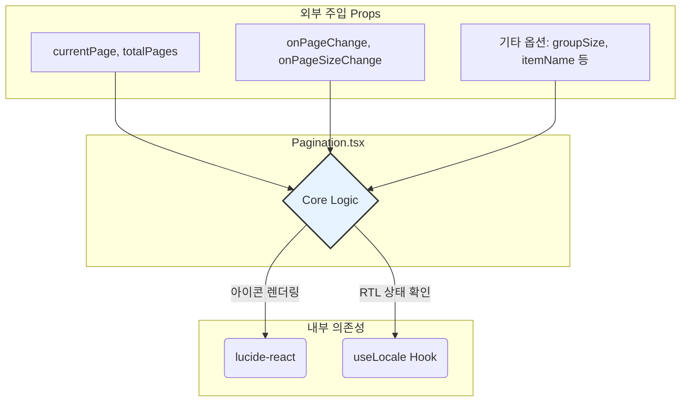

# Pagination 기술 명세

이 문서는 `Pagination` 컴포넌트의 내부 구조와 주요 로직을 설명하여 개발자가 컴포넌트를 이해하고 활용하는 데 도움을 줍니다.

## 1. 컴포넌트 의존성

`Pagination` 컴포넌트는 외부 상태와 핸들러를 Props로 주입받아 동작하는 프레젠테이셔널 컴포넌트입니다. 내부적으로는 UI 아이콘과 다국어 처리를 위해 `lucide-react`와 `useLocale` 훅에 의존합니다.



## 2. 페이지 번호 그룹 생성 플로우차트

`Pagination` 컴포넌트는 `currentPage`와 `groupSize`를 기반으로 사용자에게 보여줄 페이지 번호 배열을 동적으로 계산합니다.

```mermaid
flowchart TD
    S[Start] --> I{입력: currentPage, totalPages, groupSize};
    I --> P1{currentGroup = 천장(currentPage / groupSize)};
    P1 --> P2{startPage = (currentGroup - 1) * groupSize + 1};
    P2 --> P3{endPage = 최소값(startPage + groupSize - 1, totalPages)};
    P3 --> P4[pageNumbers 배열 초기화];
    P4 --> L1{i = startPage};
    L1 --> C1{i <= endPage 인가?};
    C1 -- "Yes" --> E1{pageNumbers에 i 추가};
    E1 --> F1{i++};
    F1 --> C1;
    C1 -- "No" --> G1[페이지 버튼 렌더링];
    G1 --> End;
```

## 3. 페이지 이동 로직 플로우차트 (다음 그룹)

'다음 그룹' 버튼 클릭 시, 현재 페이지 그룹의 마지막 페이지(`endPage`)가 전체 페이지 수(`totalPages`)보다 작은 경우에만 페이지 이동이 발생합니다.

```mermaid
flowchart TD
    S[Start: '다음 그룹' 클릭] --> C{endPage < totalPages 인가?};
    C -- "Yes" --> P{nextGroupFirstPage = endPage + 1};
    P --> A[onPageChange(nextGroupFirstPage) 호출];
    A --> E[End];
    C -- "No" --> E;
```
