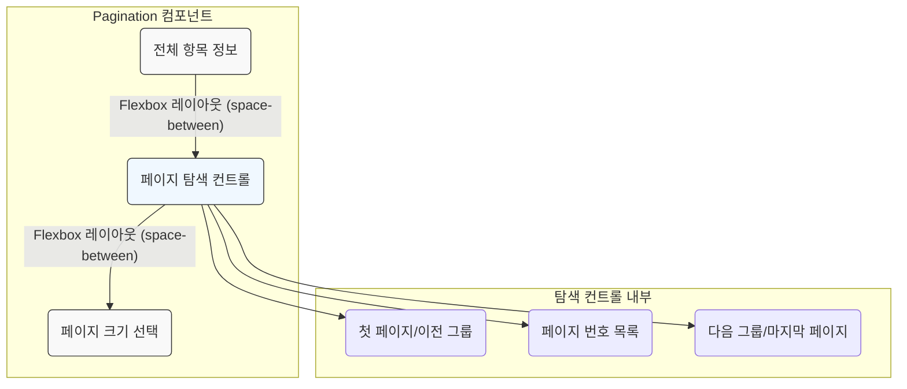

# Pagination 컴포넌트

`Pagination`은 데이터 목록의 페이지를 탐색하기 위한 컨트롤 UI를 제공하는 순수 프레젠테이셔널 컴포넌트입니다. 자체적으로 페이지 상태를 관리하지 않으며, 모든 상태와 동작은 외부로부터 props를 통해 제어됩니다.

## 주요 기능

- **제어 컴포넌트**: 현재 페이지, 전체 페이지 수, 페이지 변경 핸들러 등을 모두 외부에서 주입받아 동작합니다.
- **페이지 그룹핑**: `groupSize` prop을 통해 많은 페이지 번호를 그룹 단위로 묶어서 보여줄 수 있습니다.
- **포괄적인 탐색**: 첫 페이지, 이전/다음 그룹, 마지막 페이지로 빠르게 이동할 수 있는 컨트롤을 제공합니다.
- **페이지 크기 조절**: 페이지당 표시할 항목 수를 사용자가 직접 선택할 수 있는 UI를 옵션으로 제공합니다. (`onPageSizeChange` prop 제공 시)
- **RTL 지원**: 아랍어와 같이 오른쪽에서 왼쪽으로 읽는 언어 환경을 자동으로 지원합니다.
- **상세 정보 표시**: `totalItems` prop이 제공되면 "총 X개의 항목 중 Y-Z개 표시"와 같은 상세 정보를 보여줍니다.

## 컴포넌트 구조

`Pagination` 컴포넌트는 크게 3개의 주요 영역으로 구성됩니다.

## 사용 시나리오

`Pagination` 컴포넌트는 UI 렌더링에만 집중함으로써 재사용성을 높이고, 애플리케이션의 상태 관리 로직과 명확하게 분리됩니다.

일반적으로 상위 컴포넌트나 `usePaginationState` 같은 커스텀 훅을 통해 페이지 상태(`currentPage`, `totalPages` 등)와 상태 변경 함수(`onPageChange`)를 전달받아 사용합니다. 예를 들어, `DataTable` 컴포넌트는 내부적으로 `Pagination`을 사용하여 페이지네이션 UI를 렌더링하며, 필요한 모든 props를 계산하고 주입하는 역할을 담당합니다.
