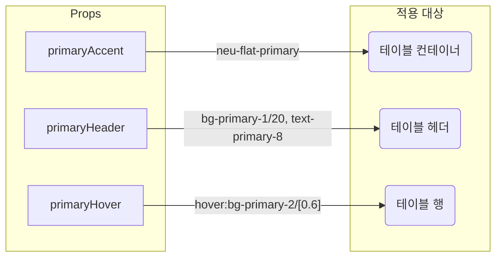
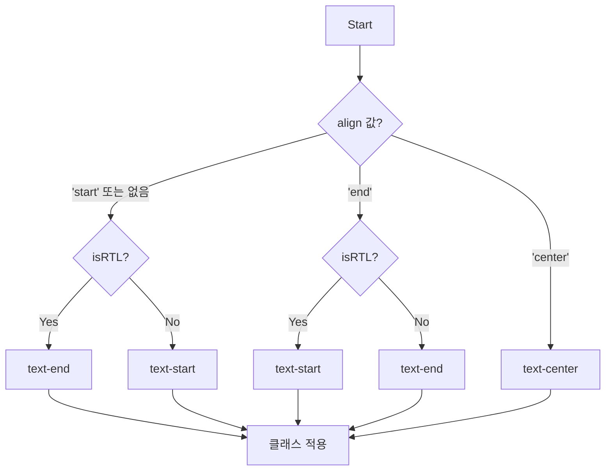

# SmartTable 기술 명세

이 문서는 `SmartTable` 컴포넌트의 내부 렌더링 로직과 주요 결정 과정을 다이어그램 중심으로 설명하여, 개발자가 컴포넌트의 동작 방식을 시각적으로 이해할 수 있도록 돕습니다.

## 1. 테이블 Body 렌더링 플로우

테이블의 `<tbody>`를 렌더링하는 로직은 `isFetching`과 `data` 배열의 길이를 기준으로 분기됩니다.

```mermaid
flowchart TD
    Start --> A{isLoading? (isFetching 또는 data가 null)};
    A -- "Yes" --> B[스켈레톤 로딩 행 생성<br/>createLoadingRows()];
    A -- "No" --> C{actualData.length === 0?};
    C -- "Yes" --> D['데이터 없음' 메시지 표시];
    C -- "No" --> E[데이터 행 반복 렌더링<br/>actualData.map(...)];
    B --> End;
    D --> End;
    E --> End;

    style B fill:#fef9e7
    style D fill:#fdebd0
    style E fill:#eafaf1
```

## 2. 셀(Cell) 콘텐츠 렌더링 우선순위

각 `<td>` 엘리먼트의 콘텐츠는 `SmartTableColumn`에 정의된 `cell`, `render`, `key` prop에 따라 다음 우선순위로 결정됩니다.

```mermaid
graph TD
    A[셀 렌더링 시작] --> B{column.cell 제공?};
    B -- "Yes" --> C[column.cell(item, index) 실행 결과];
    B -- "No" --> D{column.render 제공?};
    D -- "Yes" --> E[column.render(value, item, index) 실행 결과];
    D -- "No" --> F{column.key 제공?};
    F -- "Yes" --> G[item[column.key] 값 표시];
    F -- "No" --> H[빈 문자열];
    C --> Z[렌더링 완료];
    E --> Z;
    G --> Z;
    H --> Z;

    style C fill:#eafaf1
    style E fill:#eafaf1
    style G fill:#eafaf1
```

## 3. 스타일링 테마 적용

`primaryAccent`, `primaryHeader`, `primaryHover`와 같은 boolean props는 조건부로 특정 CSS 클래스를 적용하여 테이블의 외관을 변경합니다.



## 4. 텍스트 정렬 로직 (RTL 지원)

셀과 헤더의 텍스트 정렬은 `align` prop 값과 `isRTL` 상태를 조합하여 결정됩니다.


