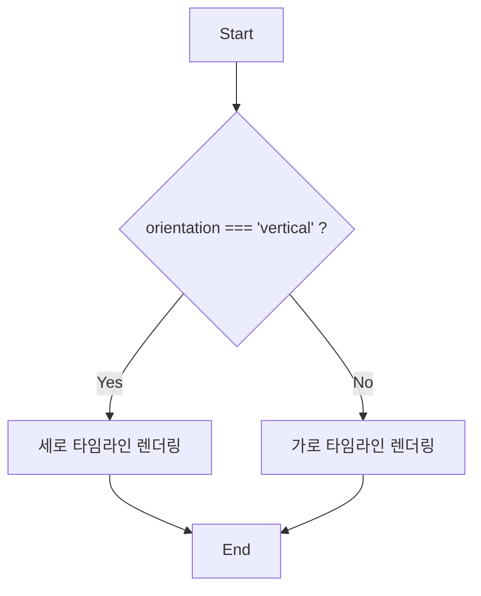
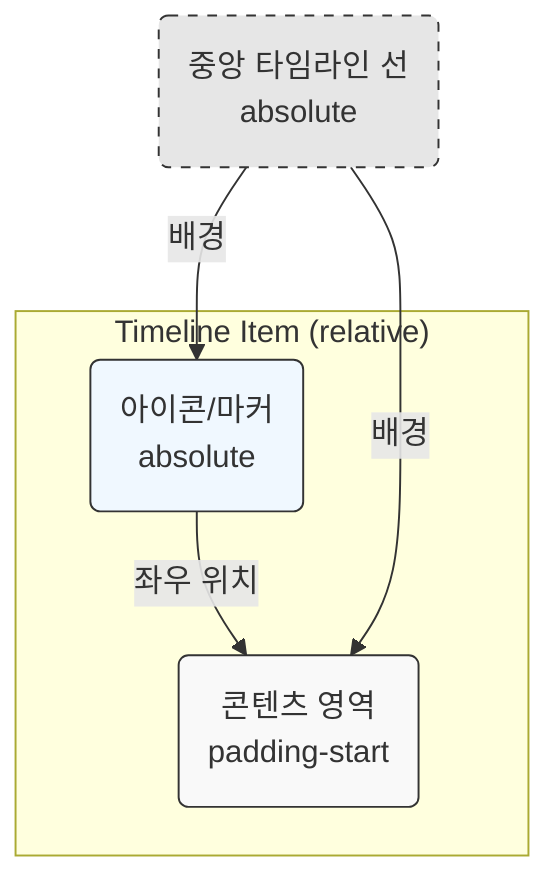
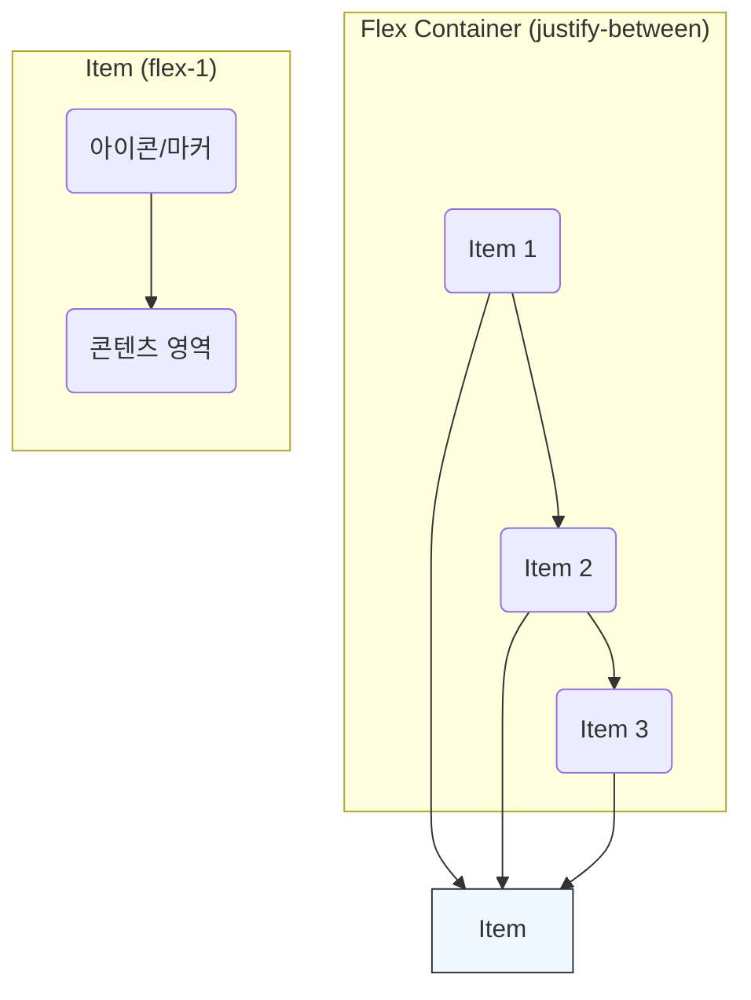
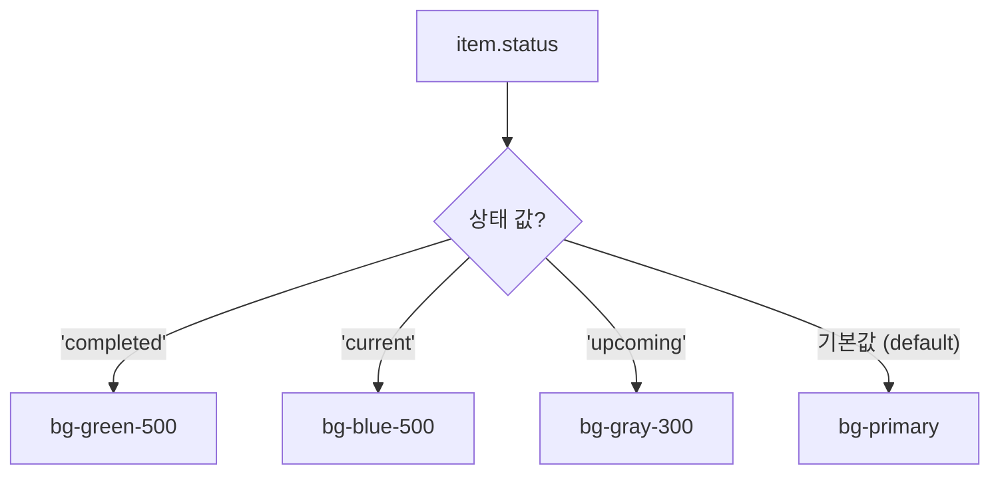

# Timeline 기술 명세

이 문서는 `Timeline` 컴포넌트의 렌더링 로직과 내부 구조를 다이어그램 중심으로 설명하여, 개발자가 컴포넌트의 동작 방식을 시각적으로 이해할 수 있도록 돕습니다.

## 1. 렌더링 로직 분기

`Timeline` 컴포넌트는 `orientation` prop 값에 따라 'vertical' 또는 'horizontal' 렌더링 함수를 선택적으로 실행합니다.

## 2. 레이아웃 구조

### 2.1. 세로 타임라인 아이템

세로 타임라인의 각 아이템은 `position: relative` 컨테이너 내부에 아이콘과 콘텐츠를 `position: absolute`와 `padding`을 이용해 배치합니다. 중앙의 타임라인 선은 별도의 `div`로 구현되어 컨테이너 전체를 관통합니다.

### 2.2. 가로 타임라인 아이템

가로 타임라인은 `flexbox`를 사용하여 전체 너비에 걸쳐 아이템들을 균등하게 배치합니다. 각 아이템은 수직으로 아이콘과 콘텐츠를 배열합니다.

## 3. 상태-스타일 매핑

`getStatusColor` 함수는 각 아이템의 `status` prop 값에 따라 CSS 클래스를 반환하여 마커의 색상을 결정합니다. 이는 `switch` 문으로 구현되어 있으며, 기본값으로는 `--primary` 색상 변수를 사용합니다.

