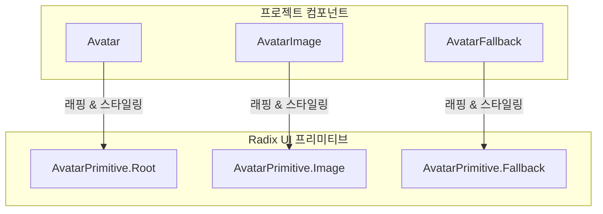
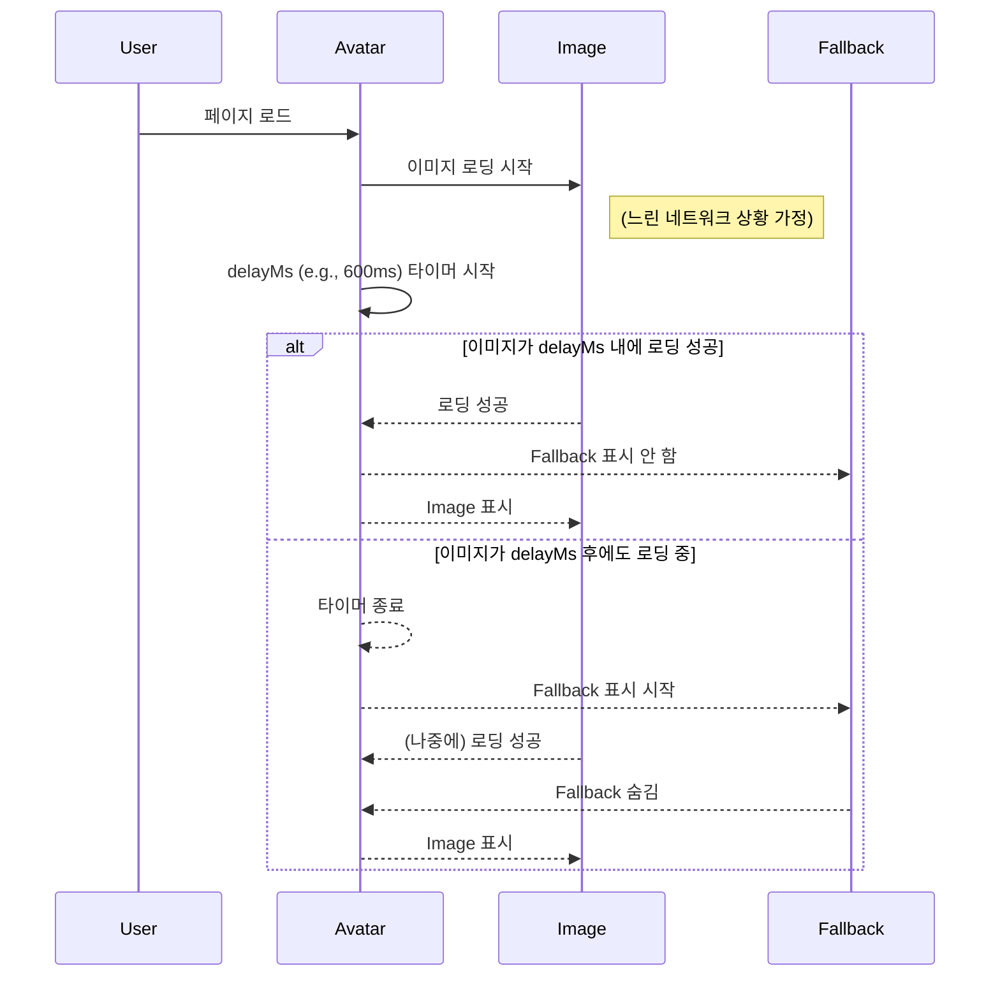

# Avatar 기술 명세서

이 문서는 `Radix UI`의 `Avatar` 프리미티브를 기반으로 구현된 `Avatar` 컴포넌트의 내부 아키텍처와 핵심 동작 원리를 설명합니다.

## 1. 아키텍처: Radix UI 프리미티브 래핑

우리 프로젝트의 `Avatar`, `AvatarImage`, `AvatarFallback` 컴포넌트는 Radix UI가 제공하는 동명의 프리미티브 컴포넌트들을 1:1로 감싸는(wrapping) 단순한 구조를 가집니다. 이 구조는 Radix UI의 강력한 기능과 접근성을 그대로 계승하면서, 프로젝트의 디자인 시스템(Tailwind CSS)을 적용하는 것을 목적으로 합니다.

## 2. 핵심 기능: Fallback 지연 표시 메커니즘

Radix UI의 `Avatar`는 `delayMs`라는 prop을 제공하여, 이미지 로딩이 지연될 때 `Fallback` 콘텐츠가 너무 성급하게 나타나는 것을 방지합니다.

이 메커니즘은 불필요한 UI 깜빡임(flickering)을 막아 사용자 경험을 크게 향상시킵니다.

## 3. `forwardRef`를 이용한 유연성 확보

모든 `Avatar` 관련 컴포넌트는 `React.forwardRef`를 사용하여 구현되었습니다. 이를 통해 `ref`를 내부의 Radix 프리미티브 DOM 요소로 직접 전달할 수 있습니다.

- **목적**: 다른 라이브러리(예: `Framer Motion`으로 애니메이션을 주거나, `Tippy.js`로 툴팁을 붙이는 경우)와 원활하게 통합할 수 있도록 유연성을 제공합니다.
- **구조**: `const Avatar = React.forwardRef((props, ref) => <AvatarPrimitive.Root ref={ref} {...props} />)`
