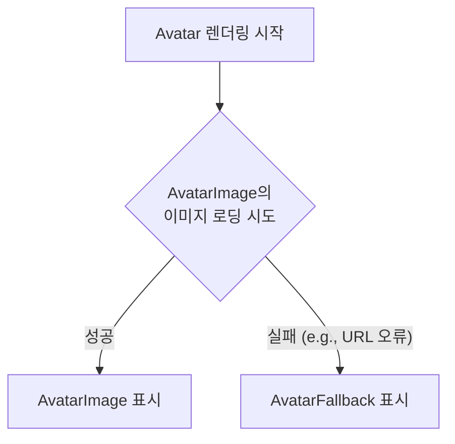

# Avatar 기능 명세서

`Avatar`는 사용자 프로필 이미지를 표시하는 데 사용되는 컴포넌트입니다. 이미지를 불러오는 데 실패할 경우, 자동으로 대체 콘텐츠(예: 사용자 이름의 이니셜)를 보여주는 기능이 내장되어 있습니다.

## 1. 컴포넌트 구조

`Avatar`는 세 가지 컴포넌트(`Avatar`, `AvatarImage`, `AvatarFallback`)를 조합하여 사용합니다. `Avatar`가 전체를 감싸는 컨테이너 역할을 하고, 내부에 이미지와 대체 콘텐츠를 넣는 구조입니다.

```mermaid
graph TD
    subgraph "Avatar 컴포넌트"
        A[Avatar<br/>(컨테이너)] --> B[AvatarImage<br/>(실제 이미지)];
        A --> C[AvatarFallback<br/>(이미지 로딩 실패 시<br/>대체 콘텐츠)];
    end
```

| 컴포넌트         | 역할                                                                              |
| :--------------- | :-------------------------------------------------------------------------------- |
| `Avatar`         | 아바타의 전체적인 모양(원형)과 크기를 결정하는 컨테이너입니다.                    |
| `AvatarImage`    | 표시할 실제 이미지의 URL(`src`)을 지정합니다.                                     |
| `AvatarFallback` | `AvatarImage` 로딩에 실패했을 때 대신 표시될 내용을 담습니다. (텍스트, 아이콘 등) |

## 2. 자동 Fallback 메커니즘

`Avatar`의 가장 큰 특징은 이미지 로딩 상태에 따라 `AvatarImage`와 `AvatarFallback`을 자동으로 전환하여 보여주는 것입니다.



이 기능 덕분에 깨진 이미지 아이콘이 사용자에게 노출되는 것을 방지하고, 항상 일관된 UI를 제공할 수 있습니다.

## 3. 주요 사용 시나리오

- **사용자 프로필**: 네비게이션 바나 프로필 페이지에서 현재 로그인한 사용자의 프로필 사진을 보여줍니다.
- **댓글 및 게시물 작성자**: 블로그 댓글이나 포럼 게시물 옆에 작성자의 아바타를 표시하여 시각적으로 구분합니다.
- **연락처 및 친구 목록**: 메신저나 소셜 미디어의 친구 목록에서 각 사용자를 아바타로 표현합니다.
- **조직도**: 회사의 조직도에서 각 구성원의 얼굴 사진을 표시합니다.
- **알림**: '홍길동님이 회원님을 언급했습니다'와 같은 알림 메시지에 해당 사용자의 아바타를 함께 보여줍니다.
