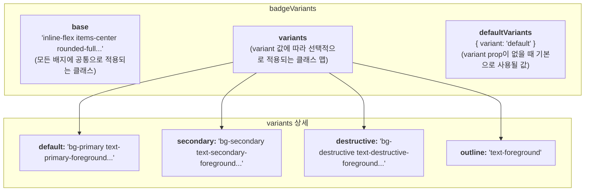
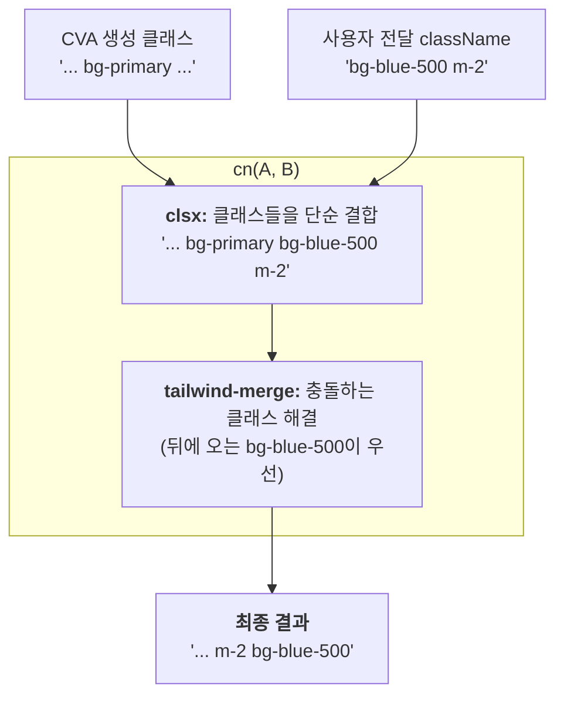

# Badge 기술 명세서

이 문서는 `class-variance-authority` (CVA) 라이브러리를 활용하여 구현된 `Badge` 컴포넌트의 내부 스타일링 아키텍처를 설명합니다.

## 1. 핵심 아키텍처: CVA (Class Variance Authority)

`Badge` 컴포넌트는 CVA를 사용하여 `variant` prop 값에 따라 동적으로 CSS 클래스를 조합합니다. 이 방식은 코드 중복을 최소화하고 스타일 관리를 매우 효율적으로 만듭니다.

```mermaid
flowchart TD
    subgraph "1. 정의 (badgeVariants.ts)"
        A[<b>cva() 함수</b><br/>- 기본 스타일 정의<br/>- Variant별 스타일 정의]
    end

    subgraph "2. 사용 (Badge.tsx)"
        B[Badge 컴포넌트에<br/>variant='destructive' 전달] --> C{badgeVariants({ variant: 'destructive' }) 호출};
        C --> D["기본 스타일 + destructive 스타일<br/>클래스 문자열 생성"];
    end

    subgraph "3. 최종 결과"
        E[<div class="기본클래스... destructive클래스...">]
    end

    A --> C
    D --> E
```

## 2. `badgeVariants` 객체 구조

`badgeVariants`는 `cva` 함수를 통해 생성되며, 세 부분으로 구성됩니다.



## 3. `cn` 유틸리티를 이용한 클래스 병합

`Badge` 컴포넌트는 `cn` 유틸리티 함수를 사용하여 CVA가 생성한 클래스와 사용자가 직접 전달한 `className` prop을 안전하게 병합합니다.



`tailwind-merge` 덕분에 사용자가 `bg-primary`와 충돌하는 `bg-blue-500`을 전달해도, 뒤에 온 `bg-blue-500`이 우선 적용되어 예상대로 동작합니다. 이로 인해 스타일 확장이 매우 유연하고 안전해집니다.
