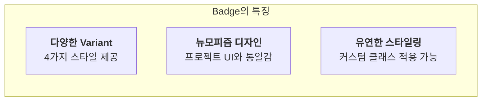

# Badge 기능 명세서

`Badge`는 상태, 카테고리, 알림 개수 등 간결한 정보를 시각적으로 강조하여 표시하는 데 사용되는 작은 UI 요소입니다.

## 1. Variant (종류)

`Badge`는 목적과 의미에 따라 선택할 수 있는 네 가지 기본 스타일(`variant`)을 제공합니다.

| Variant       | 시각적 표현 (예시)                                                                                             | 설명                                                            |
| :------------ | :------------------------------------------------------------------------------------------------------------- | :-------------------------------------------------------------- |
| `default`     | Primary   | 가장 기본적인 스타일로, 주요 정보나 긍정적인 상태를 나타냅니다. |
| `secondary`   | Secondary  | 덜 중요한 보조 정보나 중립적인 상태를 표시합니다.               |
| `destructive` | Destructive | 삭제, 위험, 오류 등 부정적인 상태를 강조하여 경고합니다.        |
| `outline`     | Outline                  | 다른 배지보다 시각적으로 덜 튀는, 테두리만 있는 스타일입니다.   |

## 2. 핵심 특징

## 3. 주요 사용 시나리오

- **게시물 태그**: 블로그 포스트나 뉴스 기사에 'React', 'Tech', 'News'와 같은 카테고리 태그를 붙입니다.
- **사용자 상태 표시**: 사용자 목록에서 '온라인'(default), '오프라인'(secondary), '탈퇴'(destructive) 상태를 표시합니다.
- **알림 카운트**: 이메일 아이콘 옆에 읽지 않은 메시지 개수(`+9`)를 표시합니다.
- **결제 상태**: 주문 내역에서 '결제 완료'(default), '배송 중'(secondary), '주문 취소'(destructive) 상태를 명확하게 보여줍니다.
- **버전 정보**: 소프트웨어 이름 옆에 'v1.2.0'과 같은 버전 정보를 `outline` 배지로 표시합니다.
