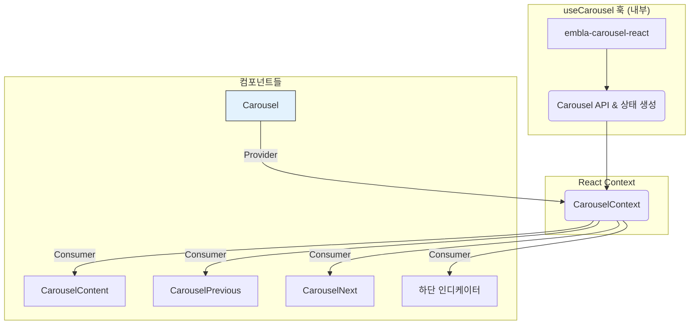
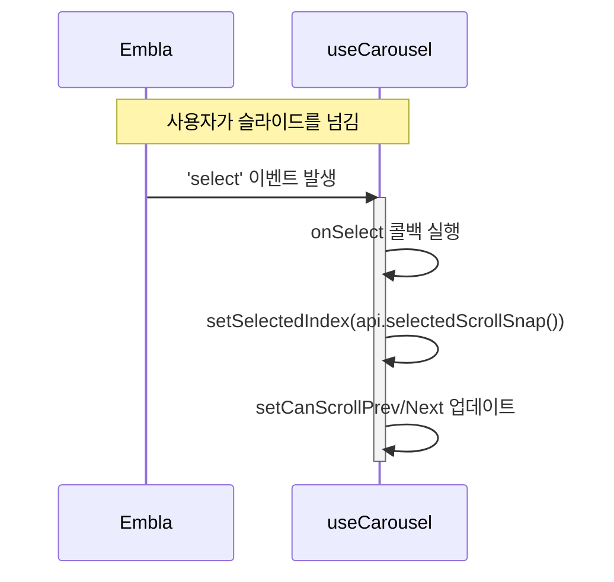

# Carousel 기술 명세서

이 문서는 `embla-carousel-react` 라이브러리를 기반으로 구현된 `Carousel` 컴포넌트의 내부 아키텍처와 상태 공유 매커니즘을 설명합니다.

## 1. 아키텍처: `useCarousel` 훅과 React Context

`Carousel` 관련 컴포넌트들은 `React Context`를 통해 `useCarousel` 훅이 제공하는 상태와 API를 공유합니다. 이 아키텍처는 각 컴포넌트가 독립적으로 동작하면서도 전체 캐러셀 시스템과 유기적으로 연동되게 합니다.



`Carousel` (루트 컴포넌트)가 `useCarousel` 훅을 호출하여 API와 상태를 생성하고, 이를 `CarouselContext.Provider`를 통해 모든 하위 컴포넌트에게 제공합니다.

## 2. `useCarousel` 훅의 역할

`useCarousel` 훅은 `embla-carousel-react`를 초기화하고, 캐러셀의 핵심 기능 및 상태를 관리하는 컨트롤 타워 역할을 합니다.

```mermaid
flowchart TD
    A[Carousel 컴포넌트 마운트] --> B{useCarousel 훅 호출};
    B -- "opts, plugins 전달" --> C[useEmblaCarousel 훅 호출];
    C --> D[Embla Carousel 인스턴스(api) 생성];
    D --> E{이벤트 리스너 등록<br/>('select', 'scroll')};
    E --> F[Context에 제공할<br/>값들 반환 (api, scrollSnaps, ...)];
```

## 3. 이벤트 기반 상태 업데이트

`useCarousel` 훅은 Embla 인스턴스의 이벤트를 구독하여, 캐러셀의 상태가 변경될 때마다 관련 상태값들을 업데이트합니다.



이 메커니즘을 통해 `CarouselPrevious`나 `CarouselNext` 버튼은 `canScrollPrev`, `canScrollNext` 상태값을 참조하여 자신이 클릭 가능한 상태인지 아닌지를 결정하고, UI를 동적으로 변경(예: 비활성화)할 수 있습니다.

## 4. API를 통한 외부 제어

`CarouselPrevious`, `CarouselNext` 및 기타 커스텀 컨트롤러는 Context를 통해 공유된 `api` 객체의 메소드를 직접 호출하여 캐러셀을 제어합니다.

```mermaid
graph TD
    subgraph CarouselPrevious
        A[Button 클릭] --> B{api.scrollPrev() 호출}
    end
    subgraph CarouselNext
        C[Button 클릭] --> D{api.scrollNext() 호출}
    end
    subgraph "하단 인디케이터"
        E[점(dot) 클릭] --> F{api.scrollTo(index) 호출}
    end

    subgraph Embla Carousel
        G[Embla 인스턴스]
    end

    B & D & F --> G
```

이러한 구조 덕분에 UI와 로직이 분리되어, 개발자는 캐러셀의 모양과 제어 방식을 매우 유연하게 커스터마이징할 수 있습니다.
