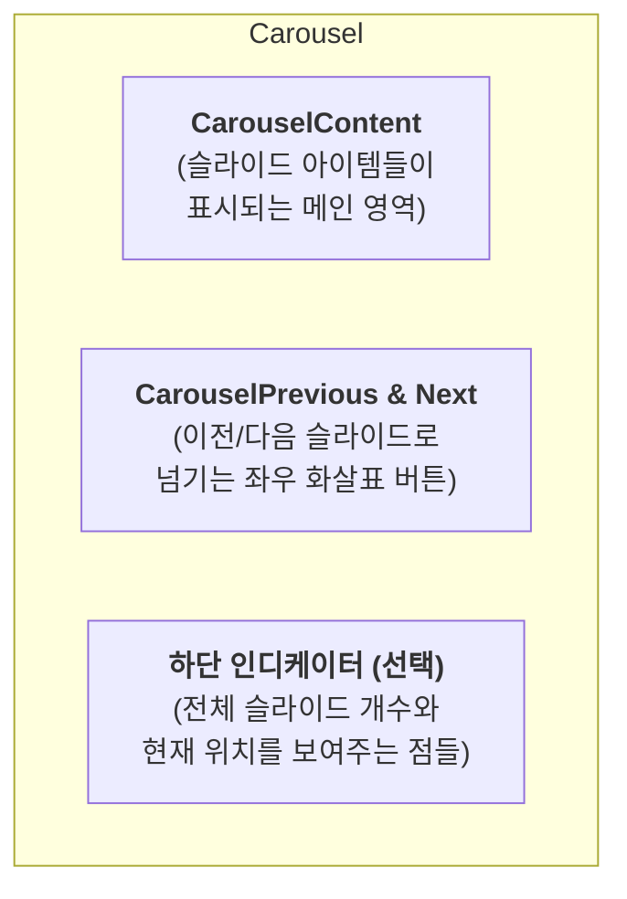
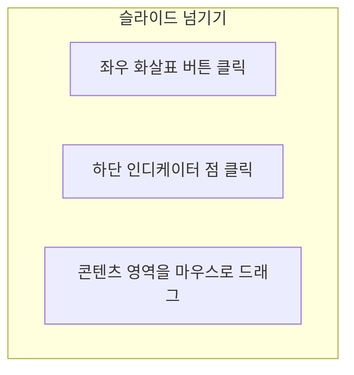

# Carousel 기능 명세서

`Carousel`은 여러 개의 콘텐츠(이미지, 카드 등)를 하나의 공간에 담아, 사용자가 좌우로 넘겨볼 수 있게 해주는 슬라이드 쇼 컴포넌트입니다.

## 1. 컴포넌트 구조

`Carousel`은 콘텐츠를 담는 영역과 이를 제어하는 여러 보조 컴포넌트들을 조합하여 완성됩니다.

## 2. 사용자 상호작용

사용자는 다양한 방법으로 슬라이드를 탐색할 수 있습니다.

## 3. 주요 기능 및 옵션

`Carousel`은 다양한 옵션을 통해 여러 환경에 맞게 동작을 변경할 수 있습니다.

| 옵션              | 설명                                                                                                                       |
| :---------------- | :------------------------------------------------------------------------------------------------------------------------- |
| **자동 재생**     | 설정된 시간 간격에 따라 슬라이드가 자동으로 넘어갑니다.                                                                    |
| **무한 루프**     | 마지막 슬라이드에서 다음으로 넘기면 첫 번째 슬라이드로, 첫 번째 슬라이드에서 이전으로 넘기면 마지막 슬라이드로 순환합니다. |
| **슬라이드 방향** | 기본값인 수평 슬라이드 외에, 수직으로 넘어가는 슬라이드도 만들 수 있습니다.                                                |
| **API 제어**      | 외부 버튼이나 로직을 통해 특정 슬라이드로 바로 이동시키는 등 프로그래밍 방식의 제어를 지원합니다.                          |

## 4. 주요 사용 시나리오

- **메인 페이지 배너**: 웹사이트의 주요 이벤트나 프로모션 광고를 자동 순환 배너로 보여줍니다.
- **제품 소개**: 여러 장의 제품 이미지를 사용자가 넘겨보며 상세히 탐색할 수 있도록 제공합니다.
- **고객 후기 및 추천사**: 여러 고객의 후기를 슬라이드 형태로 보여주어 공간을 효율적으로 사용합니다.
- **온보딩 가이드**: 앱의 새로운 사용자에게 주요 기능을 단계별 슬라이드로 안내합니다.
- **카드 뉴스**: 여러 장의 이미지와 텍스트로 구성된 카드 뉴스를 사용자가 순서대로 넘겨보게 합니다.
