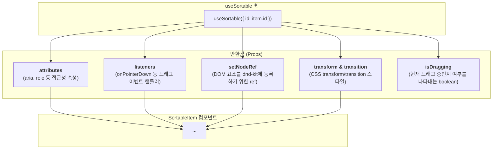

# Drag and Drop (정렬 가능 목록) 기술 명세서

이 문서는 `@dnd-kit` 라이브러리를 기반으로 구현된 `SortableList` 컴포넌트의 내부 아키텍처와 핵심 동작 원리를 설명합니다.

## 1. 아키텍처: @dnd-kit의 컨텍스트와 훅

`SortableList`는 `@dnd-kit`의 여러 모듈을 조합하여 구현됩니다. 최상위 `DndContext`가 드래그 앤 드롭의 전반적인 상태를 관리하고, `SortableContext`가 정렬 로직을, `useSortable` 훅이 개별 아이템에 드래그 기능을 부여합니다.

```mermaid
graph TD
    subgraph "@dnd-kit/core"
        A[DndContext<br/>(전역 상태, 이벤트 핸들러)]
    end
    subgraph "@dnd-kit/sortable"
        B[SortableContext<br/>(아이템 목록, 정렬 전략)]
        C[useSortable 훅<br/>(개별 아이템에 기능 주입)]
    end
    subgraph "컴포넌트 구조"
        D[SortableList (리스트 컨테이너)]
        E[SortableItem (개별 아이템)]
    end

    A --> B --> D
    D -- "map" --> E
    C -- "적용" --> E

    style A fill:#e3f2fd, stroke:#333
    style B fill:#e8f5e9, stroke:#333
    style C fill:#fff3e0, stroke:#333
```

## 2. `useSortable` 훅의 역할

`useSortable` 훅은 정렬 가능한 아이템을 만드는 데 필요한 모든 것을 반환합니다. 개발자는 이 반환값들을 DOM 요소의 `props`로 연결해주기만 하면 됩니다.



## 3. 이벤트 핸들링 및 상태 업데이트 흐름

사용자가 드래그를 마치면(`onDragEnd`), 이벤트 핸들러가 실행되어 실제 데이터 배열의 순서를 변경하고 상태를 업데이트합니다.

```mermaid
flowchart TD
    A[사용자: 드래그 종료] --> B{onDragEnd 이벤트 발생};
    B --> C["active(드래그한 아이템)와<br/>over(놓인 위치의 아이템) ID 확인"];
    C --> D{두 ID가 다른가?};
    D -- Yes --> E["arrayMove(items, oldIndex, newIndex)<br/>유틸리티로 배열 재정렬"];
    D -- No --> F[아무것도 안 함];
    E --> G[setItems(newArray)로<br/>컴포넌트 상태 업데이트 및 리렌더링];
```

`@dnd-kit/sortable`의 `arrayMove` 유틸리티는 불변성을 유지하며 배열의 순서를 안전하게 변경해주는 역할을 합니다.

## 4. 동적 스타일링

`useSortable`이 반환하는 `isDragging` 플래그와 `transform`, `transition` 스타일을 사용하여 드래그 상태에 따른 시각적 변화를 구현합니다.

- **이동 애니메이션**: `transform`과 `transition`을 아이템의 `style` prop에 직접 적용하여, 아이템이 드래그되거나 다른 아이템을 위해 자리를 비켜줄 때 부드러운 이동 효과를 만듭니다.
- **드래그 중인 아이템 스타일**: `isDragging` 플래그를 사용하여 조건부로 CSS 클래스(예: `opacity-50`, `shadow-lg`)를 적용하여 사용자가 현재 어떤 아이템을 잡고 있는지 명확하게 보여줍니다.
