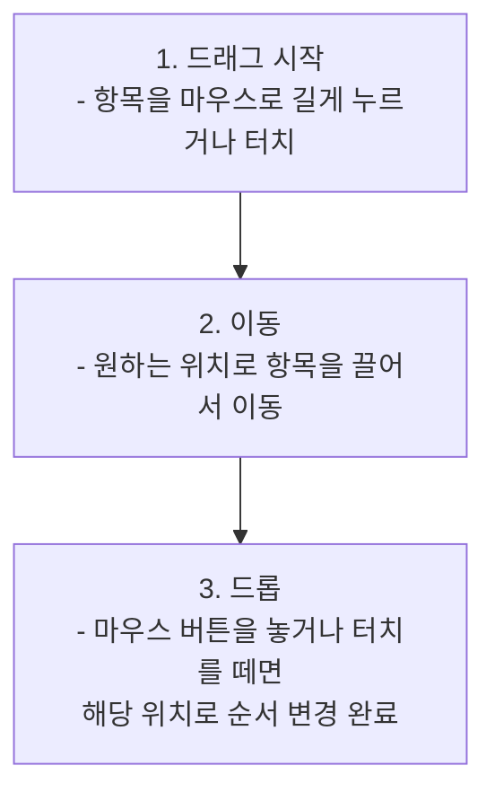
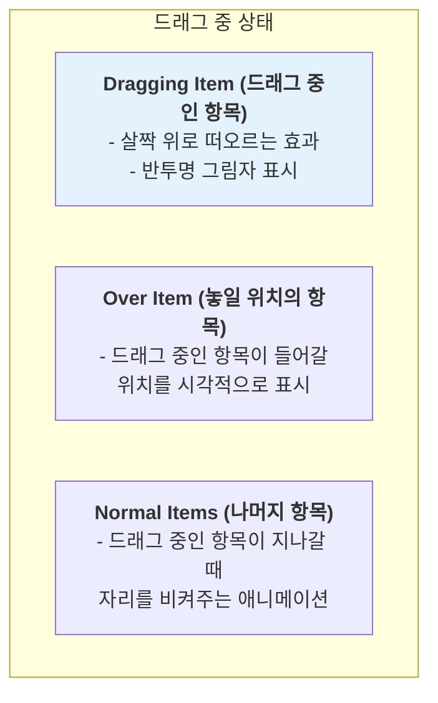

# Drag and Drop (정렬 가능 목록) 기능 명세서

`Drag and Drop` 기능은 사용자가 목록의 항목들을 마우스나 터치로 끌어서 자유롭게 순서를 변경할 수 있게 해주는 인터랙티브 컴포넌트입니다.

## 1. 사용자 상호작용 흐름

사용자는 세 가지 간단한 동작으로 목록의 순서를 직관적으로 변경할 수 있습니다.

## 2. 시각적 피드백

사용자가 순서 변경을 쉽게 인지할 수 있도록, 드래그 과정에서 다음과 같은 시각적 피드백을 제공합니다.

이러한 피드백은 사용자가 현재 어떤 항목을 잡고 있고, 어디에 놓을 수 있는지 명확하게 알려주어 사용성을 높입니다.

## 3. 핵심 기능

| 기능                    | 설명                                                                      |
| :---------------------- | :------------------------------------------------------------------------ |
| **수직/수평 정렬**      | 목록을 수직 또는 수평 방향으로 정렬할 수 있습니다.                        |
| **부드러운 애니메이션** | 항목들이 이동하고 자리를 바꿀 때 부드러운 애니메이션 효과가 적용됩니다.   |
| **터치 지원**           | 데스크톱 마우스뿐만 아니라 모바일 기기의 터치 입력도 완벽하게 지원합니다. |
| **접근성**              | 키보드만으로도 항목을 선택하고 순서를 변경할 수 있습니다.                 |

## 4. 주요 사용 시나리오

- **할 일 목록(To-Do List)**: 해야 할 일들의 우선순위를 드래그하여 쉽게 변경합니다.
- **이미지 갤러리**: 업로드된 이미지들의 표시 순서를 원하는 대로 편집합니다.
- **프로젝트 관리 보드 (칸반)**: '진행 중', '완료' 등의 상태 간에 작업 카드를 드래그하여 이동시킵니다.
- **네비게이션 메뉴 편집**: 웹사이트의 메뉴 항목 순서를 관리자 페이지에서 직관적으로 변경합니다.
- **설문지 문항 순서 변경**: 설문지를 제작할 때 문항의 순서를 자유롭게 재배치합니다.
