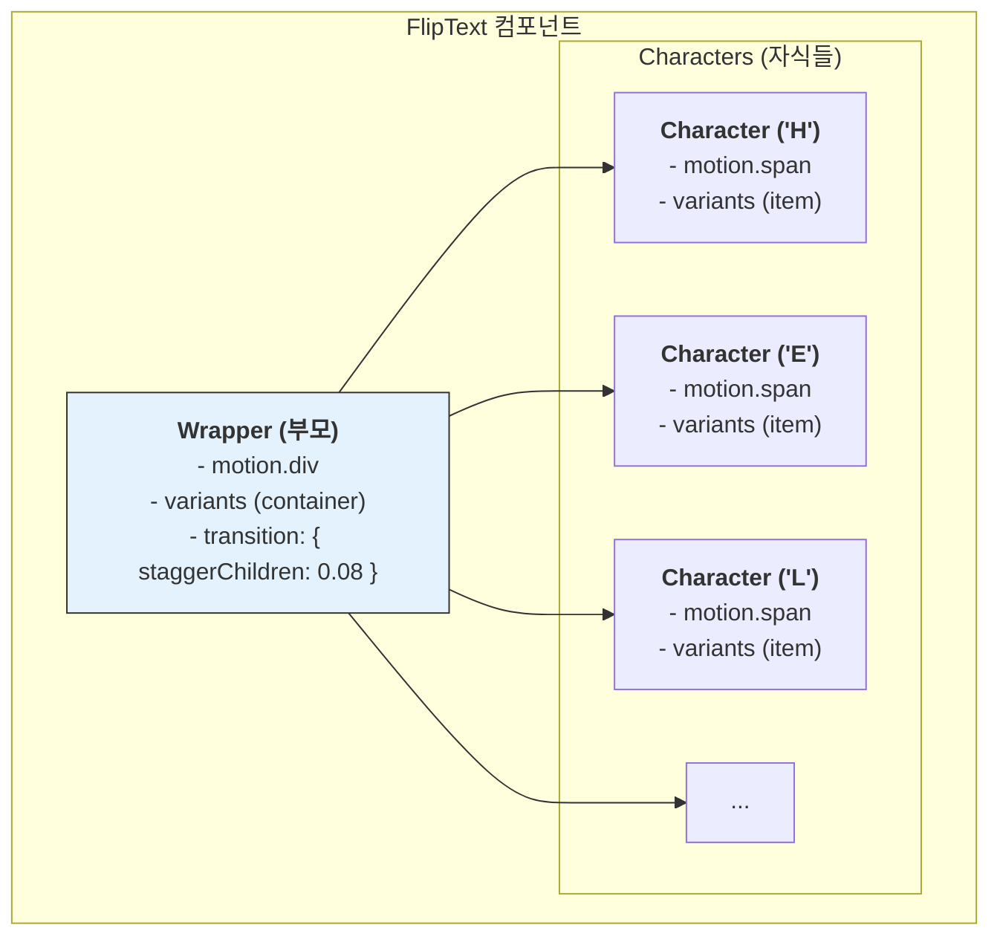
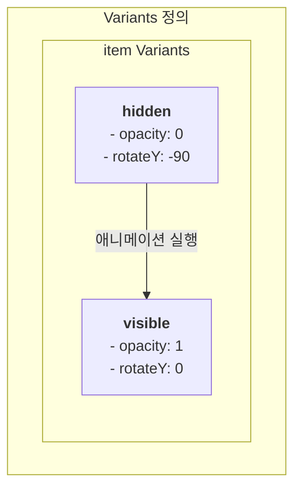
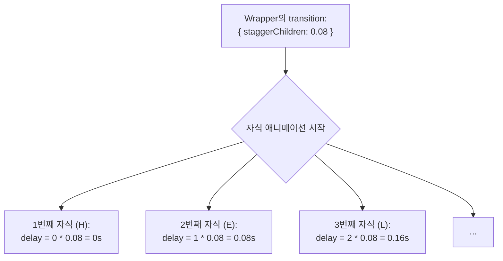

# FlipText 기술 명세서

이 문서는 `Framer Motion` 라이브러리를 활용하여 구현된 `FlipText` 컴포넌트의 내부 아키텍처와 애니메이션 실행 원리를 설명합니다.

## 1. 아키텍처: 부모-자식 구조와 Stagger 애니메이션

`FlipText`는 보이지 않는 부모 컨테이너(`Wrapper`)와 각 문자를 담당하는 여러 개의 자식 컴포넌트(`Character`)로 구성됩니다. 부모는 `staggerChildren` 속성을 통해 자식들의 애니메이션을 순차적으로 실행시키는 오케스트레이터 역할을 합니다.



## 2. Variants: 애니메이션 상태 정의

`Framer Motion`의 `variants`는 애니메이션의 시작(`hidden`)과 끝(`visible`) 상태를 미리 정의해 둔 객체입니다.

- **`container` (부모) Variants**: 자식 요소들의 애니메이션을 트리거하는 역할만 합니다.
- **`item` (자식) Variants**: 각 문자의 실제 시각적 변화(회전, 투명도)를 정의합니다.



부모 컨테이너가 `visible` 상태가 되면, 모든 자식들도 자동으로 `visible` 상태로 전환되며 애니메이션이 실행됩니다.

## 3. `staggerChildren` 동작 원리

`staggerChildren`은 부모의 `transition` prop에 설정되며, 자식 애니메이션 간의 시간 간격을 제어합니다.



이 메커니즘 덕분에 개발자가 각 문자의 `delay` 값을 수동으로 계산할 필요 없이, `staggerChildren` 값 하나로 전체 애니메이션의 리듬을 쉽게 조절할 수 있습니다.

## 4. `as` Prop을 이용한 동적 태그 생성

`as` prop은 렌더링될 HTML 태그를 동적으로 결정합니다. 이 값은 `Framer Motion`의 `motion()` 팩토리 함수에 전달되어, 해당 태그에 애니메이션 기능이 추가된 새로운 컴포넌트를 생성합니다.

```mermaid
graph TD
    A[as="h1" Prop] --> B["motion('h1') 호출"];
    B --> C[애니메이션 기능이 추가된<br/>h1 컴포넌트 생성];
    C --> D["<h1 class='...'>...</h1> 렌더링"];

    style B fill:#e8f5e9
```

이 방식을 통해 시맨틱 마크업을 유지하면서도 유연하게 애니메이션 효과를 적용할 수 있습니다.
