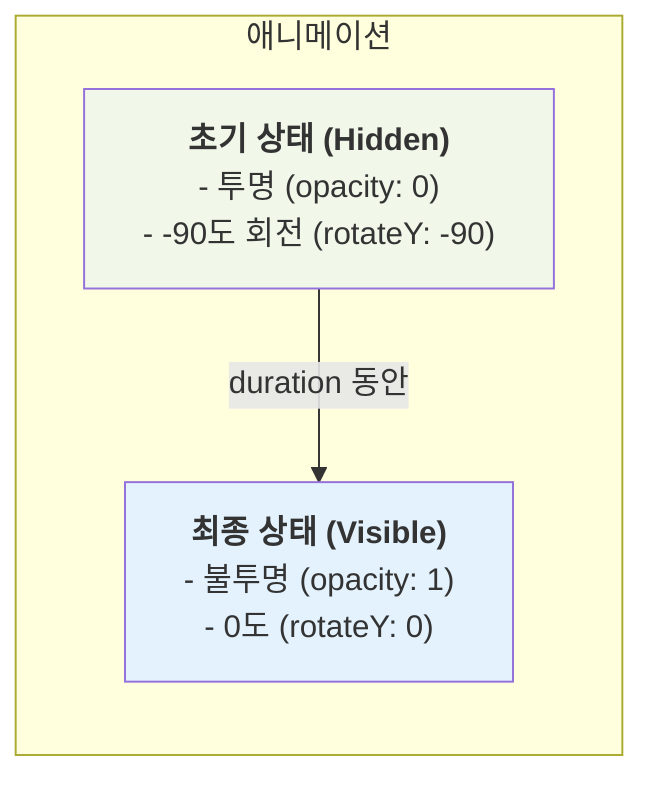

# FlipText 기능 명세서

`FlipText`는 텍스트의 각 문자가 3D 공간에서 회전하며 나타나는 듯한 인상적인 애니메이션 효과를 제공하는 컴포넌트입니다.

## 1. 애니메이션 프로세스

`FlipText`는 입력된 텍스트를 내부적으로 한 글자씩 분리하고, 각 글자에 순차적으로 지연 시간(delay)을 적용하여 자연스러운 애니메이션을 만듭니다.

```mermaid
flowchart TD
    A[입력: "HELLO"] --> B{문자 단위로 분리};
    B --> C["'H', 'E', 'L', 'L', 'O'"];
    C --> D{각 문자에 순차적<br/>지연 시간 적용};
    subgraph "애니메이션 실행"
        H["'H' (delay: 0s)"]
        E["'E' (delay: 0.08s)"]
        L1["'L' (delay: 0.16s)"]
        L2["'L' (delay: 0.24s)"]
        O["'O' (delay: 0.32s)"]
    end
    D --> H & E & L1 & L2 & O;
```

공백 문자는 레이아웃이 깨지지 않도록 줄바꿈 없는 공백(`&nbsp;`)으로 자동 처리됩니다.

## 2. 3D 회전 효과

각 문자는 Y축을 기준으로 -90도 회전하여 숨겨진 상태에서 시작하여, 원래 각도인 0도로 펼쳐지며 나타납니다.



## 3. 주요 옵션

`FlipText`는 몇 가지 간단한 옵션을 통해 애니메이션의 속도와 형태를 조절할 수 있습니다.

| 옵션                | 설명                                             | 시각적 효과                                                            |
| :------------------ | :----------------------------------------------- | :--------------------------------------------------------------------- |
| **`duration`**      | 각 글자의 애니메이션이 완료되는 시간(초)입니다.  | 숫자가 클수록 천천히, 작을수록 빠르게 회전합니다.                      |
| **`delayMultiple`** | 다음 글자가 나타나기까지의 지연 시간 배수입니다. | 숫자가 클수록 글자들이 하나씩 차례로, 작을수록 동시에 나타납니다.      |
| **`as`**            | 텍스트를 렌더링할 HTML 태그를 지정합니다.        | `as="h1"`로 설정 시, SEO에 유리한 `<h1>` 태그로 텍스트가 렌더링됩니다. |

## 4. 주요 사용 시나리오

- **웹사이트 헤드라인**: 방문자의 시선을 사로잡는 페이지의 메인 타이틀에 사용하여 강렬한 첫인상을 줍니다.
- **로딩 화면**: 데이터 로딩 중에 'Loading...'과 같은 텍스트에 애니메이션을 적용하여 지루함을 덜어줍니다.
- **이벤트 및 프로모션 배너**: 특별한 이벤트나 할인 정보를 강조하여 사용자의 주목도를 높입니다.
- **포트폴리오 및 자기소개**: 자신의 이름이나 핵심 역량을 동적인 텍스트로 표현하여 개성을 드러냅니다.
