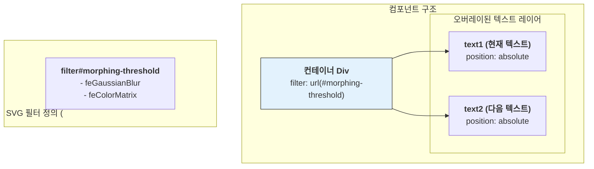
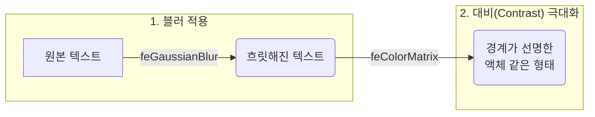
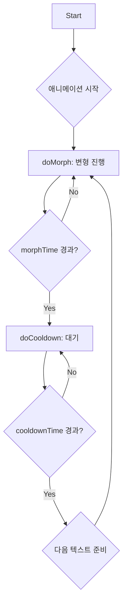

# MorphingText 기술 명세서

이 문서는 `MorphingText` 컴포넌트의 핵심 기술인 SVG 필터를 사용한 모핑 효과와 `requestAnimationFrame` 기반의 고성능 애니메이션 루프의 내부 구현 원리를 설명합니다.

## 1. 아키텍처: 이중 텍스트 오버레이와 SVG 필터

`MorphingText`는 두 개의 텍스트 레이어(`text1`, `text2`)를 동일한 위치에 겹쳐 놓고, 이들을 감싸는 컨테이너에 SVG 필터를 적용하는 구조로 되어 있습니다. 텍스트가 변경될 때, 두 레이어의 투명도와 블러 값을 반대로 조절하여 자연스러운 크로스페이드 및 모핑 효과를 만들어냅니다.

## 2. SVG 필터 동작 원리

모핑 효과의 핵심은 `feGaussianBlur`와 `feColorMatrix` 두 SVG 필터의 조합입니다.

1.  `feGaussianBlur`: 텍스트에 블러 효과를 적용하여 픽셀들을 부드럽게 퍼뜨립니다.
2.  `feColorMatrix`: 이미지의 알파 채널(투명도)을 분석하여, 특정 임계값(threshold)보다 높은 부분은 완전히 불투명하게, 낮은 부분은 완전히 투명하게 만듭니다. 이 과정에서 블러로 인해 퍼져나간 픽셀들이 뭉쳐지면서 액체 방울이 합쳐지는 듯한 효과가 발생합니다.

## 3. 애니메이션 루프

컴포넌트는 `requestAnimationFrame`을 사용하여 성능 저하 없이 부드러운 애니메이션을 구현합니다. 메인 루프는 '변형'(`doMorph`)과 '대기'(`doCooldown`) 두 가지 상태를 반복합니다.

- `doMorph`: 정해진 시간(`morphTime`) 동안 두 텍스트의 투명도와 블러 값을 프레임마다 미세하게 조절합니다.
- `doCooldown`: 변형이 끝난 후, 다음 애니메이션이 시작되기 전까지 잠시 대기(`cooldownTime`)합니다.

## 4. 리렌더링 방지를 위한 상태 관리

애니메이션에 사용되는 모든 상태 변수(현재 텍스트 인덱스, 애니메이션 진행 시간, 프레임 ID 등)는 `useRef`를 사용하여 관리됩니다.

- **장점**: `useRef`에 저장된 값은 변경되어도 컴포넌트의 리렌더링을 유발하지 않습니다.
- **효과**: 60fps로 계속 변화하는 애니메이션 상태가 렌더링을 발생시키지 않아, 애플리케이션의 다른 부분에 성능 영향을 주지 않고 부드러운 애니메이션을 보장합니다.
