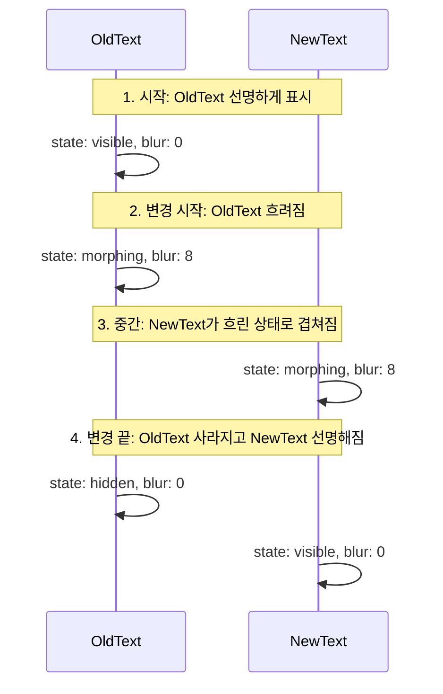
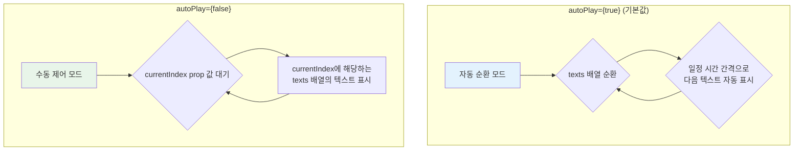

# MorphingText 기능 명세서

`MorphingText`는 하나의 텍스트가 다른 텍스트로 마치 액체처럼 부드럽게 변형되는 듯한 '모핑(Morphing)' 애니메이션 효과를 제공하는 컴포넌트입니다.

## 1. 모핑 애니메이션 시퀀스

텍스트가 변경될 때, `MorphingText`는 SVG 필터를 활용하여 블러(blur) 효과와 색상 혼합을 통해 자연스러운 변형 과정을 만들어냅니다.

## 2. 동작 모드

`MorphingText`는 `autoPlay` prop의 값에 따라 '자동 순환' 모드 또는 '수동 제어' 모드로 동작합니다.

- **자동 순환 모드**: `texts` 배열에 제공된 텍스트들을 자동으로 계속 순환하며 보여줍니다.
- **수동 제어 모드**: 외부 상태나 사용자 입력에 따라 `currentIndex` prop 값을 변경하여 원하는 텍스트를 표시합니다.

## 3. 주요 옵션

| 옵션               | 설명                                                                |
| :----------------- | :------------------------------------------------------------------ |
| **`texts`**        | 모핑 효과로 보여줄 텍스트들의 배열입니다. (필수)                    |
| **`autoPlay`**     | `true`이면 자동 순환, `false`이면 수동 제어로 동작합니다.           |
| **`currentIndex`** | 수동 제어 모드에서 표시할 텍스트의 인덱스(순서)입니다.              |
| **`onTextChange`** | 텍스트가 변경될 때마다 호출되는 함수로, 현재 인덱스를 전달받습니다. |

## 4. 다국어 지원

이 컴포넌트는 프로젝트의 다국어 폰트 시스템(`font-multilang`)을 자동으로 지원합니다. 한국어, 영어, 아랍어 등 어떤 언어의 텍스트를 `texts` 배열에 넣어도 각 언어에 최적화된 폰트로 아름답게 표시됩니다.

## 5. 주요 사용 시나리오

- **다국어 환영 메시지**: 웹사이트에 접속한 사용자에게 "안녕하세요", "Hello", "مرحبا" 등 여러 언어의 환영 메시지를 번갈아 보여줍니다.
- **핵심 가치 순환**: 회사의 핵심 가치나 서비스의 주요 특징("혁신", "신뢰", "고객 중심")을 순환하며 강조합니다.
- **인터랙티브 광고**: 사용자의 선택에 따라 광고 카피가 동적으로 변경되는 인터랙티브한 배너를 제작합니다.
- **스토리텔링**: 사용자가 스크롤하거나 버튼을 클릭할 때마다 스토리가 전개되도록 텍스트를 순차적으로 변경합니다.
