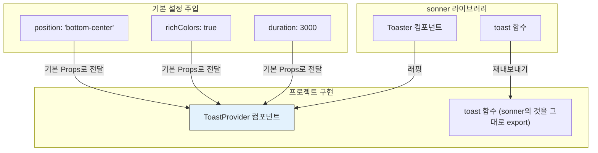

# Toast 기술 명세서

이 문서는 외부 라이브러리인 `sonner`를 기반으로 구축된 프로젝트의 `Toast` 시스템의 아키텍처와 연동 방식을 설명합니다.

## 1. 래핑 아키텍처 및 설정 주입

`Toast` 시스템은 `sonner`의 `Toaster` 컴포넌트를 `ToastProvider`라는 이름의 컴포넌트로 한 번 감싸, 프로젝트에 필요한 기본 설정을 주입하는 단순한 래핑 구조를 가집니다.



이 구조를 통해 모든 토스트에 일관된 위치, 색상, 지속 시간을 기본으로 적용하면서, `sonner`가 제공하는 강력한 `toast` 함수 API는 그대로 활용할 수 있습니다.

## 2. 디자인 시스템 연동

`ToastProvider`에 `richColors` 옵션을 활성화하고, 전역 스타일시트에서 CSS 변수를 활용하여 `sonner`의 스타일을 프로젝트의 디자인 시스템(뉴모피즘, 다크 모드)에 맞게 오버라이드합니다.

```mermaid
graph TD
    subgraph "ToastProvider 설정"
        A[richColors={true}]
    end

    subgraph "sonner의 기본 스타일"
        B["[data-sonner-toast][data-type='success'] {...}"]
    end

    subgraph "프로젝트 전역 스타일 (globals.css)"
        C["--toast-success-background: hsl(var(--success));<br/>--toast-border-radius: var(--radius);"]
    end

    subgraph "최종 결과"
        D[프로젝트 테마와 일관된<br/>디자인의 Toast UI]
    end

    A --> B
    C -- "오버라이드" --> B
    B --> D
```

`sonner`는 내부적으로 CSS 변수를 잘 지원하도록 설계되어 있어, 이처럼 간단한 오버라이드만으로 다크 모드를 포함한 테마 전환에 자동으로 반응합니다.

## 3. API 노출 전략

`sonner`의 `toast` 객체는 기능적으로 매우 뛰어나므로, 별도의 래핑이나 가공 없이 그대로 `export`하여 사용합니다.

```mermaid
flowchart LR
    A[sonner 라이브러리<br/>toast.success()<br/>toast.error()<br/>toast.promise()<br/>...] --> B(프로젝트의<br/>Toast.ts 파일) --> C(애플리케이션<br/>전체에서<br/>동일하게 사용);
```

이 전략은 다음과 같은 장점을 가집니다.

- **유지보수 비용 감소**: 라이브러리의 업데이트가 발생해도 우리 코드의 수정이 거의 필요 없습니다.
- **학습 곡선 완화**: 개발자는 `sonner`의 공식 문서를 그대로 참고하여 모든 고급 기능을 사용할 수 있습니다.
- **기능 제약 없음**: 라이브러리가 제공하는 모든 기능을 100% 활용할 수 있습니다.

## 4. 성능 및 접근성 (Sonner의 역할)

`sonner` 라이브러리 자체가 성능과 접근성을 책임집니다. 우리 컴포넌트는 이를 신뢰하고 그대로 활용합니다.

- **성능 (Portal 렌더링)**: `Toaster`는 `React Portal`을 통해 생성되므로, 토스트가 표시되거나 사라질 때 앱의 다른 부분이 리렌더링되지 않습니다.
- **접근성 (ARIA 속성)**: `sonner`는 `role="alert"`, `aria-live="assertive"` 등 적절한 ARIA 속성을 자동으로 관리하여 스크린 리더 사용자가 알림을 인지할 수 있도록 보장합니다.
