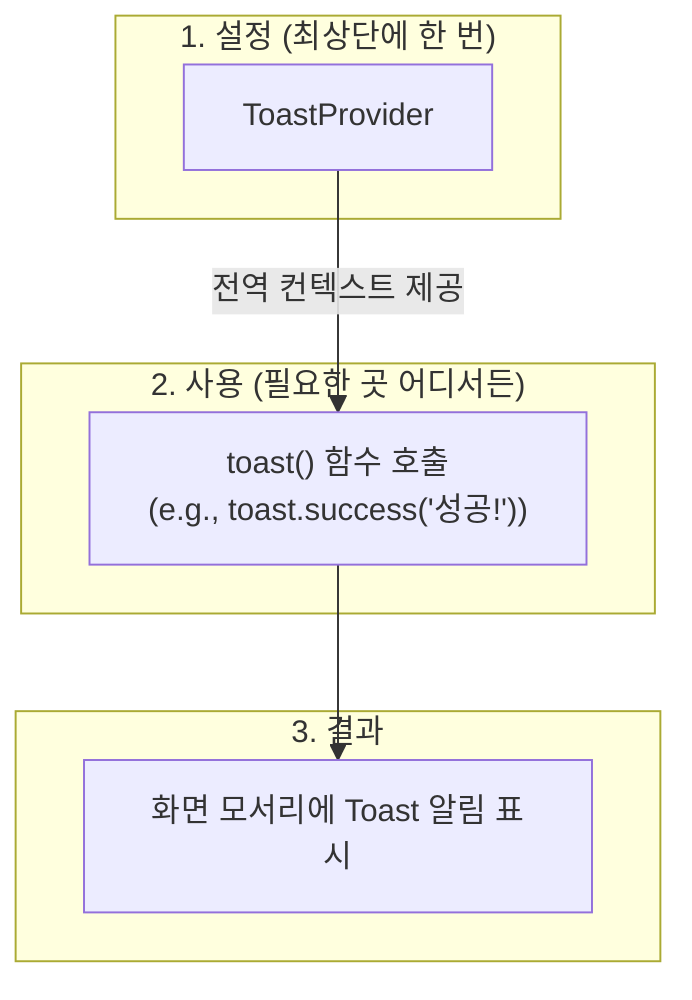
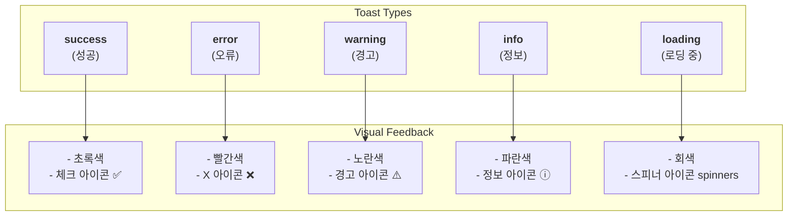
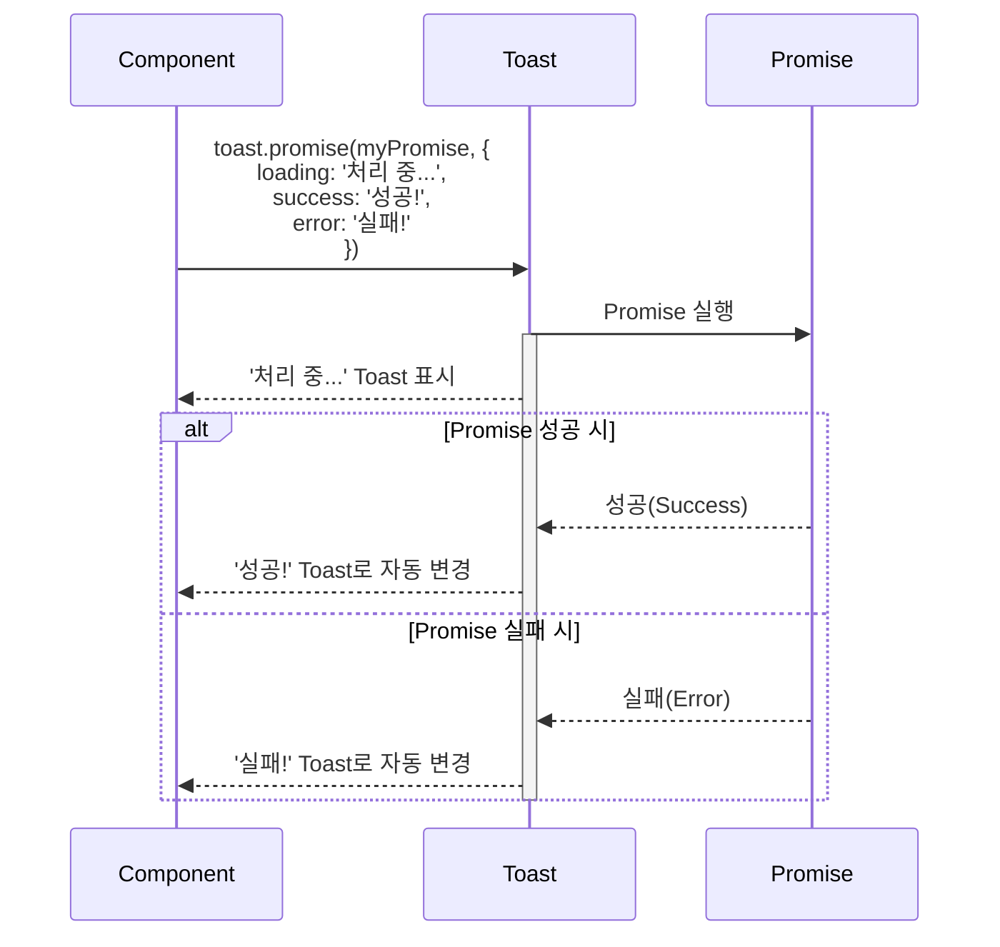

# Toast 기능 명세서

`Toast`는 사용자에게 작업 결과(예: 성공, 실패)나 간단한 정보를 화면 모서리에 잠시 나타나는 팝업 형태로 알려주는 알림 시스템입니다.

## 1. 사용 구조

`Toast` 시스템을 사용하기 위해서는, 먼저 애플리케이션의 최상위 레벨을 `ToastProvider`로 감싸주어야 합니다. 그 후, 어떤 컴포넌트에서든 `toast()` 함수를 호출하여 즉시 알림을 표시할 수 있습니다.

## 2. Toast 종류

`toast` 함수는 목적에 따라 다양한 종류(type)를 제공하며, 각 종류는 고유한 아이콘과 색상을 가져 사용자가 상황을 직관적으로 인지할 수 있도록 돕습니다.

## 3. Promise 기반 자동 상태 변경

`toast.promise` 함수를 사용하면, 비동기 작업(예: API 요청)의 상태에 따라 토스트 메시지가 자동으로 변경되어 사용자에게 실시간 진행 상황을 알려줄 수 있습니다.

## 4. 추가 기능

| 기능               | 설명                                         | 사용 예시                                          |
| :----------------- | :------------------------------------------- | :------------------------------------------------- |
| **액션 버튼**      | 토스트 내부에 클릭 가능한 버튼을 추가합니다. | '삭제되었습니다' 토스트에 '실행 취소' 버튼 추가    |
| **지속 시간 설정** | 토스트가 화면에 표시되는 시간을 조절합니다.  | `duration: 5000` (5초) 또는 `Infinity` (수동 닫기) |
| **상세 설명**      | 제목 아래에 추가적인 설명 텍스트를 붙입니다. | '업로드 완료' 제목 아래에 파일 이름 표시           |

## 5. 주요 사용 시나리오

- **폼 제출**: 사용자가 회원가입, 댓글 작성 등 폼을 제출했을 때, 그 결과를 '성공' 또는 '실패' 토스트로 알려줍니다.
- **데이터 저장**: 사용자가 '저장' 버튼을 눌러 변경사항을 저장하는 동안 '로딩 중' 토스트를, 완료 후 '성공' 토스트를 표시합니다.
- **삭제 확인**: 사용자가 항목을 삭제했을 때, '삭제되었습니다' 토스트와 함께 '실행 취소' 액션 버튼을 제공하여 실수를 만회할 기회를 줍니다.
- **알림**: 사용자에게 '새로운 메시지가 도착했습니다' 와 같은 중요하지 않지만 유용한 정보를 `info` 토스트로 알려줍니다.
