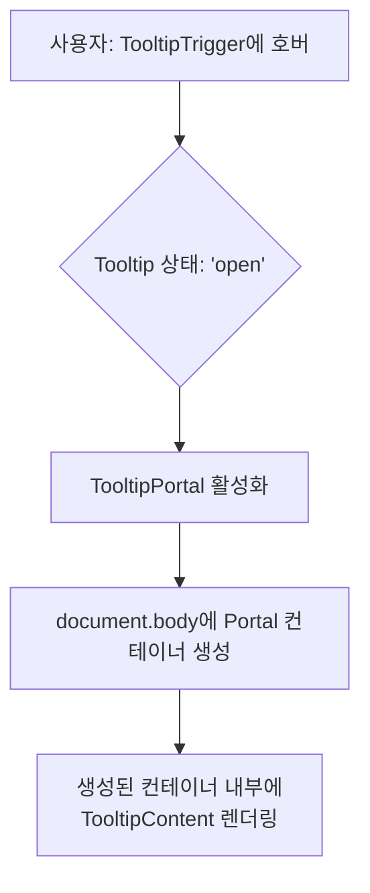
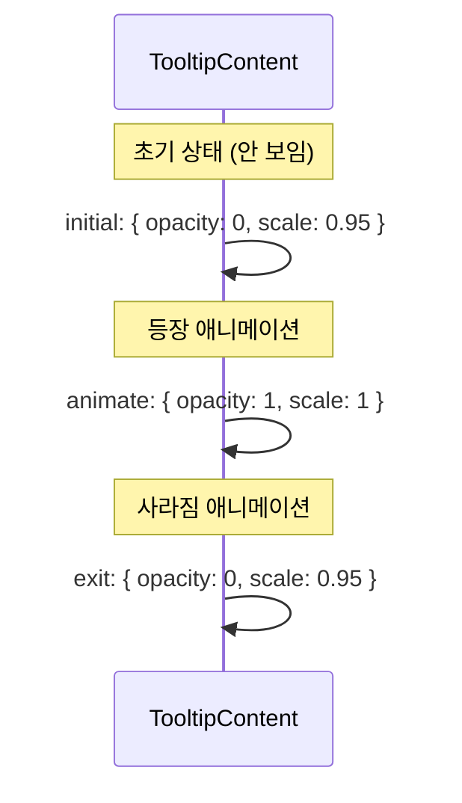

# Tooltip 기술 명세서

이 문서는 Radix UI 프리미티브와 Framer Motion을 기반으로 구현된 `Tooltip` 컴포넌트의 내부 아키텍처와 핵심 동작 원리를 설명합니다.

## 1. 컴포넌트 아키텍처: Radix UI와 Framer Motion의 결합

`Tooltip`은 Radix UI의 강력한 기능(접근성, 위치 계산)과 Framer Motion의 유연한 애니메이션을 결합하여 만들어졌습니다. `TooltipContent`는 `asChild` prop을 통해 Radix UI 컴포넌트의 렌더링을 `motion.div`에 위임하여 두 라이브러리를 자연스럽게 연결합니다.

```mermaid
graph TD
    subgraph "Radix UI 프리미티브"
        TooltipProvider
        Tooltip
        TooltipTrigger
        TooltipPortal
        R_Content[Tooltip.Content]
    end

    subgraph "Framer Motion"
        M_Div[motion.div<br/>(initial, animate, exit)]
    end

    R_Content -- "asChild={true}" --> M_Div

    subgraph "최종 렌더링"
        Final[애니메이션이 적용된 툴팁 콘텐츠]
    end

    M_Div --> Final

    style R_Content fill:#e3f2fd,stroke:#333
    style M_Div fill:#e8f5e9,stroke:#333
```

## 2. Portal 렌더링 흐름

`TooltipContent`는 `TooltipPortal`에 의해 감싸여, 컴포넌트가 선언된 위치와 상관없이 DOM 트리의 최상단(`body` 태그 직속)에 렌더링됩니다. 이를 통해 `overflow: hidden`이나 `z-index` 같은 CSS 제약 조건에서 벗어납니다.



## 3. Variant 클래스 적용 로직

`variant` prop의 값에 따라 `variantClasses` 객체에서 해당 키의 Tailwind CSS 클래스 문자열을 조회하여 `TooltipContent`에 적용합니다.

```mermaid
flowchart TD
    Start[variant Prop 입력<br/>(e.g., 'error')] --> A{"variantClasses 맵에서<br/>'error' 키 조회"};
    A -- "찾음" --> B["'bg-destructive text-destructive-foreground'<br/>클래스 반환"];
    A -- "못 찾음 (기본값)" --> C["'bg-muted text-muted-foreground'<br/>클래스 반환"];
    B & C --> D[cn() 유틸리티로 병합];
    D --> Final[TooltipContent에 최종 클래스 적용];
```

## 4. 애니메이션 시퀀스 (Framer Motion)

`TooltipContent`의 등장과 사라짐은 `motion.div`의 `initial`, `animate`, `exit` 상태에 정의된 `opacity`와 `scale` 값의 변화를 통해 부드럽게 표현됩니다.



이러한 상태 기반 애니메이션은 사용자가 툴팁의 나타남과 사라짐을 자연스럽게 인지하도록 돕습니다.
