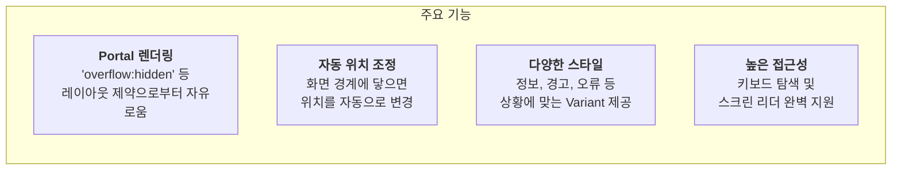

# Tooltip 기능 명세서

`Tooltip`은 특정 UI 요소 위에 마우스를 올렸을 때, 해당 요소에 대한 추가적인 정보나 도움말을 제공하는 작은 팝업입니다.

## 1. 컴포넌트 구조

`Tooltip`은 네 가지 컴포넌트(`TooltipProvider`, `Tooltip`, `TooltipTrigger`, `TooltipContent`)를 조합하여 사용합니다. 이 구조는 Radix UI의 설계 원칙을 따라 높은 접근성과 유연성을 보장합니다.

```mermaid
graph TD
    subgraph "Tooltip 사용 구조"
        A[TooltipProvider<br/>(전역 설정 및 제스처 감지)]
        B[Tooltip<br/>(개별 툴팁 인스턴스)]
        C[TooltipTrigger<br/>(툴팁을 여는 요소, e.g., 버튼, 아이콘)]
        D[TooltipContent<br/>(실제 표시될 툴팁 내용)]
    end

    A --> B --> C & D
    C -- "Hover/Focus" --> D

    style A fill:#e3f2fd, stroke:#333
```

- `TooltipProvider`: 애플리케이션의 최상단에 한 번만 선언하여, 툴팁이 열리고 닫히는 지연 시간 등을 관리합니다.
- `Tooltip`: 개별 툴팁의 열림/닫힘 상태를 관리하는 컨테이너입니다.
- `TooltipTrigger`: 이 컴포넌트로 감싸진 요소에 마우스를 올리거나 포커스하면 툴팁이 나타납니다.
- `TooltipContent`: 툴팁의 실제 콘텐츠 부분으로, 다양한 스타일과 위치 옵션을 가집니다.

## 2. 핵심 기능

`Tooltip`은 다양한 환경에서 안정적으로 동작하도록 여러 기능을 내장하고 있습니다.



## 3. 위치 및 간격 옵션

`side`와 `sideOffset` prop을 사용하여 툴팁이 `TooltipTrigger`를 기준으로 어느 방향에, 얼마나 떨어져서 표시될지 결정할 수 있습니다.

```mermaid
graph TD
    subgraph "side: 'top' (기본값)"
        TC_T[TooltipContent] --> TT_T(TooltipTrigger)
    end
    subgraph "side: 'bottom'"
        TT_B(TooltipTrigger) --> TC_B[TooltipContent]
    end
    subgraph "side: 'left'"
        TC_L[TooltipContent] --- TT_L(TooltipTrigger)
    end
    subgraph "side: 'right'"
        TT_R(TooltipTrigger) --- TC_R[TooltipContent]
    end

    note right of TC_R
     <b>sideOffset</b> prop으로
     Trigger와 Content 사이의
     간격을 조절할 수 있습니다.
    end note
```

## 4. Variant 별 스타일

`variant` prop을 사용하여 툴팁의 목적과 중요도에 따라 다른 스타일을 적용할 수 있습니다.

| Variant   | 색상   | 아이콘 예시 | 설명                       |
| :-------- | :----- | :---------- | :------------------------- |
| `default` | 회색   | (없음)      | 일반적인 정보 제공         |
| `info`    | 파란색 | ⓘ           | 추가 정보 또는 안내        |
| `warning` | 노란색 | ⚠️          | 주의 또는 잠재적 문제 경고 |
| `error`   | 빨간색 | ⓧ           | 오류 또는 실패 메시지      |

## 5. 주요 사용 시나리오

- **아이콘 버튼 설명**: 텍스트 라벨이 없는 아이콘 버튼(예: 삭제, 편집) 위에 마우스를 올렸을 때, 해당 버튼의 기능을 설명합니다.
- **폼 필드 가이드**: 복잡한 입력 필드(예: 비밀번호 규칙) 옆의 물음표 아이콘에 마우스를 올렸을 때, 상세한 입력 가이드를 제공합니다.
- **비활성화된 버튼 사유 설명**: 클릭할 수 없는 버튼 위에 마우스를 올렸을 때, 비활성화된 이유(예: '권한이 없습니다')를 알려줍니다.
- **유효성 검사 오류**: `error` variant를 사용하여, 유효성 검사에 실패한 입력 필드에 대한 오류 메시지를 표시합니다.
