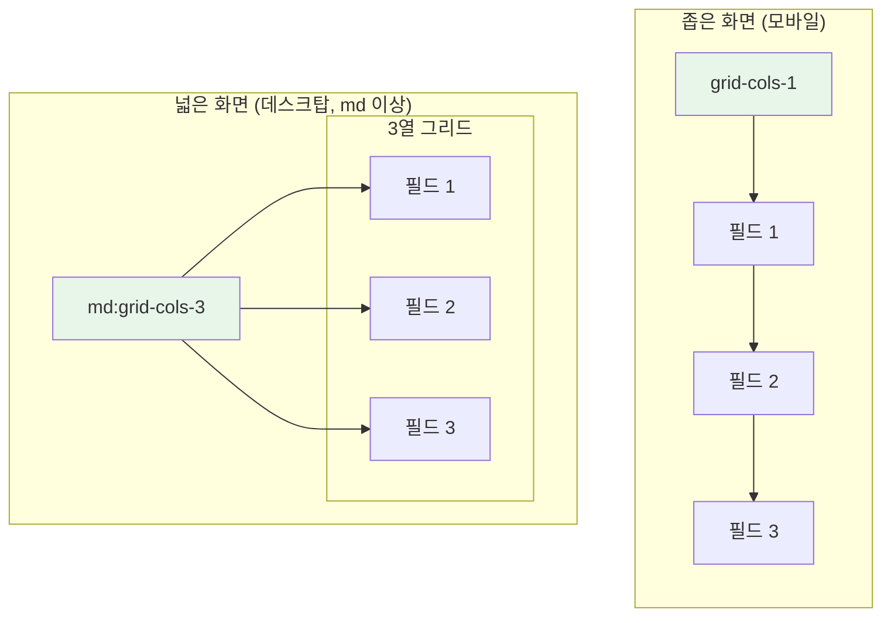
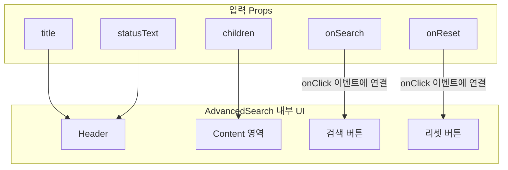

# AdvancedSearch 기술 명세서

이 문서는 `AdvancedSearch` 컴포넌트의 내부 아키텍처, 레이아웃 시스템, 그리고 데이터 흐름을 기술적으로 설명합니다.

## 1. 컴포넌트 아키텍처: Collapsible 기반 컨테이너

`AdvancedSearch`의 핵심 기능인 '접고 펴기'는 Radix UI의 `Collapsible` 컴포넌트(또는 유사한 아코디언 컴포넌트)를 기반으로 구현되었습니다. `AdvancedSearch`는 이를 래핑하여 제목(Header), 사용자 정의 콘텐츠(Content), 액션 버튼(Footer)을 포함하는 구조화된 컨테이너를 제공합니다.

```mermaid
graph TD
    subgraph "AdvancedSearch"
        A[Collapsible.Root<br/>(전체 컨테이너 및 상태 관리)]
    end

    subgraph "내부 구성 요소"
        B[Collapsible.Trigger<br/>(Header: 제목, 열기/닫기 아이콘)]
        C[Collapsible.Content<br/>(Content & Footer)]
    end

    subgraph "Content & Footer 내부"
        D["- 반응형 Grid Layout<br/>- children (사용자 정의 필드)"]
        E["- Button Layout<br/>- 검색/리셋 버튼"]
    end

    A --> B
    A --> C
    C --> D & E

    style A fill:#e3f2fd,stroke:#333
```

## 2. 반응형 그리드 레이아웃

`children`으로 전달된 검색 필드들은 CSS Grid를 사용하여 화면 너비에 따라 자동으로 재배치됩니다.



- **기본**: 1열(`grid-cols-1`)로 모든 필드를 수직 정렬합니다.
- **`md` 브레이크포인트 이상**: 3열(`md:grid-cols-3`)로 변경되어 공간 효율성을 높입니다.
- **간격**: `gap-4` 유틸리티를 사용하여 필드 간의 일정한 간격을 유지합니다.

## 3. 데이터 및 이벤트 흐름

`AdvancedSearch`는 제어되지 않는(Uncontrolled) 컴포넌트로, 열림/닫힘 상태는 내부적으로 관리합니다. 데이터와 이벤트 핸들러는 Props를 통해 전달받아 각 영역에 연결됩니다.



## 4. 스타일링 및 레이아웃

- **컨테이너**: 전체 컨테이너는 `neu-flat` 클래스를 적용하여 평면적인 뉴모피즘 스타일을 가집니다.
- **내부 간격**: 콘텐츠 영역과 버튼 영역은 `space-y-6` 클래스를 통해 수직 간격을 유지합니다.
- **버튼**: 검색/리셋 버튼은 각각 `bg-primary`, `bg-background` 클래스로 배경색을 지정하고, 공통적으로 `neu-raised` 클래스를 적용하여 입체감을 줍니다. 버튼 사이의 간격은 `gap-2`로 조절됩니다.
