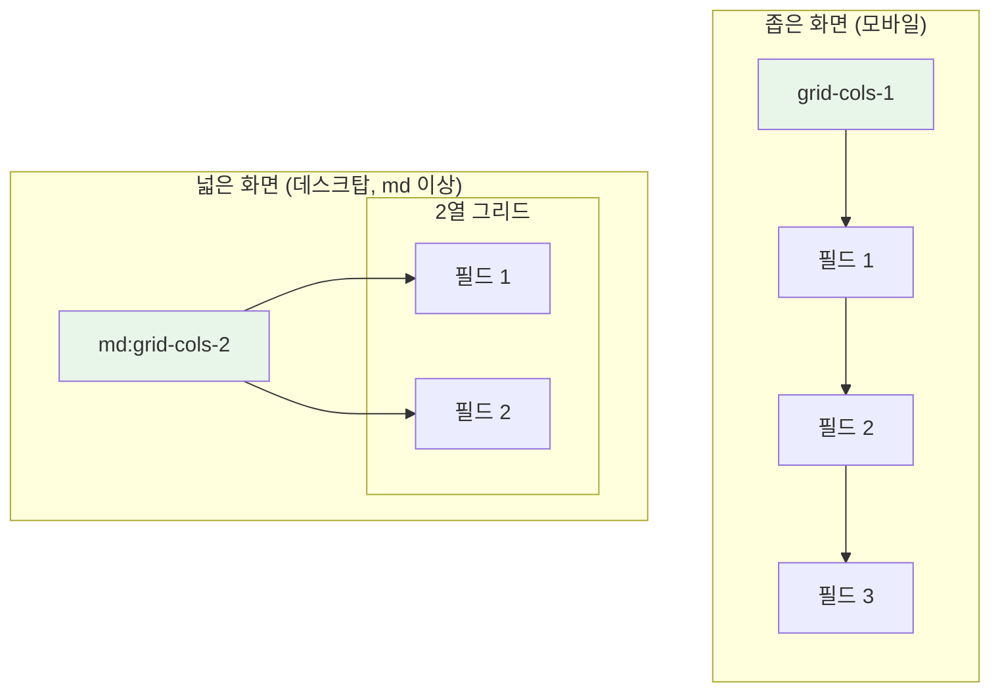
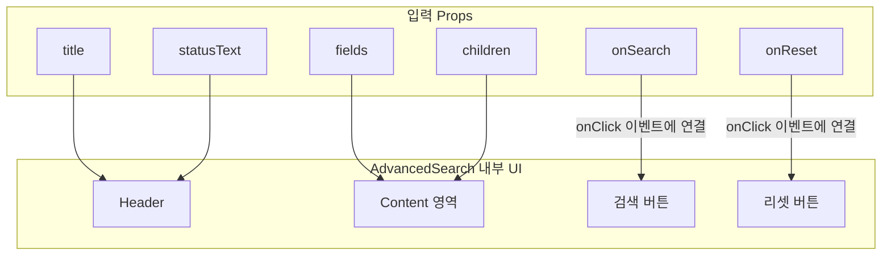

# AdvancedSearch 기술 명세서

이 문서는 `AdvancedSearch` 컴포넌트의 내부 아키텍처, 레이아웃 시스템, 그리고 데이터 흐름을 기술적으로 설명한다.

## 1. 컴포넌트 아키텍처: Collapsible 기반 컨테이너

`AdvancedSearch`의 핵심 기능인 '접고 펴기'는 Radix UI의 `Collapsible` 컴포넌트(또는 유사한 아코디언 컴포넌트)를 기반으로 구현되었다. `AdvancedSearch`는 이를 래핑하여 제목(Header), 사용자 정의 콘텐츠(Content), 액션 버튼(Footer)을 포함하는 구조화된 컨테이너를 제공한다.

```mermaid
graph TD
    subgraph "AdvancedSearch"
        A[Accordion.Root<br/>(전체 컨테이너 및 상태 관리)]
    end

    subgraph "내부 구성 요소"
        B[Accordion.Trigger<br/>(Header: 제목, 열기/닫기 아이콘)]
        C[Accordion.Content<br/>(Content & Footer)]
    end

    subgraph "Content & Footer 내부"
        D2["- 반응형 Grid Layout<br/>- children (사용자 정의 필드)"]
        E["- Button Layout<br/>- 검색/리셋 버튼"]
    end

    A --> B
    A --> C
    C --> D2 & E

    style A fill:#e3f2fd,stroke:#333
```

## 2. 반응형 그리드 레이아웃

`children`으로 전달된 검색 필드들은 CSS Grid를 사용하여 화면 너비에 따라 자동으로 재배치된다.



- **기본**: 1열(`grid-cols-1`)로 모든 필드를 수직 정렬한다.
- **`md` 브레이크포인트 이상**: 2열(`md:grid-cols-2`)로 변경되어 공간 효율성을 높인다.
- **간격**: `gap-4` 유틸리티를 사용하여 필드 간의 일정한 간격을 유지한다.

## 3. 데이터 및 이벤트 흐름

### 3.1 컴포넌트 상태 관리

```mermaid
graph TD
    subgraph "Props 입력"
        P_Fields[fields: FieldConfig[]]
        P_Title[title?: string]
        P_StatusText[statusText?: string]
    end

    subgraph "렌더링 영역"
        R_Content[검색 필드들]
        R_Buttons[액션 버튼들]
    end

    P_Fields --> R_Content
    P_Title --> R_Content
    P_StatusText --> R_Content
```

### 3.2 이벤트 처리 흐름

`AdvancedSearch`는 열림/닫힘 상태는 내부적으로 관리하며, 데이터와 이벤트 핸들러는 Props를 통해 전달받는다.



## 4. cloneElement를 통한 동적 컴포넌트 렌더링

Fields 방식에서는 `React.cloneElement`를 사용하여 각 필드 컴포넌트에 고유한 `key` prop을 주입한다.

```typescript
// 핵심 렌더링 로직
{fields.map(field => (
  <div key={field.key}>
    {cloneElement(field.element, { key: field.key })}
  </div>
))}
```

### 4.1 cloneElement 사용 이유
- **Key 주입**: React의 리스트 렌더링 최적화를 위한 고유 key 제공
- **Props 확장**: 필요시 추가 props를 동적으로 주입 가능
- **컴포넌트 재사용**: 동일한 컴포넌트를 다른 설정으로 재사용

## 5. RTL(Right-to-Left) 지원

`useLocale` 훅을 통해 RTL 언어 지원을 구현한다.

```typescript
const { isRTL } = useLocale();

// 버튼 정렬 조건부 적용
<div className={`flex gap-2 ${isRTL ? 'justify-start' : 'justify-end'}`}>
```

## 6. 스타일링 및 레이아웃

### 6.1 컨테이너 구조
- **최상위**: Accordion 컴포넌트가 `neu-flat` 스타일 제공
- **내부 간격**: `space-y-6` 클래스로 섹션 간 일정한 수직 간격 유지

### 6.2 버튼 스타일링
- **검색 버튼**: `bg-primary text-primary-foreground neu-raised`
- **리셋 버튼**: `bg-background text-muted-foreground neu-raised`
- **호버 효과**: `hover:bg-primary/90`, `hover:text-primary`
- **간격**: `gap-2`로 버튼 간 간격 조절
