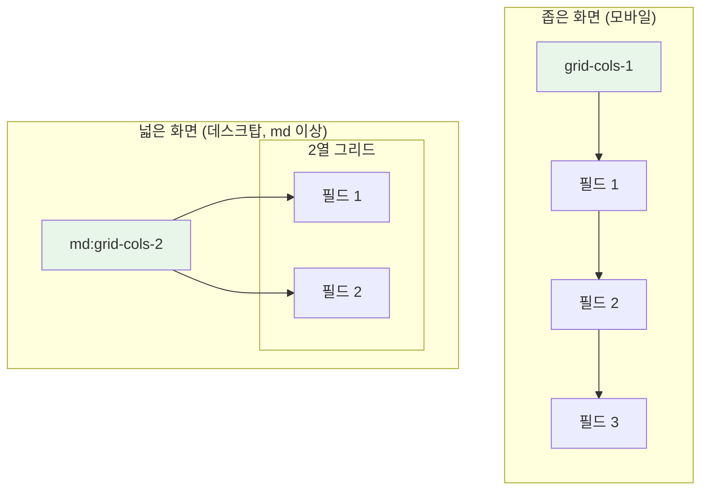
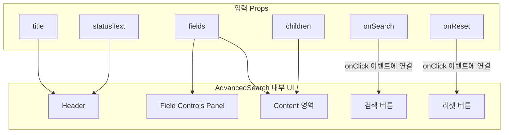

# AdvancedSearch 기술 명세서

이 문서는 `AdvancedSearch` 컴포넌트의 내부 아키텍처, 레이아웃 시스템, 그리고 데이터 흐름을 기술적으로 설명합니다.

## 1. 컴포넌트 아키텍처: Collapsible 기반 컨테이너

`AdvancedSearch`의 핵심 기능인 '접고 펴기'는 Radix UI의 `Collapsible` 컴포넌트(또는 유사한 아코디언 컴포넌트)를 기반으로 구현되었습니다. `AdvancedSearch`는 이를 래핑하여 제목(Header), 필드 제어 패널(Field Controls), 사용자 정의 콘텐츠(Content), 액션 버튼(Footer)을 포함하는 구조화된 컨테이너를 제공합니다.

```mermaid
graph TD
    subgraph "AdvancedSearch"
        A[Accordion.Root<br/>(전체 컨테이너 및 상태 관리)]
    end

    subgraph "내부 구성 요소"
        B[Accordion.Trigger<br/>(Header: 제목, 열기/닫기 아이콘)]
        C[Accordion.Content<br/>(Field Controls, Content & Footer)]
    end

    subgraph "Content & Footer 내부"
        D1["- Field Controls Panel<br/>- 체크박스 기반 필드 제어<br/>- useState로 상태 관리"]
        D2["- 반응형 Grid Layout<br/>- children (사용자 정의 필드)"]
        E["- Button Layout<br/>- 검색/리셋 버튼"]
    end

    A --> B
    A --> C
    C --> D1 & D2 & E

    style A fill:#e3f2fd,stroke:#333
    style D1 fill:#f3e5f5,stroke:#333
```

## 2. 필드 제어 시스템 (Field Control System)

### 2.1 상태 관리 구조

컴포넌트는 `FieldConfig[]` 배열을 통한 구조화된 필드 관리 방식만을 지원합니다.

```mermaid
graph TD
    subgraph "상태 관리 흐름"
        A[Props: fields]
        B[useState<FieldConfig[]><br/>fieldStates 초기화]
        C[필드별 visibility 상태 관리]
        D[toggleFieldVisibility 함수]
        E[전체 제어 함수들]
    end

    A --> B
    B --> C
    C --> D
    C --> E

    style B fill:#e8f5e9
    style C fill:#fff3e0
```

### 2.2 FieldConfig 인터페이스

```typescript
interface FieldConfig {
  key: string;          // 필드 고유 식별자 (React key로도 사용)
  label: string;        // 체크박스에 표시될 사용자 친화적 이름
  element: ReactElement; // 실제 렌더링될 입력 컴포넌트
  visible: boolean;     // 현재 표시 상태 (기본값: true)
}
```

### 2.3 전체 제어 기능

전체 선택/해제 버튼은 모든 필드의 `visible` 상태를 일괄적으로 변경합니다.

```typescript
// 전체 선택 - 모든 필드를 visible: true로 설정
const selectAllFields = () => {
  setFieldStates(prev =>
    prev.map(field => ({ ...field, visible: true }))
  );
};

// 전체 해제 - 모든 필드를 visible: false로 설정  
const deselectAllFields = () => {
  setFieldStates(prev =>
    prev.map(field => ({ ...field, visible: false }))
  );
};

// 버튼 활성화 상태 제어
const allFieldsVisible = fieldStates.every(field => field.visible);
const noFieldsVisible = fieldStates.every(field => !field.visible);
```

### 2.4 Field Controls 렌더링 로직

```mermaid
graph LR
    subgraph "렌더링 조건 검사"
        A[showFieldControls?]
        B[initialFields 존재?]
        C[fieldStates.length > 0?]
    end

    subgraph "Field Controls UI"
        D[Settings 아이콘 + 제목]
        E[전체선택/전체해제 버튼]
        F[Grid Layout (2~3열)]
        G[각 필드별 체크박스]
        H[onChange 이벤트 바인딩]
    end

    A -->|true| B
    B -->|true| C
    C -->|true| D
    D --> E --> F --> G --> H

    style D fill:#e3f2fd
    style E fill:#f3e5f5
    style G fill:#fff3e0
```

## 3. 반응형 그리드 레이아웃

`children`으로 전달된 검색 필드들은 CSS Grid를 사용하여 화면 너비에 따라 자동으로 재배치됩니다.



- **기본**: 1열(`grid-cols-1`)로 모든 필드를 수직 정렬합니다.
- **`md` 브레이크포인트 이상**: 2열(`md:grid-cols-2`)로 변경되어 공간 효율성을 높입니다.
- **간격**: `gap-4` 유틸리티를 사용하여 필드 간의 일정한 간격을 유지합니다.

## 4. 데이터 및 이벤트 흐름

### 4.1 컴포넌트 상태 관리

```mermaid
graph TD
    subgraph "Props 입력"
        P_Fields[fields: FieldConfig[]]
        P_Title[title?: string]
        P_StatusText[statusText?: string]
    end

    subgraph "내부 상태"
        S_FieldStates[fieldStates: FieldConfig[]]
        S_VisibleFields[visibleFields: FieldConfig[]]
    end

    subgraph "렌더링 영역"
        R_Controls[필드 제어 패널]
        R_Content[검색 필드들]
        R_Buttons[액션 버튼들]
    end

    P_Fields --> S_FieldStates
    S_FieldStates --> S_VisibleFields
    S_FieldStates --> R_Controls
    S_VisibleFields --> R_Content
    P_Title --> R_Controls
    P_StatusText --> R_Controls
```

### 4.2 이벤트 처리 흐름

`AdvancedSearch`는 제어되지 않는(Uncontrolled) 컴포넌트로, 열림/닫힘 상태와 필드 표시 상태는 내부적으로 관리하며, 데이터와 이벤트 핸들러는 Props를 통해 전달받습니다.



## 5. cloneElement를 통한 동적 컴포넌트 렌더링

Fields 방식에서는 `React.cloneElement`를 사용하여 각 필드 컴포넌트에 고유한 `key` prop을 주입합니다.

```typescript
// 핵심 렌더링 로직
{visibleFields.map(field => (
  <div key={field.key}>
    {cloneElement(field.element, { key: field.key })}
  </div>
))}
```

### 5.1 cloneElement 사용 이유
- **Key 주입**: React의 리스트 렌더링 최적화를 위한 고유 key 제공
- **Props 확장**: 필요시 추가 props를 동적으로 주입 가능
- **컴포넌트 재사용**: 동일한 컴포넌트를 다른 설정으로 재사용

## 6. RTL(Right-to-Left) 지원

`useLocale` 훅을 통해 RTL 언어 지원을 구현합니다.

```typescript
const { isRTL } = useLocale();

// 버튼 정렬 조건부 적용
<div className={`flex gap-2 ${isRTL ? 'justify-start' : 'justify-end'}`}>
```

## 7. 스타일링 및 레이아웃

### 7.1 컨테이너 구조
- **최상위**: Accordion 컴포넌트가 `neu-flat` 스타일 제공
- **내부 간격**: `space-y-6` 클래스로 섹션 간 일정한 수직 간격 유지

### 7.2 Field Controls 패널
- **카드 스타일**: `bg-gradient-to-br from-background to-muted/20` - 그라데이션 배경
- **테두리**: `border border-border/50 rounded-xl` - 부드러운 모서리와 섬세한 테두리
- **그림자**: `shadow-sm` - 미묘한 그림자로 입체감 제공
- **오버플로우**: `overflow-hidden` - 자식 요소의 모서리 처리

#### 헤더 영역
- **배경**: `bg-gradient-to-r from-muted/30 to-muted/10` - 헤더 전용 그라데이션
- **구분선**: `border-b border-border/30` - 섬세한 하단 구분선
- **아이콘 컨테이너**: `w-8 h-8 rounded-lg bg-primary/10` - 아이콘을 감싸는 카드
- **계층 구조**: 제목과 상태 텍스트를 수직으로 분리하여 정보 계층 제공

### 7.3 전체 제어 버튼
- **크기**: `px-3 py-1.5 text-xs font-medium` - 적절한 패딩과 폰트 크기
- **전체선택**: `bg-primary/10 text-primary border-primary/20` - 주요 액션 강조
- **전체해제**: `bg-muted/50 text-muted-foreground border-border/50` - 보조 액션 스타일
- **전환 효과**: `transition-all duration-200` - 부드러운 200ms 전환
- **상태 제어**: `disabled:opacity-40` - 비활성화 상태 명확화
- **아이콘 크기**: `w-3.5 h-3.5` - 텍스트와 균형 잡힌 아이콘 크기

#### 체크박스 영역
- **그리드**: `grid-cols-1 sm:grid-cols-2 lg:grid-cols-3` - 반응형 그리드 레이아웃
- **간격**: `gap-2` - 컴팩트한 아이템 간 간격
- **아이템 호버**: `hover:bg-muted/30 hover:border-border/30` - 부드러운 호버 효과
- **체크박스**: `w-4 h-4 rounded border-2` - 표준화된 크기와 스타일
- **텍스트**: `select-none` - 텍스트 선택 방지로 앱다운 경험

### 7.4 버튼 스타일링
- **검색 버튼**: `bg-primary text-primary-foreground neu-raised`
- **리셋 버튼**: `bg-background text-muted-foreground neu-raised`
- **호버 효과**: `hover:bg-primary/90`, `hover:text-primary`
- **간격**: `gap-2`로 버튼 간 간격 조절

## 8. 성능 최적화 고려사항

### 8.1 메모이제이션 기회
- `visibleFields` 계산을 `useMemo`로 최적화 가능
- `toggleFieldVisibility` 함수를 `useCallback`으로 메모이제이션 가능

### 8.2 리렌더링 최소화
- 필드 상태 변경시 전체 컴포넌트가 아닌 해당 필드만 업데이트
- `cloneElement` 사용으로 인한 성능 영향 모니터링 필요

```typescript
// 최적화 예시
const visibleFields = useMemo(
  () => fieldStates.filter(field => field.visible),
  [fieldStates]
);

const toggleFieldVisibility = useCallback((key: string) => {
  setFieldStates(prev =>
    prev.map(field =>
      field.key === key ? { ...field, visible: !field.visible } : field
    )
  );
}, []);
```
