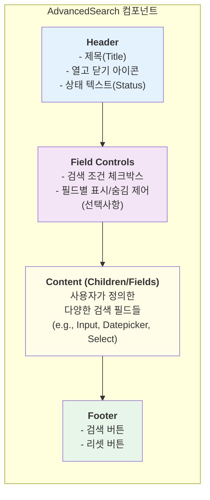
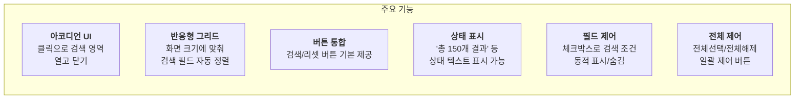
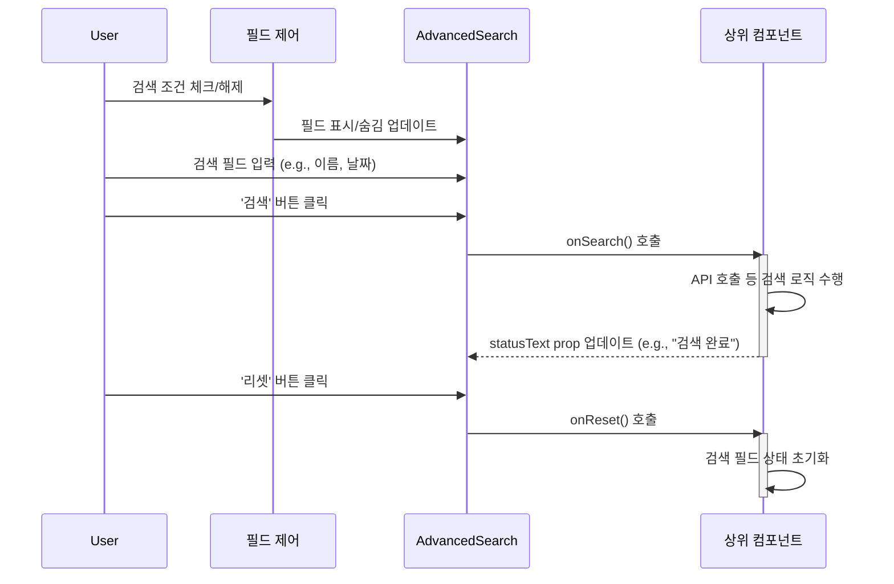

# AdvancedSearch 기능 명세서

`AdvancedSearch`는 다양한 검색 조건을 담을 수 있는 아코디언 형태의 컨테이너 컴포넌트입니다. 복잡한 검색 인터페이스를 깔끔하게 정리하고, 필요할 때만 펼쳐볼 수 있어 화면 공간을 효율적으로 사용할 수 있습니다.

## 1. 컴포넌트 구조

`AdvancedSearch`는 제목과 열기/닫기 상태를 표시하는 `Header`, 검색 조건을 선택할 수 있는 `Field Controls`(선택사항), 사용자가 직접 구성하는 검색 필드들이 들어가는 `Content`, 그리고 검색/리셋 버튼이 위치하는 `Footer`로 구성됩니다.



## 2. 핵심 기능

`AdvancedSearch`는 사용자 편의를 위한 여러 핵심 기능을 내장하고 있습니다.



## 3. 필드 제어 기능 (신규)

### 3.1 개요
검색 파라미터별로 체크박스를 제공하여 사용자가 원하는 검색 조건만 선택적으로 표시할 수 있습니다.

### 3.2 주요 특징
- **기본 활성화**: 모든 검색 조건이 최초에는 활성화되어 표시됩니다.
- **동적 제어**: 체크박스를 통해 실시간으로 필드를 표시하거나 숨길 수 있습니다.
- **전체 제어**: "전체선택" / "전체해제" 버튼으로 모든 조건을 한 번에 제어할 수 있습니다.
- **상태 관리**: 컴포넌트 내부에서 각 필드의 표시 상태를 자동으로 관리합니다.

### 3.3 사용 방법

```typescript
const searchFields = [
  {
    key: 'name',
    label: '이름',
    element: <NameInputField />,
    visible: true
  },
  {
    key: 'email', 
    label: '이메일',
    element: <EmailInputField />,
    visible: true
  }
];

<AdvancedSearch
  fields={searchFields}
  title="사용자 검색"
  onSearch={handleSearch}
  onReset={handleReset}
/>
```

## 4. 상호작용 흐름

사용자가 검색 필드를 채우고 버튼을 클릭하면, `AdvancedSearch`는 외부로 정의된 `onSearch` 또는 `onReset` 함수를 호출합니다. 컴포넌트 자체는 상태를 관리하지 않습니다.



## 5. 필드 구성

AdvancedSearch는 `fields` prop으로 필드 구성을 전달받아 동작합니다.

```mermaid
graph TD
    subgraph "FieldConfig 구조"
        A[key: string<br/>필드 고유 식별자]
        B[label: string<br/>체크박스에 표시될 이름]
        C[element: ReactElement<br/>실제 입력 컴포넌트]
        D[visible: boolean<br/>표시 여부 (기본: true)]
    end

    A & B & C & D --> E(AdvancedSearch 컴포넌트)

    style E fill:#f1f5f9, stroke:#333
```

## 6. 사용 시나리오

- **사용자 관리 페이지**: 이름, 이메일, 역할, 가입일 등 여러 조건으로 사용자를 필터링하여 검색합니다. 관리자는 필요에 따라 특정 검색 조건만 활성화할 수 있습니다.
- **전자상거래 사이트**: 상품 카테고리, 가격 범위, 브랜드, 재고 유무 등 상세 조건으로 상품을 검색합니다. 고객이 자주 사용하지 않는 필터는 숨겨서 UI를 단순화할 수 있습니다.
- **로그 분석 시스템**: 특정 기간, 로그 레벨(Error, Info), 출처(Source) 등으로 방대한 로그 데이터를 필터링합니다. 분석 목적에 따라 필요한 검색 조건만 표시할 수 있습니다.
- **예약 관리 시스템**: 예약자 이름, 예약 날짜, 객실 타입, 상태(확정, 취소) 등 다양한 조건으로 예약을 조회합니다. 시즌별로 자주 사용하는 검색 조건을 맞춤화할 수 있습니다.

## 7. Props 인터페이스

### AdvancedSearchProps
```typescript
interface AdvancedSearchProps {
  title?: string;                    // 제목 (기본: 'Advanced Search')
  fields: FieldConfig[];             // 필드 구성 (필수)
  onSearch?: () => void;             // 검색 버튼 클릭 핸들러
  onReset?: () => void;              // 리셋 버튼 클릭 핸들러
  searchLabel?: string;              // 검색 버튼 라벨 (기본: '검색')
  resetLabel?: string;               // 리셋 버튼 라벨 (기본: '리셋')
  defaultOpen?: boolean;             // 기본 열림 상태 (기본: true)
  showButtons?: boolean;             // 버튼 표시 여부 (기본: true)
  statusText?: string;               // 헤더 상태 텍스트
  fieldControlsLabel?: string;       // 필드 제어 패널 제목 (기본: '검색 조건 설정')
}

interface FieldConfig {
  key: string;                       // 필드 고유 식별자
  label: string;                     // 체크박스 라벨
  element: ReactElement;             // 입력 컴포넌트
  visible: boolean;                  // 표시 여부
}
```
