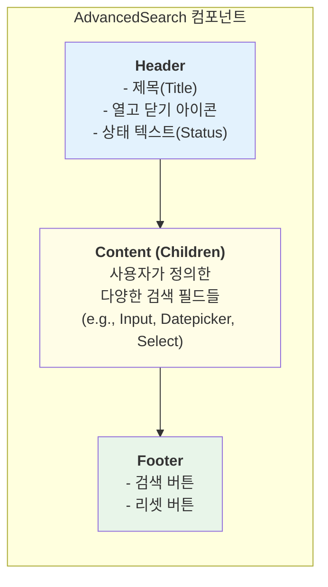
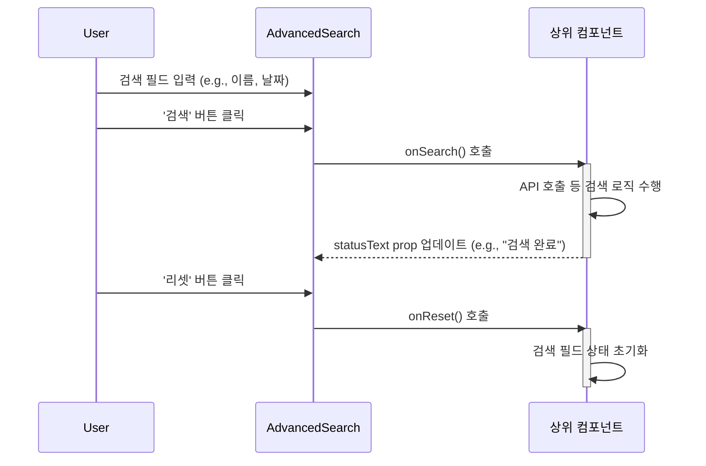
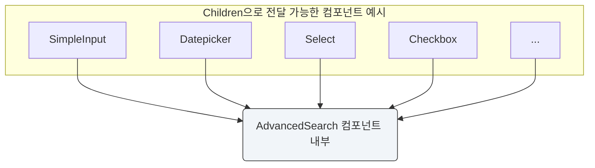

# AdvancedSearch 기능 명세서

`AdvancedSearch`는 다양한 검색 조건을 담을 수 있는 아코디언 형태의 컨테이너 컴포넌트입니다. 복잡한 검색 인터페이스를 깔끔하게 정리하고, 필요할 때만 펼쳐볼 수 있어 화면 공간을 효율적으로 사용할 수 있습니다.

## 1. 컴포넌트 구조

`AdvancedSearch`는 제목과 열기/닫기 상태를 표시하는 `Header`, 사용자가 직접 구성하는 검색 필드들이 들어가는 `Content`, 그리고 검색/리셋 버튼이 위치하는 `Footer`로 구성됩니다.

## 2. 핵심 기능

`AdvancedSearch`는 사용자 편의를 위한 여러 핵심 기능을 내장하고 있습니다.

## 3. 상호작용 흐름

사용자가 검색 필드를 채우고 버튼을 클릭하면, `AdvancedSearch`는 외부로 정의된 `onSearch` 또는 `onReset` 함수를 호출합니다. 컴포넌트 자체는 상태를 관리하지 않습니다.

## 4. 유연한 콘텐츠 구성 (`children`)

`children` prop을 통해 어떤 종류의 입력 컴포넌트든 내부에 배치하여 자유롭게 검색 폼을 구성할 수 있습니다.

## 5. 사용 시나리오

- **사용자 관리 페이지**: 이름, 이메일, 역할, 가입일 등 여러 조건으로 사용자를 필터링하여 검색합니다.
- **전자상거래 사이트**: 상품 카테고리, 가격 범위, 브랜드, 재고 유무 등 상세 조건으로 상품을 검색합니다.
- **로그 분석 시스템**: 특정 기간, 로그 레벨(Error, Info), 출처(Source) 등으로 방대한 로그 데이터를 필터링합니다.
- **예약 관리 시스템**: 예약자 이름, 예약 날짜, 객실 타입, 상태(확정, 취소) 등 다양한 조건으로 예약을 조회합니다.
