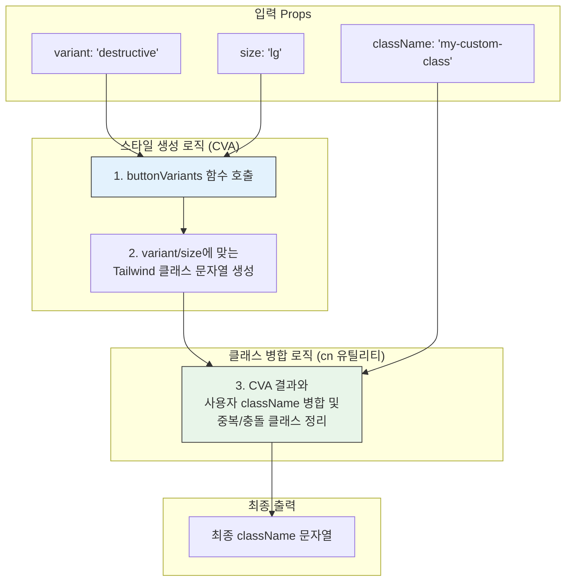
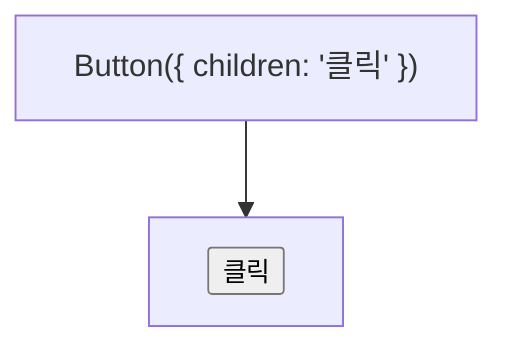
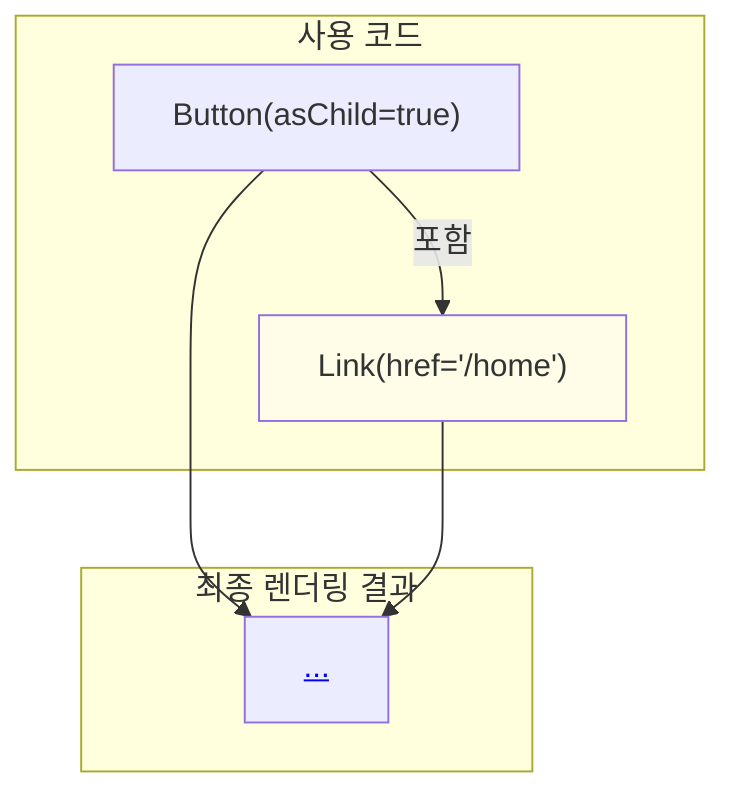
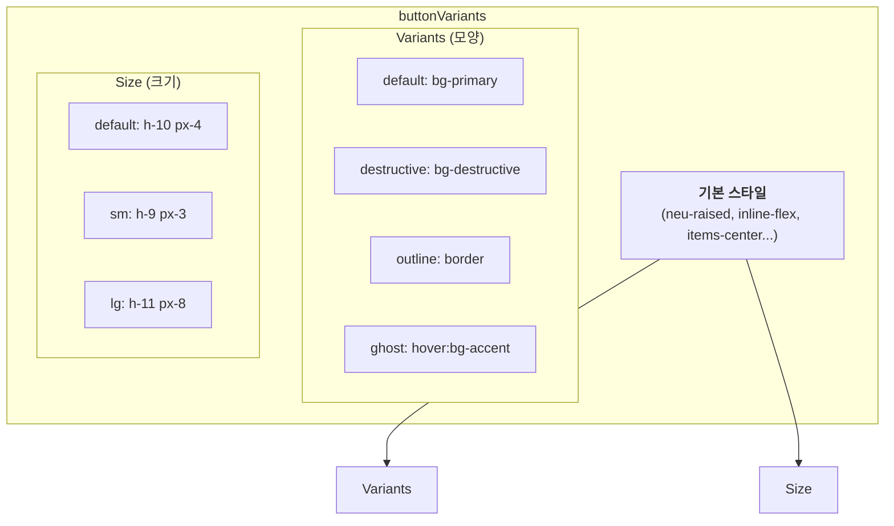

# Button 기술 명세서

이 문서는 `Button` 컴포넌트의 내부 아키텍처, 특히 `class-variance-authority`(CVA)를 사용한 스타일 관리와 `asChild` prop을 통한 유연성 확보 방식을 설명합니다.

## 1. 아키텍처: CVA 기반의 동적 스타일링

`Button` 컴포넌트는 CVA 라이브러리를 핵심 엔진으로 사용하여, `variant`와 `size` prop에 따라 동적으로 스타일 클래스를 조합합니다.

이 구조를 통해 스타일 로직을 컴포넌트 코드로부터 분리하여 가독성과 유지보수성을 크게 향상시킵니다.

## 2. `asChild` Prop을 이용한 컴포넌트 합성

`asChild` prop은 `Button`의 스타일은 그대로 유지하면서, 렌더링되는 실제 태그를 자식 컴포넌트로 대체할 수 있게 해주는 강력한 기능입니다. `@radix-ui/react-slot`을 통해 구현됩니다.

### `asChild={false}` (기본값)

`Button`은 일반적인 `<button>` HTML 태그로 렌더링됩니다.

### `asChild={true}`

`Button` 자체는 렌더링되지 않고, 자신의 props(스타일 클래스 포함)를 유일한 자식 컴포넌트에 병합하여 전달합니다.

이 기능은 Next.js의 `<Link>` 컴포넌트나 다른 라우팅 라이브러리와 결합하여, 링크가 버튼처럼 보이게 만들 때 특히 유용합니다.

## 3. 뉴모피즘 상태와 클래스 매핑

버튼의 인터랙션 상태에 따라 뉴모피즘 관련 클래스가 동적으로 적용됩니다.

| 상태      | 적용 클래스                             | 시각적 효과             |
| :-------- | :-------------------------------------- | :---------------------- |
| 기본      | `neu-raised`                            | 양각 (튀어나옴)         |
| 호버      | `hover:scale-[1.02]`                    | 미세하게 커짐           |
| 활성/클릭 | `active:neu-inset`                      | 음각 (눌림)             |
| 비활성    | `disabled:opacity-50 disabled:neu-flat` | 평면, 흐릿함, 클릭 불가 |

## 4. `buttonVariants` 상세 구성

CVA로 정의된 `buttonVariants`는 다음과 같은 구조를 가집니다.

- 새로운 종류의 버튼이나 크기를 추가하고 싶을 때, 이 `buttonVariants` 객체만 수정하면 되므로 확장성이 매우 뛰어납니다.
