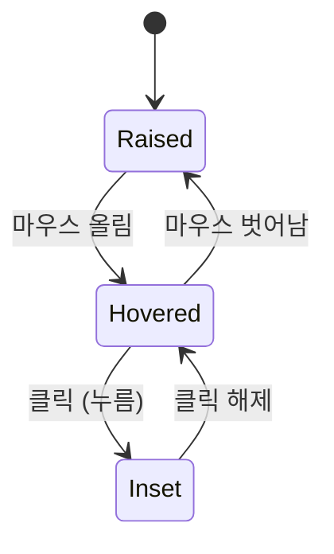
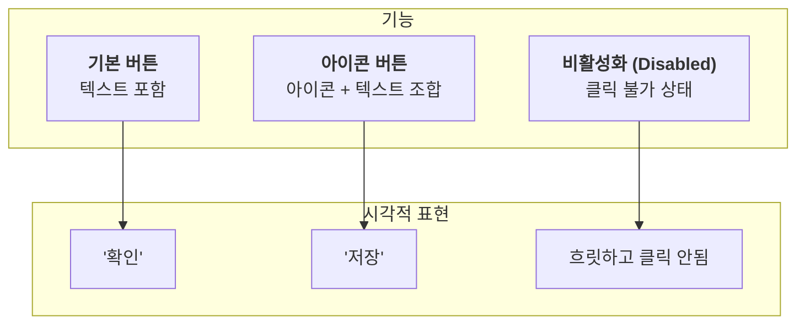
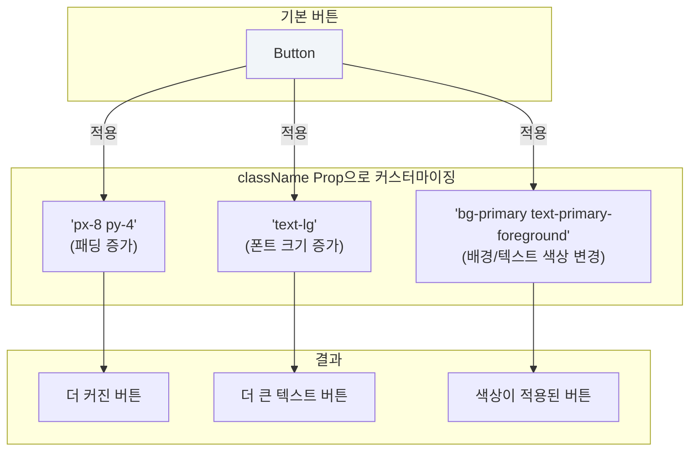

# Button 기능 명세서

`Button`은 사용자의 액션을 트리거하는 가장 기본적인 UI 요소입니다. 프로젝트의 뉴모피즘 디자인 시스템에 맞춰 설계되어 일관된 사용자 경험을 제공합니다.

## 1. 상호작용에 따른 시각적 상태 변화

버튼은 사용자의 마우스 움직임(Hover)과 클릭(Click/Active)에 따라 입체적인 시각 효과를 통해 피드백을 제공합니다.

## 2. 주요 기능 및 속성

`Button` 컴포넌트는 비활성화 상태를 지원하며, 아이콘과 텍스트를 자유롭게 조합하여 의미를 명확하게 전달할 수 있습니다.

## 3. 크기 및 스타일 커스터마이징

`className` prop을 통해 Tailwind CSS 유틸리티 클래스를 추가하여 버튼의 크기, 색상, 여백 등을 자유롭게 조절할 수 있습니다.

## 4. 사용 시나리오

- **폼(Form) 제출**: '저장하기', '가입하기' 등 사용자가 입력한 데이터를 서버로 전송할 때.
- **확인/취소 대화상자**: 중요한 작업을 확인하거나 취소하는 액션을 받을 때.
- **아이콘 기반 액션**: '삭제', '편집', '새로고침' 등 텍스트 없이 아이콘만으로 기능을 표현할 때.
- **페이지 이동**: 다른 페이지로 사용자를 안내하는 링크 역할을 할 때.
