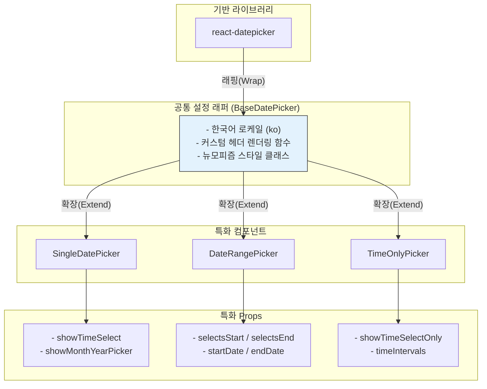
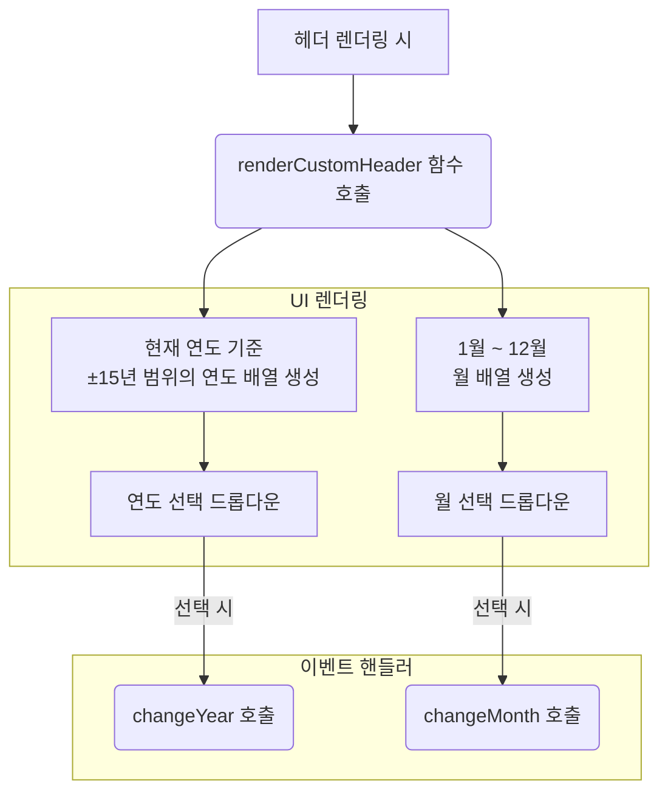
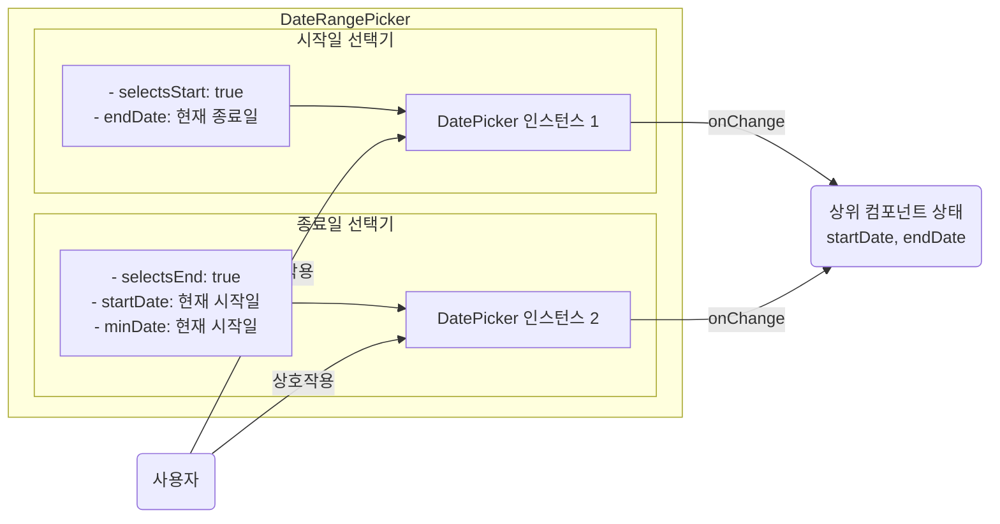

# Datepicker 기술 명세서

이 문서는 `react-datepicker` 라이브러리를 기반으로 구현된 `Datepicker` 컴포넌트 시스템의 내부 아키텍처와 커스터마이징 방식을 설명합니다.

## 1. 아키텍처: 공통 설정 기반의 특화 컴포넌트

모든 Datepicker 컴포넌트는 공통 설정을 공유하는 `BaseDatePicker`를 기반으로, 각각의 용도에 맞게 특화된 props를 추가하여 구현됩니다.



## 2. 커스텀 헤더 로직

빠른 날짜 탐색을 위해 기본 헤더 대신 연/월 드롭다운을 제공하는 커스텀 헤더를 `renderCustomHeader` prop을 통해 렌더링합니다.



## 3. 스타일링 오버라이드 시스템

Datepicker의 스타일은 `react-datepicker`의 기본 CSS 위에 프로젝트의 커스텀 스타일과 뉴모피즘 클래스를 덮어쓰는 계층 구조로 적용됩니다.

```mermaid
graph TD
    subgraph "스타일 적용 우선순위 (아래로 갈수록 높음)"
        direction TB
        L1[react-datepicker/dist/react-datepicker.css<br/>(라이브러리 기본 스타일)]
        L2[컴포넌트 주입 클래스<br/>(e.g., neu-inset, w-full)]
        L3[전역 CSS 오버라이드<br/>(e.g., .react-datepicker__header {...})]
    end

    L1 --> L2 --> L3

    style L1 fill:#f1f1f1
    style L2 fill:#e8f5e9
    style L3 fill:#e3f2fd
```

이를 통해 라이브러리의 기본 구조는 유지하면서, 프로젝트의 디자인 시스템과 일관된 UI를 구현합니다.

## 4. `DateRangePicker`의 내부 구현

`DateRangePicker`는 실제로는 두 개의 `react-datepicker` 인스턴스를 조합하여 구현됩니다. 각 인스턴스는 시작일과 종료일을 담당하며, 서로의 상태에 영향을 줍니다.



- **`selectsStart`/`selectsEnd`**: `react-datepicker`에 지금 선택하는 날짜가 범위의 시작인지 끝인지를 알려주는 역할을 합니다.
- **`minDate`**: 종료일 선택기에서는 `minDate`를 현재 선택된 시작일로 설정하여, 시작일보다 이전 날짜를 종료일로 선택하는 것을 방지합니다.

## 5. 성능 및 확장성

- **메모이제이션**: 커스텀 헤더의 연/월 배열은 `useMemo`를 사용하여 불필요한 재계산을 방지하고 렌더링 성능을 최적화할 수 있습니다.
- **로케일 확장**: 현재 한국어 로케일이 하드코딩되어 있으나, `locale` prop을 외부에서 주입받도록 수정하면 다국어 환경에 쉽게 대응할 수 있습니다.
- **CSS 변수**: 향후 테마 시스템과 연동을 위해 `var(--primary-color)` 같은 CSS 변수를 사용하도록 스타일을 리팩토링할 수 있습니다.
