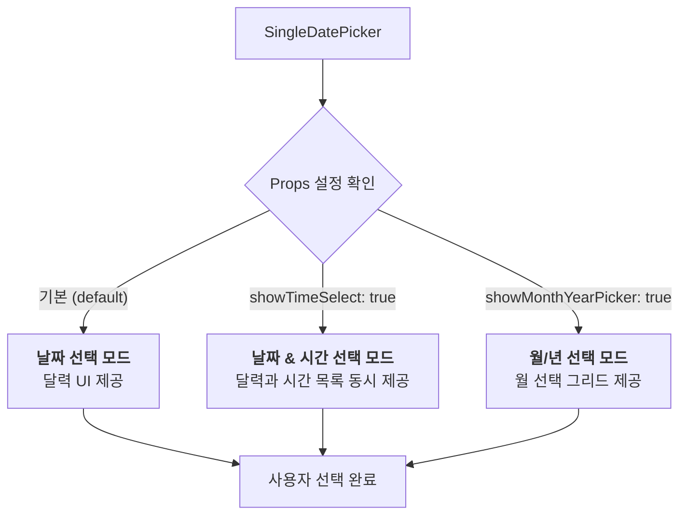
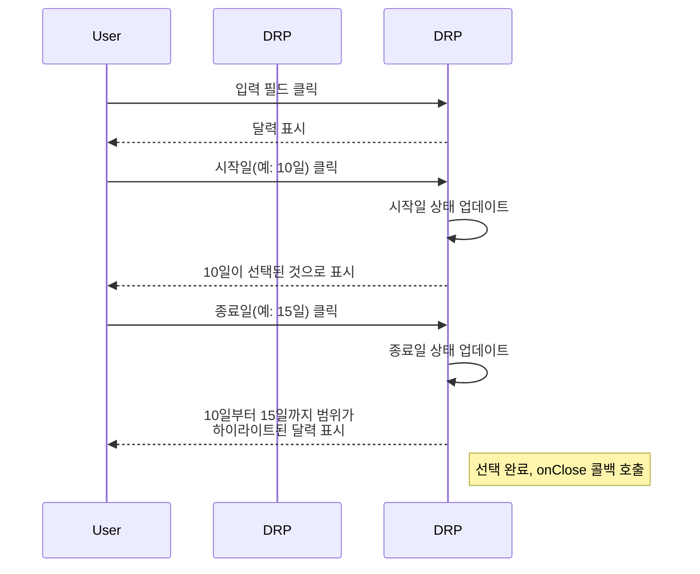

# Datepicker 기능 명세서

`Datepicker`는 다양한 시나리오에 맞춰 날짜, 시간, 또는 날짜 범위를 선택할 수 있는 유연한 컴포넌트 모음입니다.

## 1. 컴포넌트 구성

Datepicker는 세 가지 주요 컴포넌트로 구성되어 있으며, 각각 특정 선택 시나리오를 담당합니다.

```mermaid
graph TD
    subgraph "Datepicker 모음"
        A[SingleDatePicker<br/>(단일 날짜/시간 선택)]
        B[DateRangePicker<br/>(날짜 범위 선택)]
        C[TimeOnlyPicker<br/>(시간만 선택)]
    end

    subgraph "주요 기능"
        Func_A["- 특정 날짜 하나 선택<br/>- 시간 또는 월/년 단위 선택 모드 지원"]
        Func_B["- 시작일과 종료일 선택<br/>- 예약, 조회 기간 설정에 사용"]
        Func_C["- 날짜 정보 없이 시간만 선택<br/>- 알람, 영업 시간 설정에 사용"]
    end

    A --> Func_A
    B --> Func_B
    C --> Func_C
```

## 2. 공통 기능 및 특징

모든 Datepicker 컴포넌트는 사용자 편의를 위한 공통 기능을 공유합니다.


## 3. `SingleDatePicker`의 동작 모드

`SingleDatePicker`는 `props` 설정에 따라 세 가지 다른 모드로 동작할 수 있습니다.



## 4. `DateRangePicker` 상호작용 흐름

`DateRangePicker`는 시작일과 종료일을 순차적으로 선택하여 기간을 설정합니다.



## 5. 주요 사용 시나리오

- **회원 가입**: `SingleDatePicker`를 사용하여 사용자의 생년월일을 입력받습니다.
- **예약 시스템**: `DateRangePicker`를 사용하여 호텔이나 렌터카의 체크인/체크아웃 날짜를 선택합니다.
- **알람 설정**: `TimeOnlyPicker`를 사용하여 매일 반복될 알람 시간을 설정합니다.
- **이벤트 생성**: `SingleDatePicker`의 `showTimeSelect` 옵션을 활성화하여 이벤트가 열리는 정확한 날짜와 시간을 지정합니다.
- **데이터 조회**: `DateRangePicker`를 사용하여 특정 기간의 판매 실적이나 로그 데이터를 조회할 범위를 설정합니다.
