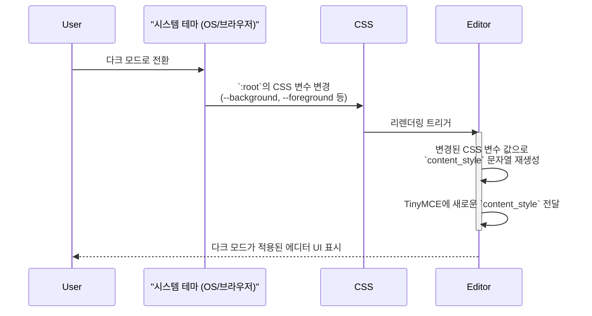
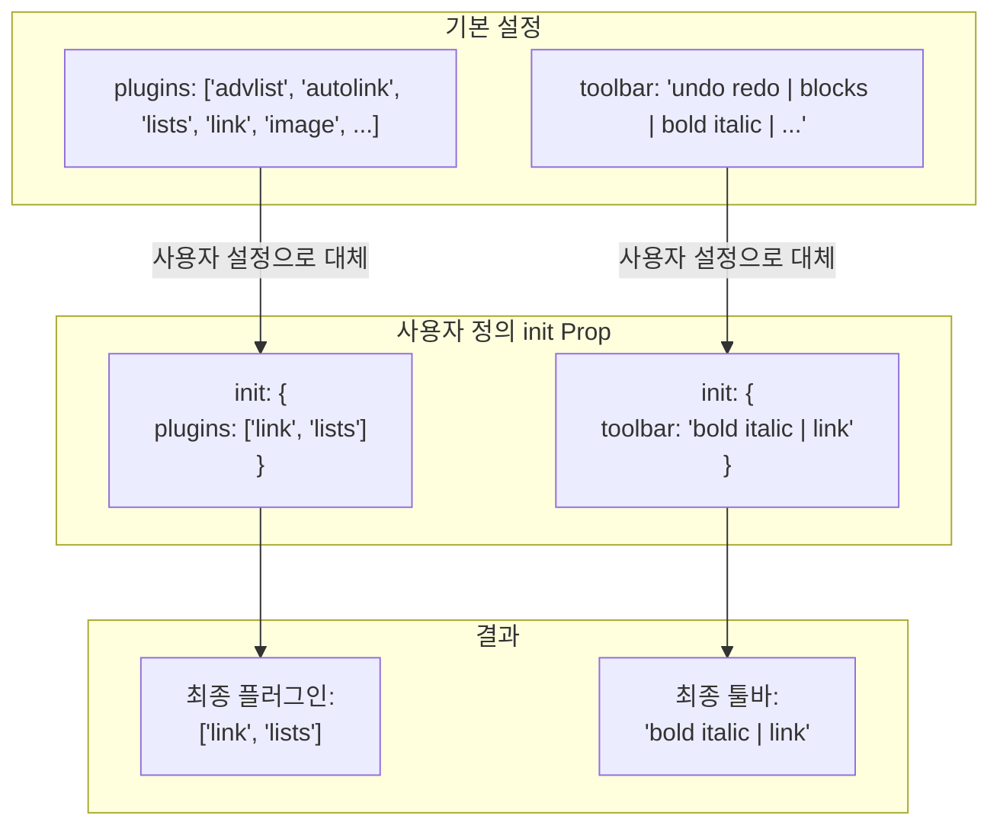

# Editor 기술 명세서

이 문서는 `@tinymce/tinymce-react` 라이브러리를 래핑하여 만든 `Editor` 컴포넌트의 내부 아키텍처, 설정 관리, 테마 연동 방식을 설명합니다.

## 1. 래핑 아키텍처

`Editor` 컴포넌트는 외부 라이브러리인 `TinyMCE`를 직접 노출하지 않고, 프로젝트에 필요한 기본 설정을 내장한 형태로 한 번 더 감싸서 제공합니다. 이를 통해 일관성을 유지하고 사용법을 단순화합니다.

```mermaid
graph TD
    subgraph "상위 컴포넌트"
        A[사용자 정의 Props<br/>(value, onChange, init...)]
    end

    subgraph "Editor 컴포넌트 (래퍼)"
        B{설정 병합 로직}
        C[기본 설정 객체<br/>- 플러그인, 툴바, 다크모드 스타일]
    end

    subgraph "내부 TinyMCE"
        D[@tinymce/tinymce-react]
    end

    A -- 전달 --> B
    C -- 전달 --> B
    B -- "최종 설정(Final Init) 전달" --> D

    style B fill:#e3f2fd,stroke:#333
```

## 2. 설정 병합 플로우

`Editor`는 자체 기본 설정 위에 사용자가 전달한 `init` 객체를 덮어쓰는 방식으로 최종 설정을 결정합니다. 이를 통해 기본값을 유지하면서 필요한 부분만 커스터마이징할 수 있습니다.

```mermaid
flowchart TD
    Start --> A[Editor 기본 설정 객체 생성<br/>- height, menubar, plugins, toolbar, content_style...];
    A --> B{사용자 정의 init Prop이 있는가?};
    B -- Yes --> C[기본 설정 위에<br/>사용자 init 설정을 덮어씀<br/>( {...defaultInit, ...userInit} )];
    B -- No --> D[기본 설정 객체 사용];
    C & D --> Final[최종 설정(Final Init) 확정];
    Final --> TinyMCE[TinyMCE 컴포넌트에 전달];
```

## 3. 다크 모드 연동 시스템

에디터 내부(`iframe`)의 다크 모드는 `content_style`에 CSS 변수를 주입하는 방식으로 구현됩니다. 시스템 테마가 변경되면, `Editor` 컴포넌트가 리렌더링되면서 새로운 CSS 변수 값을 참조하여 자동으로 테마가 변경됩니다.



## 4. 플러그인 및 툴바 커스터마이징

기본 플러그인과 툴바 구성은 `Editor`의 기본 설정에 정의되어 있습니다. 사용자는 `init` prop에 `plugins` 또는 `toolbar` 키를 제공하여 이 설정을 완전히 덮어쓸 수 있습니다.



## 5. 이벤트 처리 흐름

`Editor`는 `onEditorChange`라는 `TinyMCE`의 내부 이벤트를 받아, 이를 상위 컴포넌트에서 사용하기 쉬운 `onChange` prop으로 변환하여 전달합니다.

```mermaid
graph TD
    subgraph "TinyMCE 내부"
        A[콘텐츠 변경 발생] --> B[onEditorChange 이벤트 트리거<br/>(새로운 content 문자열과 함께)];
    end

    subgraph "Editor 래퍼"
        C[이벤트 수신<br/>(newValue) => onChange(newValue)];
    end

    subgraph "상위 컴포넌트"
        D[onChange prop으로<br/>상태 업데이트 (e.g., setContent)];
    end

    B --> C --> D
```
