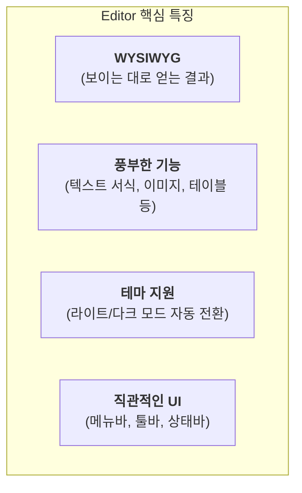
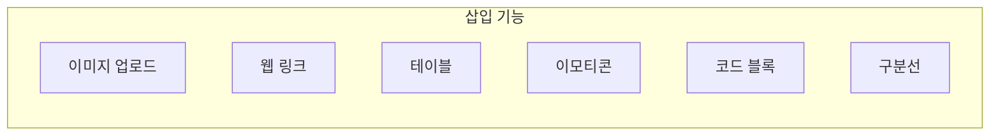

# Editor 기능 명세서

`Editor`는 문서를 시각적으로 편집하고 서식을 지정할 수 있는 리치 텍스트 에디터(WYSIWYG)입니다. 워드프로세서처럼 직관적인 인터페이스를 제공하여 누구나 쉽게 콘텐츠를 작성하고 꾸밀 수 있습니다.

## 1. 핵심 특징

`Editor`는 강력한 기능과 사용자 친화적인 디자인을 결합하여 최적의 콘텐츠 작성 환경을 제공합니다.



## 2. 에디터 UI 구성

에디터 인터페이스는 메뉴바, 툴바, 콘텐츠 편집 영역, 상태바의 네 부분으로 명확하게 구분됩니다.

```mermaid
graph TD
    subgraph "Editor Layout"
        direction TB
        MenuBar[메뉴바: 파일, 편집, 보기 등]
        ToolBar[툴바: 자주 사용하는 기능 아이콘]
        ContentArea[콘텐츠 편집 영역<br/>(실제 텍스트와 이미지가 표시되는 공간)]
        StatusBar[상태바: 단어 수, 확대/축소 등]
    end
    MenuBar --> ToolBar --> ContentArea --> StatusBar
```

## 3. 주요 기능 둘러보기

에디터의 다양한 기능은 목적에 따라 그룹화되어 툴바와 메뉴바에 배치되어 있습니다.

### 텍스트 서식

글꼴 스타일, 색상, 정렬, 목록 등 기본적인 텍스트 서식을 지정합니다.

```mermaid
graph LR
    subgraph "텍스트 서식 기능"
        S1[굵게/기울임]
        S2[글자/배경색]
        S3[제목/단락 스타일]
        S4[정렬]
        S5[목록 (순서/비순서)]
        S6[들여쓰기]
    end
```

### 미디어 및 객체 삽입

이미지, 링크, 테이블 등 텍스트 외의 다양한 요소를 문서에 추가할 수 있습니다.



## 4. 상황별 메뉴 (Context Menu)

편집 중인 요소 위에서 마우스 오른쪽 버튼을 클릭하면, 해당 요소에만 적용할 수 있는 전용 메뉴가 나타납니다.

```mermaid
flowchart TD
    User[사용자: 마우스 우클릭] --> Target{어떤 요소를 클릭했는가?};
    Target -- "일반 텍스트" --> Menu_Link[링크 생성/편집];
    Target -- "이미지" --> Menu_Image[이미지 속성 편집];
    Target -- "테이블" --> Menu_Table[테이블 속성<br/>(셀, 행, 열 편집)];
```

## 5. 사용 시나리오

- **블로그 게시물 작성**: 제목, 본문, 이미지, 인용구를 자유롭게 조합하여 전문적인 블로그 글을 작성합니다.
- **온라인 쇼핑몰 상품 상세 설명**: 테이블을 이용해 제품 사양을 정리하고, 이미지를 첨부하여 상품을 매력적으로 소개합니다.
- **위키 또는 지식 베이스 문서 작성**: 링크 기능을 활용하여 여러 문서들을 서로 연결하고, 코드 블록으로 기술적인 내용을 명확하게 전달합니다.
- **댓글 작성**: 이모티콘과 간단한 텍스트 서식을 사용하여 다른 사용자와의 소통에 생동감을 더합니다.
