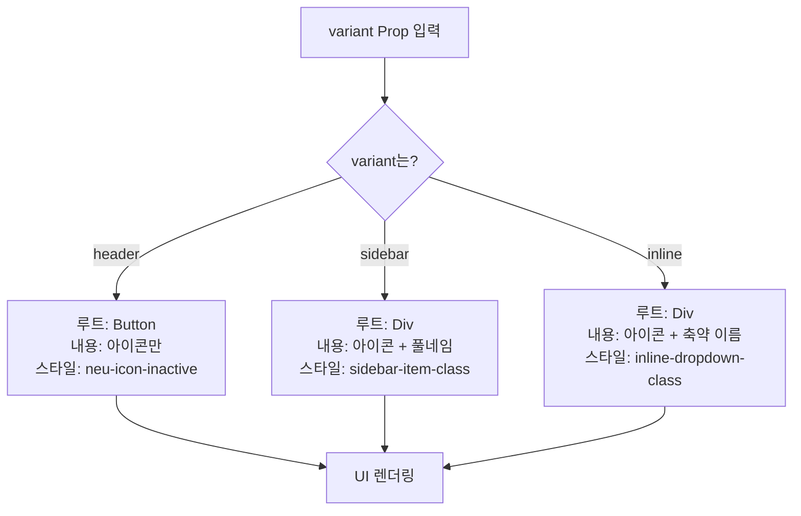

# LanguageSwitcher 기술 명세서

이 문서는 `LanguageSwitcher` 컴포넌트의 내부 데이터 흐름과 렌더링 로직을 기술적으로 설명합니다.

## 1. 데이터 및 상태 흐름

컴포넌트는 국제화 설정 파일(`i18n.ts`)에서 언어 목록과 현재 언어 정보를 가져오고, `useLocale` 훅을 통해 언어 변경 함수에 접근합니다.

```mermaid
graph TD
    subgraph "외부 설정/훅"
        A["config/i18n.ts<br>(전체 언어 목록, 기본값)"]
        B["hooks/useI18n<br>(useLocale: currentLocale, changeLocale)"]
    end

    subgraph "LanguageSwitcher 컴포넌트"
        C[1. 현재 언어(currentLocale) 가져오기]
        D[2. 전체 언어 목록(locales) 가져오기]
        E[3. 렌더링: 현재 언어 표시]
        F[4. 사용자 선택 시 changeLocale(newLocale) 호출]
    end

    A --> D
    B --> C
    B -- "제공" --> F

    style A fill:#e3f2fd
    style B fill:#e8f5e9
```

## 2. Variant에 따른 동적 렌더링 로직

`variant` prop의 값에 따라 컴포넌트의 루트 요소, 아이콘, 텍스트 라벨의 렌더링 여부와 적용되는 스타일 클래스가 동적으로 결정됩니다.



- **`header`**: 가장 단순한 형태로, 클릭 가능한 버튼 안에 아이콘만 렌더링하여 공간 효율성을 높입니다.
- **`sidebar`**: `div` 컨테이너 안에 아이콘과 전체 언어 이름을 함께 표시하여 명확한 정보를 전달합니다.
- **`inline`**: 드롭다운 트리거 역할을 하는 `div` 안에 현재 언어의 축약된 이름과 아이콘을 표시합니다.

## 3. 언어 목록 생성 로직

컴포넌트는 `i18n.ts`에서 가져온 언어 목록을 `map` 함수로 순회하여 드롭다운 메뉴 아이템들을 생성합니다. 각 아이템은 `changeLocale` 함수를 호출하는 `onClick` 이벤트를 가집니다.

```mermaid
graph TD
    A[i18n.locales 배열] --> B(map(locale => ...));
    B --> C{DropdownMenuItem 생성};
    C --> D["- FlagIcon<br>- locale.name<br>- onClick: () => changeLocale(locale.code)"];
    D --> E[언어 목록 UI];

    style A fill:#e3f2fd
    style E fill:#fffde7
```

이 과정을 통해 국제화 설정 파일(`i18n.ts`)에 새로운 언어를 추가하기만 하면, `LanguageSwitcher` 컴포넌트의 드롭다운 메뉴에도 별도의 코드 수정 없이 해당 언어가 자동으로 반영됩니다.
