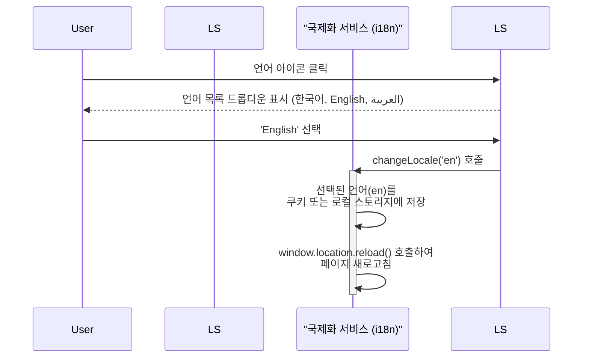
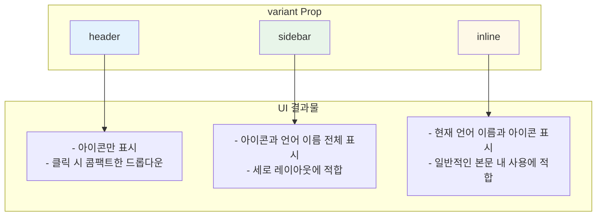

# LanguageSwitcher 기능 명세서

`LanguageSwitcher`는 사용자가 애플리케이션의 표시 언어를 손쉽게 변경할 수 있도록 돕는 UI 컴포넌트입니다. 드롭다운 메뉴 형태로 사용 가능한 언어 목록을 보여주고, 선택 시 즉시 언어를 전환합니다.

## 1. 핵심 기능 및 동작

사용자가 언어 아이콘을 클릭하면 선택 가능한 언어 목록이 나타나고, 특정 언어를 선택하면 애플리케이션 전체의 언어가 변경된 후 페이지가 새로고침됩니다.

## 2. 형태(Variant)에 따른 UI 변화

`variant` prop을 통해 `header`, `sidebar`, `inline` 세 가지 다른 UI 형태로 렌더링할 수 있습니다. 각 형태는 특정 레이아웃에 최적화되어 있습니다.

| Variant   | 주요 특징                                     | 사용 위치 예시 |
| :-------- | :-------------------------------------------- | :------------- |
| `header`  | 공간을 절약하는 아이콘 기반의 콤팩트한 디자인 | 페이지 헤더    |
| `sidebar` | 명확한 텍스트 라벨을 포함한 세로 디자인       | 사이드바 메뉴  |
| `inline`  | 가장 표준적인 형태의 드롭다운                 | 설정 페이지 등 |

## 3. 사용 시나리오

- **다국어 웹사이트 헤더**: 웹사이트의 메인 헤더에 `header` variant를 배치하여 모든 페이지에서 일관된 언어 전환 기능을 제공합니다.
- **사용자 설정 페이지**: 사용자가 자신의 프로필 설정에서 선호 언어를 직접 선택할 수 있도록 `inline` variant를 제공합니다.
- **모바일 사이드 메뉴**: 모바일 환경의 햄버거 메뉴나 사이드바 내부에 `sidebar` variant를 배치하여 쉽게 언어를 변경할 수 있도록 합니다.
