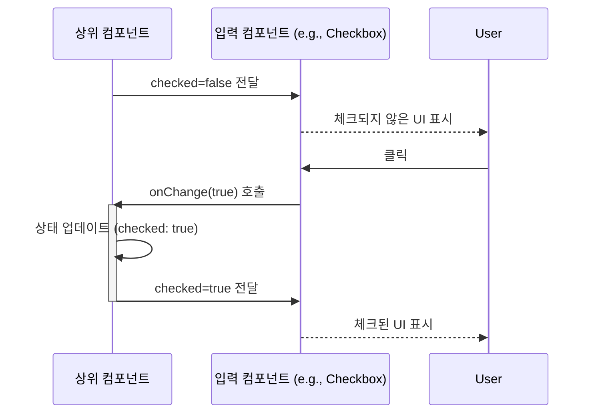
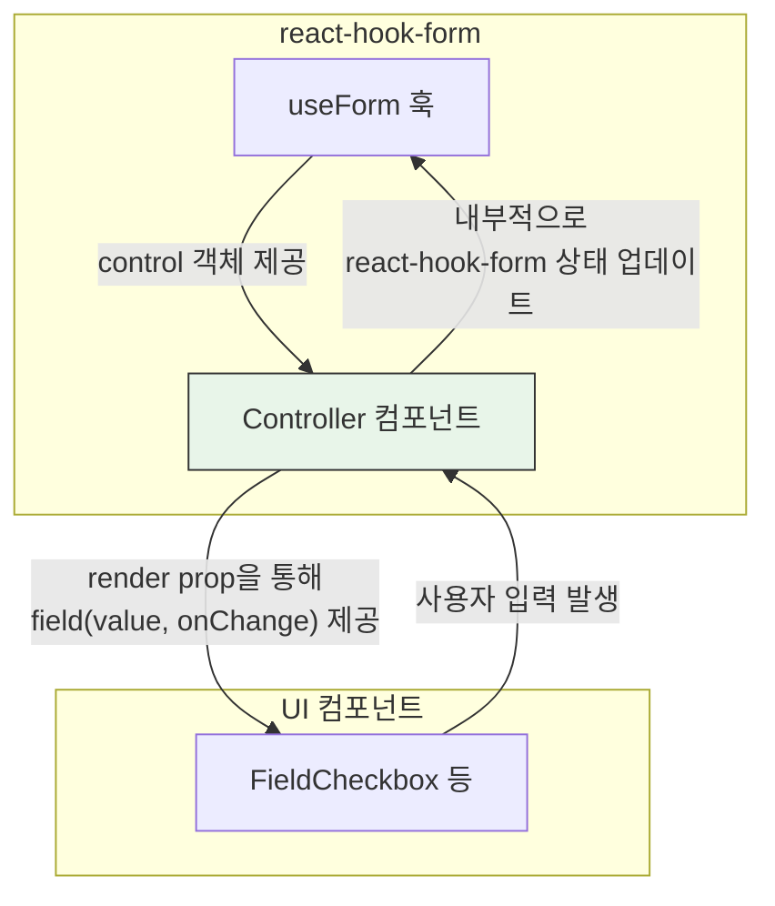

# 단순 입력(Simple Input) 기술 명세서

이 문서는 `FieldCheckbox`, `FieldRadioGroup`, `FieldToggleButton`, `FieldToggleSwitch` 컴포넌트의 내부 아키텍처와 외부 라이브러리와의 연동 방식을 설명합니다.

## 1. 공통 Field 아키텍처

네 컴포넌트는 모두 재사용 가능한 `Field` 컴포넌트를 기반으로 설계되었습니다. `Field` 컴포넌트는 라벨, 도움말 텍스트, 오류 메시지 표시 등 입력 필드의 공통적인 UI와 기능을 담당합니다.

```mermaid
graph TD
    subgraph "공통 Field 컴포넌트"
        direction LR
        F_Core[Field<br/>(라벨, 오류 메시지, 레이아웃)]
    end

    subgraph "개별 입력 컴포넌트"
        A[FieldCheckbox]
        B[FieldRadioGroup]
        C[FieldToggleButton]
        D[FieldToggleSwitch]
    end

    A -- "확장(Extends)" --> F_Core
    B -- "확장(Extends)" --> F_Core
    C -- "확장(Extends)" --> F_Core
    D -- "확장(Extends)" --> F_Core

    subgraph "고유 로직"
        Logic_A["- Checkbox UI<br/>- checked/onChange"]
        Logic_B["- Radio UI<br/>- value/onChange"]
        Logic_C["- Button UI<br/>- isToggled/onToggle"]
        Logic_D["- Switch UI<br/>- checked/onChange"]
    end

    A --> Logic_A
    B --> Logic_B
    C --> Logic_C
    D --> Logic_D

    style F_Core fill:#e3f2fd,stroke:#333
```

이 구조를 통해 각 컴포넌트는 자신의 핵심 기능(체크, 선택, 토글) 구현에만 집중하고, 나머지 부가 기능은 `Field` 컴포넌트에 위임하여 코드 중복을 최소화하고 일관성을 유지합니다.

## 2. 상태 관리 및 인터페이스

각 컴포넌트는 제어 컴포넌트(Controlled Component)로 설계되었습니다. 즉, `value`/`checked` 등의 상태를 prop으로 받고, 사용자 입력이 발생하면 `onChange`/`onToggle` 콜백 함수를 호출하여 상태 변경을 상위 컴포넌트에 알립니다.



## 3. `react-hook-form` 연동

이 컴포넌트들은 `react-hook-form`과의 원활한 통합을 위해 설계되었습니다. `Controller` 컴포넌트로 래핑하여 사용합니다.



- **`Controller`**: `react-hook-form`의 상태와 UI 컴포넌트를 연결하는 브릿지 역할을 합니다.
- **`render` prop**: `Controller`는 `field` 객체(`value`, `onChange`, `onBlur` 등 포함)를 `render` prop을 통해 UI 컴포넌트로 전달합니다.
- UI 컴포넌트의 `value`/`checked`와 `onChange` prop을 `field` 객체의 속성과 그대로 매핑하면 `react-hook-form`의 상태 관리에 통합됩니다.

## 4. 스타일링 및 뉴모피즘

- **상태별 스타일**: 각 컴포넌트는 `checked`, `isToggled` 등의 상태에 따라 뉴모피즘 클래스(`neu-inset`, `neu-raised`)를 동적으로 적용하여 시각적인 피드백을 제공합니다.
- **포커스 관리**: 키보드 탐색 시 포커스를 받으면 `focus-visible`과 함께 외곽선 스타일이 적용되어 접근성을 준수합니다.
- **비활성화 상태**: `disabled` prop이 `true`일 경우, `opacity-50`와 `cursor-not-allowed` 클래스를 적용하여 사용자 입력을 막고 시각적으로 비활성화되었음을 표시합니다.
