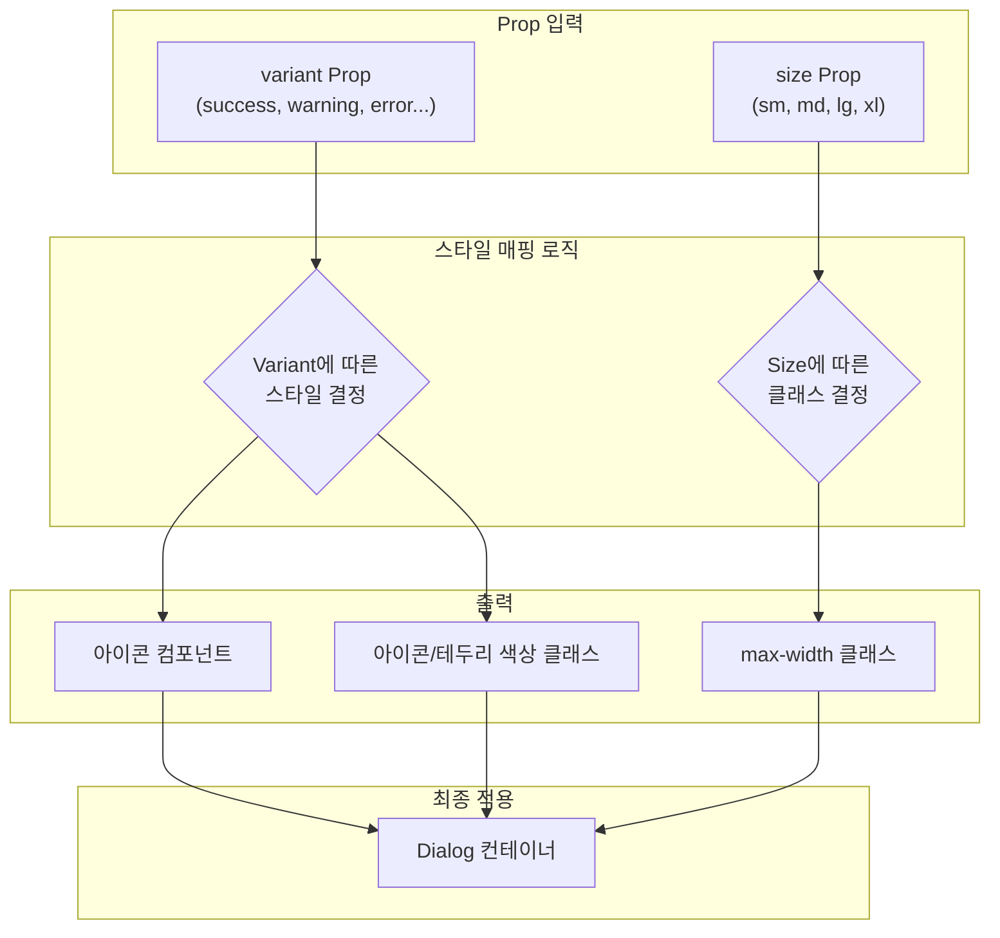
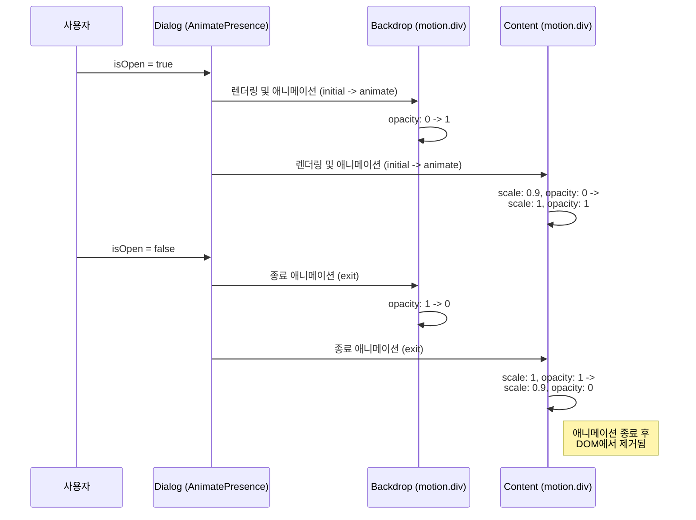
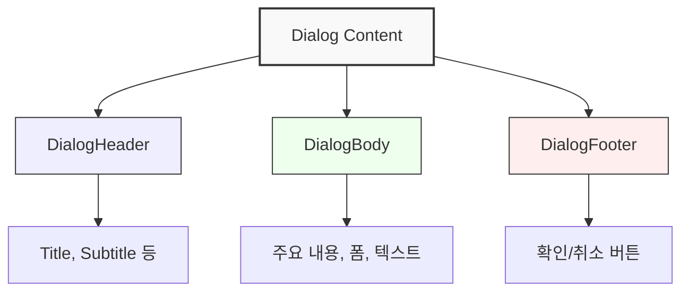

# Dialog 컴포넌트 기술 명세서

## 1. 아키텍처 개요

`Dialog` 컴포넌트는 `React Portal`을 사용하여 DOM의 최상단에 렌더링되며, `Framer Motion`을 통해 애니메이션 효과를 구현합니다. `DialogHeader`, `DialogBody`, `DialogFooter` 같은 헬퍼 컴포넌트와 조합하여 유연한 구조를 만듭니다.

```mermaid
graph TD
    subgraph App
        A[Dialog 호출<br/>(isOpen=true)]
    end

    subgraph "DOM Root (body 태그)"
        P[Portal 생성]
    end

    subgraph "Dialog 컴포넌트"
        B(Framer Motion: AnimatePresence)
        C{Dialog 렌더링}
        D[Backdrop<br/>(배경)]
        E[Dialog Content<br/>(콘텐츠 영역)]
        F[헬퍼 컴포넌트<br/>Header, Body, Footer]
    end

    A --> P
    P --> B
    B --> C
    C --> D
    C --> E
    E --> F
```

## 2. 렌더링 및 상태 흐름

`Dialog`는 `isOpen` prop에 따라 렌더링 여부가 결정됩니다. 컴포넌트가 마운트된 후에만 `Portal`을 통해 렌더링하여 SSR 환경과의 호환성을 보장합니다.

```mermaid
flowchart TD
    Start[Dialog 마운트] --> IsMounted{mounted 상태인가?};
    IsMounted -- No --> RenderNull[null 렌더링 후<br/>useEffect로 mounted=true 설정];
    RenderNull --> IsMounted;
    IsMounted -- Yes --> IsOpen{isOpen Prop이 true인가?};
    IsOpen -- No --> Unmount[AnimatePresence로<br/>종료 애니메이션 후 언마운트];
    IsOpen -- Yes --> RenderDialog[Portal을 통해<br/>Dialog 렌더링];
    RenderDialog --> HandleEvents[이벤트 핸들러 등록<br/>(ESC, Backdrop 클릭)];
    HandleEvents --> End[Dialog 표시];
    Unmount --> End;
```

## 3. Variant 및 Size 시스템

`variant`와 `size` prop은 각각 정해진 아이콘, 색상, 테두리 스타일과 최대 너비 클래스로 매핑됩니다. 이 시스템은 코드 내의 설정 객체를 통해 관리됩니다.



## 4. 애니메이션 시퀀스

`Dialog`는 배경(Backdrop)과 콘텐츠(Content)에 각각 다른 애니메이션을 적용하여 깊이감을 만듭니다. `AnimatePresence`가 `isOpen` 상태에 따라 이 애니메이션들을 제어합니다.



## 5. 이벤트 처리 흐름

`onClose` 함수는 `closeOnEscape` 또는 `closeOnBackdropClick` prop이 `true`일 때 특정 조건 하에 호출됩니다.

```mermaid
flowchart TD
    subgraph "이벤트 발생"
        A[ESC 키 입력]
        B[Backdrop 클릭]
    end

    subgraph "조건 검사"
        C{isOpen 이고<br/>closeOnEscape: true 인가?}
        D{isOpen 이고<br/>closeOnBackdropClick: true 인가?}
    end

    subgraph "액션"
        E[onClose() 호출]
    end

    A --> C
    B --> D
    C -- Yes --> E
    D -- Yes --> E
    C -- No --> F[무시]
    D -- No --> F
```

## 6. 헬퍼 컴포넌트 구조

`Dialog` 내부는 `DialogHeader`, `DialogBody`, `DialogFooter`를 사용하여 콘텐츠를 의미론적으로 구조화할 수 있습니다. 이들은 단순한 `div` 래퍼로, 기본적인 스타일과 레이아웃을 제공합니다.



## 7. 개선 계획

- **포커스 트랩**: `focus-trap` 라이브러리를 통합하여 다이얼로그가 활성화되었을 때 탭 이동을 다이얼로그 내로 제한합니다.
- **ARIA 속성**: `role="dialog"`, `aria-modal="true"`, `aria-labelledby` 등 웹 접근성 속성을 추가하여 스크린 리더 사용성을 개선합니다.
- **중첩 다이얼로그 관리**: 여러 다이얼로그가 중첩될 때 z-index와 포커스를 관리하는 시스템을 도입합니다.
